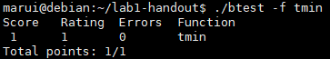
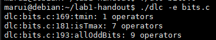

# 南京航空航天大学《计算机组成原理实验》报告

* 姓名：马睿
* 班级：1619304
* 学号：161930131
* 报告阶段：lab1
* 完成日期：2021.4.8
* 本次实验，我完成了所有内容。

## 目录

[TOC]


## 1. Nuaa_question1 tmin.c 

- 题目：返回`int`最小值
- 思路

`0x1`左移`31`位


- 代码

```c
int tmin(void) {
  return 1 << 31;
}
```

* 测试截图





## 2. Nuaa_question2 isTmax.c 

- 题目：如果是`int`型最大值，返回`1`

* 思路

如果是int型最大值`0x7fffffff`，则`+1`之后再`×2`，会得到`0`；除此之外还有`0xffffffff`也会得到`0`，需要将其进行排除。

两者不同的是，前者`+1`取反为`0`，后者`+1`取反为`1`。


* 代码

```c
int isTmax(int x) {
  int ans = !(x + 2 + x);
  ans = (!!(x + 1)) & ans;
  return ans;
}
```

* 测试截图


## 3. Nuaa_question3 allOddBits.c

- 题目：判断所有奇数位是否都为`1`，是就返回`1`

* 思路

如果奇数位都是`1`，则`x`与`0xaaaaaaaa | x`异或为`0`

因为`0xaaaaaaaa | x`之后，偶数位仍是原先的数，奇数位如果是`0`则会变成`1`，`1`还是`1`。然后结果再与`x`异或，偶数位还是自身，所以必定得到`0`；如果奇数位原先是`0`，然后变成了`1`，再与自身异或必定为`1`，如果奇数位原先是`1`，再与自己异或就是`0`。所以如果原先奇数位全部为`1`，最后得到的异或的结果必定为`0`，否则，异或的结果必定为真。


* 代码

```c
int allOddBits(int x) {
  int odd = 0xaa;
  int testodd = odd + (odd << 8) + (odd << 16) + (odd << 24);
  return !(x ^ (x | testodd));
}
```

* 测试截图




## 4. Nuaa_question4 conditional.c

- 题目：如果`x`为真返回`y`，否则返回`z`

* 思路

默认答案是`y`，如果`x`为真，则`!x`为假（0），对其`取反+1`仍为0，`z-y`与`0`相与仍为`0`，返回的就是`y`；如果`x`为假，则返回的是`y + z - y`。


* 代码

```c
int conditional(int x, int y, int z) {
  int zsy = z + ~y + 1;
  x = !x;
  x = ~x + 1;
  zsy = zsy & x;
  return y + zsy;
}
```

* 测试截图


## 5. Nuaa_question5 float_twice.c

- 题目：给予⼀个⽆符号整数表示的浮点数`uf`，返回浮点参数`uf`的表达式 `2*uf` 的位级等效值


* 思路

先提取阶码、尾数以及符号位。

如果阶码全部为`0`，则`uf`要么是非规格化数，要么是0，将尾数左移一位再加上符号位即可；

如果阶码不是`255`，则不是`NaN`或无穷，则将原数的阶码`+1`。


* 代码

```c
unsigned float_twice(unsigned uf) {
  int exp = uf & 0x7f800000;//阶码
  int frac = uf & 0x7fffff;//尾数
  int s = 0x80000000 & uf;//符号
  if(exp == 0) uf = (frac << 1) | s;//如果阶码全为0，要么是非规格化数，要么是0，尾数隐藏位为0，只需要将尾数左移+符号位
  else if(exp != 0x7f800000) uf = uf + 0x800000;//如果阶码不是255，即不是NaN或者无穷，将阶码+1
  return uf;
}
```


* 测试截图


## 6. Nuaa_question6 float_f2i.c

- 题目：给予⼀个⽆符号整数表示的浮点数`uf` ，函数返回它对应的强制类型转换后的整数


* 思路

先得到阶、尾数和符号位，再将尾数加上隐藏位；

判断阶是否大于`30`，如果为真则`int`无法表示，返回`NaN`


接着判断阶是否小于`0`，如果为真则强制转换后为`0`。（包括了`uf == 0`的情况）


再判断阶是否大于等于`23`，如果为真，则需要将按位与得到的尾数进行左移操作（因为得到的尾数是`23位`的，即`1.X * 2^23`，如果`uf`表示的数的阶大于`23`，需要将其再乘以`2^(阶 - 23)`）。

否则，需要将尾数进行右移操作。


* 代码

```c
int float_f2i(unsigned uf) {
  int exp = (uf & 0x7f800000) >> 23;
  int frac = uf & 0x7fffff;
  int s = 0x80000000 & uf;
  frac = frac | 0x800000;//加上尾数前一位的隐藏位
  exp = exp - 127;//减去偏移量
  if(exp > 30) return 0x80000000u;//如果阶大于30，则超过int范围       
  if(exp < 0) return 0;//如果阶小于0，或者uf == 0


  if(exp >= 23) frac = frac << (exp - 23);//如果大于等于1.XXX * 2^23，需要将尾数左移
  else frac = frac >> (23 - exp);//否则右移
    
  if(s) return ~frac + 1;//如果是负数
  return frac;
}
```

* 测试截图


## 7. 最终结果

* `./driver.pl`截图


* 挑战教授截图（必须是你的学号）


## 8. 备注

完成了原先的`bits.c`，在这里也列出来

1. `lsbZero - set 0 to the least significant bit of x`

```c
int lsbZero(int x) {
  return (x >> 1) << 1 ; 先右移一位，再左移一位
}

```


2. `byteNot - bit-inversion to byte n from word x`

```c
取反：和1异或
int byteNot(int x, int n) {
  int y = 0xff;
  n = n << 3;
  y = y << n;
  return x ^ y;
}
```


3. `byteXor - compare the nth byte of x and y, if it is same, return 0, if not, return 1`

```c
int byteXor(int x, int y, int n) {
  n = n << 3;
  x = x & (0xff << n);
  y = y & (0xff << n);
  return !!(x ^ y);
}
```


4. `logicalAnd - x && y`

```c
int logicalAnd(int x, int y) {
  return !!x & !!y;
}
```


5. `logicalOr - x || y`

```c
int logicalOr(int x, int y) {
  return !!x | !!y;
}
```


6. `rotateLeft - Rotate x to the left by n`

把x的前n位移到末尾

```c
int rotateLeft(int x, int n) {
  int t = x >> (32 + ~n + 1);//获取前n位
  x = x << n;//将后n位腾出
  t = t & ((1 << n) + ~0); //将前n位的前32-n位置为0
    // (1 << n) + ~0 == 2的n次方 -1
  return x + t;
}
```


7. `parityCheck - returns 1 if x contains an odd number of 1's`

1的数量如果是奇数，返回1

```c
int parityCheck(int x) {
  x = x ^ (x >> 1);
  x = x ^ (x >> 2);
  x = x ^ (x >> 4);
  x = x ^ (x >> 8);
  x = x ^ (x >> 16);
  return x & 1;
}

1. X == x31 x30 .. x0
   X >> 1 == x31 x31 .. x1
   X ^ (X >> 1) == ... x2,1 x1,0

2. X == ...x2,1 x1,0
   X >> 2 == ... x43 x32
   X ^ (X >> 2) == ...x4321 x3210
...

5.
   X ^ (X >>16) == ...x12345~31 x12345~31
```

所以先是得到原X每两位的1的奇偶性（奇位1，偶位0），然后得到每四位的，直到得到每32位的，结果与1位与，得到奇偶性。


8. `mul2OK - Determine if can compute 2*x without overflow`

×2是否溢出，如果溢出输出0，否则为1。思路：看符号位和其后一位是否相等

该题的样例貌似有问题。


9. `mult3div2 - multiplies by 3/2 rounding toward 0`

×3/2，向0取整

```c
int mult3div2(int x) {
  x = (x << 1) + x;// x * 3
  int s = (x >> 31) & 1;//判断符号位，如果是负数，则要+1再右移（因为右移是向负取整）
  x = (x + s) >> 1;
  return x;
}
```


10. `subOK - Determine if can compute x-y without overflow`

相减是否溢出

```c
int subOK(int x, int y) {
  int ans = x + (~y + 1);
  int sxy = ((x ^ y) >> 31) & 1;//得到x和y的符号位是否相同，相同为0
  ans = ((ans ^ x) >> 31) & 1;//x-y的符号位和x符号位是否相同，相同为0
  return !(sxy & ans);
}
```


11. `absVal - absolute value of x`

```c
int absVal(int x) {
  int s = (x >> 31) & 1;//取到符号位
  int s1 = ~s + 1;//对符号位取反+1，如果符号位是1，则得到0xffffffff；否则得到0
  x = (x + s1) ^ s1;//如果是负数，则对应的操作为-1然后按位与1异或，即取反；正数则是-0，按位与-异或，即不进行操作
  return x;
}
```


12. `float_abs - Return bit-level equivalent of absolute value of f for`

返回与f的绝对值相等的位级等效值

```c
unsigned float_abs(unsigned uf) {
  unsigned ans = uf & 0x7fffffff;//得到uf的绝对值
  if(ans > 0x7f800000) return uf;//如果大于NaN的最小值，则返回自身
  return ans;//返回绝对值
}
```


13. `float_f2i - Return bit-level equivalent of expression (int) f`

给予⼀个⽆符号整数表示的浮点数 uf，函数返回它对应的强制类型转换后的整数

```c
int float_f2i(unsigned uf) {
  int exp = (uf & 0x7f800000) >> 23;
  int frac = uf & 0x7fffff;
  int s = 0x80000000 & uf;
  frac = frac | 0x800000;//加上尾数前一位的隐藏位
  exp = exp - 127;//减去偏移量
  if(exp > 30) return 0x80000000u;//如果阶大于30，则超过int范围       
  if(exp < 0) return 0;//如果阶小于0，或者uf == 0


  if(exp >= 23) frac = frac << (exp - 23);//如果大于等于1.XXX * 2^23，需要将尾数左移
  else frac = frac >> (23 - exp);//否则右移
    
  if(s) return ~frac + 1;//如果是负数
  return frac;
}
```


