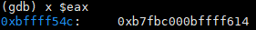
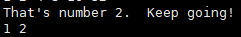

# 南京航空航天大学《计算机组成原理实验》报告

* 姓名：马睿
* 班级：1619304
* 学号：161930131
* 报告阶段：lab2
* 完成日期：2021.5.1
* 本次实验，我完成了所有内容。

## 目录

[TOC]

## 1. phase_1

* 思路

```asm
08048ae0 <phase_1>:
 8048ae0:	55                   	push   %ebp
 8048ae1:	89 e5                	mov    %esp,%ebp
 8048ae3:	83 ec 18             	sub    $0x18,%esp
 8048ae6:	c7 44 24 04 50 a1 04 	movl   $0x804a150,0x4(%esp)
 8048aed:	08 
 8048aee:	8b 45 08             	mov    0x8(%ebp),%eax
 8048af1:	89 04 24             	mov    %eax,(%esp)
 8048af4:	e8 69 04 00 00       	call   8048f62 <strings_not_equal>
 8048af9:	85 c0                	test   %eax,%eax
 8048afb:	74 05                	je     8048b02 <phase_1+0x22>
 8048afd:	e8 83 06 00 00       	call   8049185 <explode_bomb>
 8048b02:	c9                   	leave  
 8048b03:	c3                   	ret
```

阶段一的目的是检测输入的字符串是否与首地址为`0x804a150`的字符串相同。


通过`gdb` 输入`x/s 0x804a150`后得到字符串为

`I am just a renegade hockey mom.`

* 完成截图


## 2. phase_2

* 思路

### 步骤一

```asm
08048b04 <phase_2>:
 8048b04:	55                   	push   %ebp
 8048b05:	89 e5                	mov    %esp,%ebp
 8048b07:	56                   	push   %esi
 8048b08:	53                   	push   %ebx
 8048b09:	83 ec 30             	sub    $0x30,%esp
 8048b0c:	8d 45 e0             	lea    -0x20(%ebp),%eax
```


`-0x20(%ebp)`存放的是第一个数，可见`lea  -0x20(%ebp),%eax`是将输入的第一个数传送到`EAX`

### 步骤二

```asm
08048b04 <phase_2>:
 ...
 8048b19:	e8 a9 06 00 00       	call   80491c7 <read_six_numbers>
 ...

```

```asm
080491c7 <read_six_numbers>:
 80491c7:	55                   	push   %ebp
 80491c8:	89 e5                	mov    %esp,%ebp
 80491ca:	83 ec 28             	sub    $0x28,%esp
 80491cd:	8b 45 0c             	mov    0xc(%ebp),%eax
 80491d0:	8d 50 14             	lea    0x14(%eax),%edx
 80491d3:	89 54 24 1c          	mov    %edx,0x1c(%esp)
 80491d7:	8d 50 10             	lea    0x10(%eax),%edx
 80491da:	89 54 24 18          	mov    %edx,0x18(%esp)
 80491de:	8d 50 0c             	lea    0xc(%eax),%edx
 80491e1:	89 54 24 14          	mov    %edx,0x14(%esp)
 80491e5:	8d 50 08             	lea    0x8(%eax),%edx
 80491e8:	89 54 24 10          	mov    %edx,0x10(%esp)
 80491ec:	8d 50 04             	lea    0x4(%eax),%edx
 80491ef:	89 54 24 0c          	mov    %edx,0xc(%esp)
 80491f3:	89 44 24 08          	mov    %eax,0x8(%esp)
 80491f7:	c7 44 24 04 99 a3 04 	movl   $0x804a399,0x4(%esp)
 80491fe:	08 
 80491ff:	8b 45 08             	mov    0x8(%ebp),%eax
 8049202:	89 04 24             	mov    %eax,(%esp)
 8049205:	e8 c6 f5 ff ff       	call   80487d0 <__isoc99_sscanf@plt>
 804920a:	83 f8 05             	cmp    $0x5,%eax
 804920d:	7f 05                	jg     8049214 <read_six_numbers+0x4d>
 804920f:	e8 71 ff ff ff       	call   8049185 <explode_bomb>
 8049214:	c9                   	leave  
 8049215:	c3                   	ret 
```

$U`$N$@]GL%9MNE64A.png)

PW5_QVMG}B8.png)


该函数用来判断输入数的数量是否大于5，如果小于等于5则 bomb；同时，将 6 个数的地址存放在相应位置，因为地址之间的间隔为4，可以推断这6个数存放在一个数组中，首地址为`-1073744580`，即`0xbffff53c`，最后一个数的地址为`0xbffff54c`

### 步骤三

```asm
 8048b1e:	83 7d e0 01          	cmpl   $0x1,-0x20(%ebp)
 									输入的第一个数 - 1 = ?
 									
 8048b22:	74 1e                	je     8048b42 <phase_2+0x3e>
 									跳转条件：输入的第一个数 - 1 == 0
 									
 8048b24:	e8 5c 06 00 00       	call   8049185 <explode_bomb>
 8048b29:	eb 17                	jmp    8048b42 <phase_2+0x3e>
 8048b2b:	8b 43 fc             	mov    -0x4(%ebx),%eax
 					第i个数的地址-4的内容，也就是第i-1个数，送到EAX；i从2开始
 					
 8048b2e:	01 c0                	add    %eax,%eax
 									第i-1个数*2 送到 EAX
 									
 8048b30:	39 03                	cmp    %eax,(%ebx)
 									第i个数 - 第i-1个数 * 2 = ?
 									
 8048b32:	74 05                	je     8048b39 <phase_2+0x35> 										跳转条件：第i个数 - 第i-1个数 * 2 = 0
 
 8048b34:	e8 4c 06 00 00       	call   8049185 <explode_bomb>
 8048b39:	83 c3 04             	add    $0x4,%ebx
 
 						EBX += 4，即第i个数的地址+4, 得到第i+1个数的地址
 8048b3c:	39 f3                	cmp    %esi,%ebx
 
 									第i+1个数的地址 - 0xbffff550 = ?
 									
 8048b3e:	75 eb                	jne    8048b2b <phase_2+0x27>
 								跳转条件：第i+1个数的地址 - 0xbffff550!=0
 								
 8048b40:	eb 08                	jmp    8048b4a <phase_2+0x46>
 8048b42:	8d 5d e4             	lea    -0x1c(%ebp),%ebx
 											EBX <- 输入的第二个数的地址
 											
 8048b45:	8d 75 f8             	lea    -0x8(%ebp),%esi
 								ESI <- EBP - 0x8
 								ESI == 0xbffff550
 								
 8048b48:	eb e1                	jmp    8048b2b <phase_2+0x27>
 ...
```

1. 因为`-0x20(%ebp)`存放的是第一个数，则`-0x1c(%ebp)`存放的是第二个数；
2. `ESI`的值是什么？
3. 

`-0x8(%ebp)`存放的是`0xbffff550`，而最后一个数的地址是`0xbffff54c`，加4刚好得到`0xbffff550`，所以`ESI`存放的是最后一个数的下一个地址；


可得，该函数实现的功能是

```c
a[6]={1, x1, x2, x3, x4, x5};
for(int &p = a + 2; p != a + 7; p++){
    int x = *(p-1) + *(p-1); //第二个数必须是第一个数的两倍
    if(*p != x) bomb();
}
```

由此可见，这六个数分别是`1 2 4 8 16 32`

* 完成截图


## 3. phase_3

* 思路

```ASM
08048b51 <phase_3>:
 8048b51:	55                   	push   %ebp
 8048b52:	89 e5                	mov    %esp,%ebp
 8048b54:	83 ec 28             	sub    $0x28,%esp
 8048b57:	8d 45 f0             	lea    -0x10(%ebp),%eax
 8048b5a:	89 44 24 0c          	mov    %eax,0xc(%esp)
 									M[ESP + 0xc] == 0xbffff548
 									
 8048b5e:	8d 45 f4             	lea    -0xc(%ebp),%eax
 8048b61:	89 44 24 08          	mov    %eax,0x8(%esp)
 									M[ESP + 8] == 0xbffff54c
 									
 8048b65:	c7 44 24 04 a5 a3 04 	movl   $0x804a3a5,0x4(%esp)
 8048b6c:	08 
 8048b6d:	8b 45 08             	mov    0x8(%ebp),%eax
 8048b70:	89 04 24             	mov    %eax,(%esp)
 8048b73:	e8 58 fc ff ff       	call   80487d0 <__isoc99_sscanf@plt>
 8048b78:	83 f8 01             	cmp    $0x1,%eax
 8048b7b:	7f 05                	jg     8048b82 <phase_3+0x31>
 8048b7d:	e8 03 06 00 00       	call   8049185 <explode_bomb>
 8048b82:	83 7d f4 07          	cmpl   $0x7,-0xc(%ebp)
 									M[EBP - 0xc] > (unsigned)0x7 
 									M[EBP - 0xc] 为输入的第一个数
 									
 8048b86:	77 63                	ja     8048beb <phase_3+0x9a>
 									不能大于7
 									
 8048b88:	8b 45 f4             	mov    -0xc(%ebp),%eax
 8048b8b:	ff 24 85 a4 a1 04 08 	jmp    *0x804a1a4(,%eax,4)
 8048b92:	b8 00 00 00 00       	mov    $0x0,%eax
 8048b97:	eb 05                	jmp    8048b9e <phase_3+0x4d>
 8048b99:	b8 4c 01 00 00       	mov    $0x14c,%eax
 8048b9e:	83 e8 39             	sub    $0x39,%eax
 8048ba1:	eb 05                	jmp    8048ba8 <phase_3+0x57>
 8048ba3:	b8 00 00 00 00       	mov    $0x0,%eax
 8048ba8:	05 81 01 00 00       	add    $0x181,%eax
 8048bad:	eb 05                	jmp    8048bb4 <phase_3+0x63>
 8048baf:	b8 00 00 00 00       	mov    $0x0,%eax
 8048bb4:	2d d8 02 00 00       	sub    $0x2d8,%eax
 8048bb9:	eb 05                	jmp    8048bc0 <phase_3+0x6f>
 8048bbb:	b8 00 00 00 00       	mov    $0x0,%eax
 8048bc0:	05 d8 02 00 00       	add    $0x2d8,%eax
 8048bc5:	eb 05                	jmp    8048bcc <phase_3+0x7b>
 8048bc7:	b8 00 00 00 00       	mov    $0x0,%eax
 8048bcc:	2d d8 02 00 00       	sub    $0x2d8,%eax
 8048bd1:	eb 05                	jmp    8048bd8 <phase_3+0x87>
 8048bd3:	b8 00 00 00 00       	mov    $0x0,%eax
 8048bd8:	05 d8 02 00 00       	add    $0x2d8,%eax
 8048bdd:	eb 05                	jmp    8048be4 <phase_3+0x93>
 8048bdf:	b8 00 00 00 00       	mov    $0x0,%eax
 8048be4:	2d d8 02 00 00       	sub    $0x2d8,%eax
 8048be9:	eb 0a                	jmp    8048bf5 <phase_3+0xa4>
 8048beb:	e8 95 05 00 00       	call   8049185 <explode_bomb>
 8048bf0:	b8 00 00 00 00       	mov    $0x0,%eax
 8048bf5:	83 7d f4 05          	cmpl   $0x5,-0xc(%ebp)
 									第一个数 > 5 ? 
 									要小于等于5，否则会bomb
 8048bf9:	7f 05                	jg     8048c00 <phase_3+0xaf>
 8048bfb:	3b 45 f0             	cmp    -0x10(%ebp),%eax
 8048bfe:	74 05                	je     8048c05 <phase_3+0xb4>
 8048c00:	e8 80 05 00 00       	call   8049185 <explode_bomb>
 8048c05:	c9                   	leave  
 8048c06:	c3                   	ret    
```

### 步骤一

1. `0x804a3a5`存的是什么？


可见要输入两个数


2. `ESP + 0x8` 和 `ESP + 0xc`存的是什么？




存放分别是`0xbffff548` 和 `0xbffff54c`


3. `EBP - 0xc` 和 `EBP - 0x10`存的是什么？




存放的是输入的第一个数和第二个数，`0xbffff548 ~ 0xbffff54b`存放的是第二个数，`0xbffff54c ~ 0xbffff54f`存放的是第一个数


4. `0x804a1a4`存的是什么？为其内容为首地址开始的24个字节中存放的是什么？


整理可得

```c
0x804a1a4：0x08048b99	0x804a1a8：0x08048b92
0x804a1ac：0x08048ba3	0x804a1b0：0x08048baf
0x804a1b4：0x08048bbb	0x804a1b8：0x08048bc7
0x804a1bc：0x08048bd3	0x804a1d0：0x08048bdf
```


### 步骤二

1. 确定第一个数

```asm
 ...
 8048b82:	83 7d f4 07          	cmpl   $0x7,-0xc(%ebp)
 									M[EBP - 0xc] > (unsigned)0x7 
 									M[EBP - 0xc] 为输入的第一个数
 									
 8048b86:	77 63                	ja     8048beb <phase_3+0x9a>
 									不能大于7
 ...
 8048b82:	83 7d f4 07          	cmpl   $0x7,-0xc(%ebp)
 									M[EBP - 0xc] > (unsigned)0x7 
 									M[EBP - 0xc] 为输入的第一个数
 									
 8048b86:	77 63                	ja     8048beb <phase_3+0x9a>
 8048bf5:	83 7d f4 05          	cmpl   $0x5,-0xc(%ebp)
 									第一个数 > 5 ? 
 									要小于等于5，否则会bomb
 									
 8048bf9:	7f 05                	jg     8048c00 <phase_3+0xaf>
```

由这几条指令可知，第一个数是  0 ~ 5


2. 跳转到哪条指令？（多解）

令第一个数为5，所以执行`jmp  *0x804a1a4(,%eax,4)` 该指令后跳转到`0x08048bdf`

```ASM
 8048bdf:	b8 00 00 00 00       	mov    $0x0,%eax
 8048be4:	2d d8 02 00 00       	sub    $0x2d8,%eax
 8048be9:	eb 0a                	jmp    8048bf5 <phase_3+0xa4>
 8048beb:	e8 95 05 00 00       	call   8049185 <explode_bomb>
 8048bf0:	b8 00 00 00 00       	mov    $0x0,%eax
 8048bf5:	83 7d f4 05          	cmpl   $0x5,-0xc(%ebp)
 									第一个数 > 5 ? 
 									要小于等于5，否则会bomb
 8048bf9:	7f 05                	jg     8048c00 <phase_3+0xaf>
 8048bfb:	3b 45 f0             	cmp    -0x10(%ebp),%eax
 8048bfe:	74 05                	je     8048c05 <phase_3+0xb4>
 8048c00:	e8 80 05 00 00       	call   8049185 <explode_bomb>
 8048c05:	c9                   	leave  
 8048c06:	c3                   	ret    
```

最终会让`EAX和`第二个数相减，结果必须为0；且该情况下得到的`EAX == -728`，所以第二个数应该是`-728`

所以最终答案是`5 -728`


* 完成截图


## 4. phase_4

* 思路

```ASM
08048c65 <phase_4>:
 8048c65:	55                   	push   %ebp
 8048c66:	89 e5                	mov    %esp,%ebp
 8048c68:	83 ec 28             	sub    $0x28,%esp
 8048c6b:	8d 45 f0             	lea    -0x10(%ebp),%eax
 8048c6e:	89 44 24 0c          	mov    %eax,0xc(%esp)
 8048c72:	8d 45 f4             	lea    -0xc(%ebp),%eax
 8048c75:	89 44 24 08          	mov    %eax,0x8(%esp)
 8048c79:	c7 44 24 04 a5 a3 04 	movl   $0x804a3a5,0x4(%esp)
 8048c80:	08 
 8048c81:	8b 45 08             	mov    0x8(%ebp),%eax
 8048c84:	89 04 24             	mov    %eax,(%esp)
 8048c87:	e8 44 fb ff ff       	call   80487d0 <__isoc99_sscanf@plt>
 8048c8c:	83 f8 02             	cmp    $0x2,%eax
 8048c8f:	75 06                	jne    8048c97 <phase_4+0x32>
 8048c91:	83 7d f4 0e          	cmpl   $0xe,-0xc(%ebp)
 									输入的第一个数 <= (unsigned)15
 									
 8048c95:	76 05                	jbe    8048c9c <phase_4+0x37>
 8048c97:	e8 e9 04 00 00       	call   8049185 <explode_bomb>
 8048c9c:	c7 44 24 08 0e 00 00 	movl   $0xe,0x8(%esp)
 									M[ESP + 8] <- 14
 8048ca3:	00 
 8048ca4:	c7 44 24 04 00 00 00 	movl   $0x0,0x4(%esp)
 									M[ESP + 4] <- 0
 
 8048cab:	00 
 8048cac:	8b 45 f4             	mov    -0xc(%ebp),%eax
 8048caf:	89 04 24             	mov    %eax,(%esp)
 									第一个数送到M[ESP]
 									
 8048cb2:	e8 50 ff ff ff       	call   8048c07 <func4>
 8048cb7:	83 f8 1f             	cmp    $0x1f,%eax
 									返回值 == 0x1f
 
 8048cba:	75 06                	jne    8048cc2 <phase_4+0x5d>
 8048cbc:	83 7d f0 1f          	cmpl   $0x1f,-0x10(%ebp)
 									第二个数 == 0x1f
 8048cc0:	74 05                	je     8048cc7 <phase_4+0x62>
 8048cc2:	e8 be 04 00 00       	call   8049185 <explode_bomb>
 8048cc7:	c9                   	leave  
 8048cc8:	c3                   	ret   
```

### 步骤一

1. `0xc(%esp)` 和 `0x8(%esp)`存的是什么？


2. `0x804a3a5`中存的是什么？


### 步骤二

由`phase_4`的汇编可得，第二个数必须是`0x1f`，也就是`31` 。现在需要确定第一个数

```ASM
08048c07 <func4>:
 8048c07:	55                   	push   %ebp
 8048c08:	89 e5                	mov    %esp,%ebp
 8048c0a:	56                   	push   %esi
 8048c0b:	53                   	push   %ebx
 8048c0c:	83 ec 10             	sub    $0x10,%esp
 8048c0f:	8b 55 08             	mov    0x8(%ebp),%edx
 									EDX = 第一个数
 									
 8048c12:	8b 45 0c             	mov    0xc(%ebp),%eax 
  									EAX = b
 
 8048c15:	8b 75 10             	mov    0x10(%ebp),%esi
 									ESI = c
 
 8048c18:	89 f1                	mov    %esi,%ecx
 									ECX = c
 
 8048c1a:	29 c1                	sub    %eax,%ecx
  									ECX = c - b
 
 8048c1c:	89 cb                	mov    %ecx,%ebx
 									EBX = c - b
 
 8048c1e:	c1 eb 1f             	shr    $0x1f,%ebx
 									EBX = (unsigned)EBX >> 31
 
 8048c21:	01 d9                	add    %ebx,%ecx
 							  		ECX = EBX + ECX
 
 8048c23:	d1 f9                	sar    %ecx
 									ECX = ECX >> 1
 
 8048c25:	8d 1c 01             	lea    (%ecx,%eax,1),%ebx
 									EBX = ECX + EAX
 
 8048c28:	39 d3                	cmp    %edx,%ebx
 8048c2a:	7e 17                	jle    8048c43 <func4+0x3c>
 
 如果：EBX > 第一个数，执行以下指令
 8048c2c:	8d 4b ff             	lea    -0x1(%ebx),%ecx
   									ECX = EBX - 1
   								
 8048c2f:	89 4c 24 08          	mov    %ecx,0x8(%esp) 
 8048c33:	89 44 24 04          	mov    %eax,0x4(%esp)
 8048c37:	89 14 24             	mov    %edx,(%esp)
 8048c3a:	e8 c8 ff ff ff       	call   8048c07 <func4>
 									fun(a, EAX, ECX)
 
 8048c3f:	01 d8                	add    %ebx,%eax
 									EAX = fun(a, EAX, ECX) + EBX
 
 8048c41:	eb 1b                	jmp    8048c5e <func4+0x57>
 									return EAX
 									
 如果：EBX <= 第一个数，执行以下指令
 8048c43:	89 d8                	mov    %ebx,%eax
 									EAX = EBX
 
 8048c45:	39 d3                	cmp    %edx,%ebx
 8048c47:	7d 15                	jge    8048c5e <func4+0x57>
 									if(EBX >= a)	return EAX
 
 8048c49:	89 74 24 08          	mov    %esi,0x8(%esp)
 									M[ESP + 8] = c
 
 8048c4d:	8d 43 01             	lea    0x1(%ebx),%eax
 									EAX = EBX + 1 
 
 8048c50:	89 44 24 04          	mov    %eax,0x4(%esp)
									M[ESP + 4] = EAX
 
 8048c54:	89 14 24             	mov    %edx,(%esp)
 									M[ESP] = a
 
 8048c57:	e8 ab ff ff ff       	call   8048c07 <func4>
                                    fun4(a, EAX, c)
                                     
 8048c5c:	01 d8                	add    %ebx,%eax
 									return EAX = fun4(a, EAX, c) + EBX
 	
 8048c5e:	83 c4 10             	add    $0x10,%esp
 8048c61:	5b                   	pop    %ebx
 8048c62:	5e                   	pop    %esi
 8048c63:	5d                   	pop    %ebp
 8048c64:	c3                   	ret    
```

功能如下：

```c
int fun4(int a,int b,int c){
	int ecx = c - b;
    int eax = b;
    int ebx = ecx;
    ebx = (unsigned)ebx >> 31;
    ecx = ebx + ecx;
    ecx = ecx >> 1;
    ebx = ecx + eax;
    if(ebx > a){
        ecx = ebx - 1;
        return fun4(a, eax, ecx) + ebx;
    }
    else{
        eax = ebx;
        if(ebx >= a) return eax;
        else{
            eax = ebx + 1;
            return fun4(a, eax, c) + ebx;
        }
    }
}
fun4(first, 0, 14);
```

因为最后的返回值必须等于`31`，且第一个数要小于等于`15`，所以第一个数必须是 `13`

所以最终答案是 `13 31`

* 完成截图


## 5. phase_5

* 思路

```ASM
08048cc9 <phase_5>:
 8048cc9:	55                   	push   %ebp
 8048cca:	89 e5                	mov    %esp,%ebp
 8048ccc:	53                   	push   %ebx
 8048ccd:	83 ec 24             	sub    $0x24,%esp
 8048cd0:	8b 5d 08             	mov    0x8(%ebp),%ebx
 8048cd3:	89 1c 24             	mov    %ebx,(%esp)
 									EBX中存的是输入的字符串
 
 8048cd6:	e8 65 02 00 00       	call   8048f40 <string_length>
 8048cdb:	83 f8 06             	cmp    $0x6,%eax
 									要输入长度为6的字符串
 									
 8048cde:	74 43                	je     8048d23 <phase_5+0x5a>
 8048ce0:	e8 a0 04 00 00       	call   8049185 <explode_bomb>
 8048ce5:	eb 3c                	jmp    8048d23 <phase_5+0x5a>
 									EAX = 0
 
 8048ce7:	0f b6 14 03          	movzbl (%ebx,%eax,1),%edx
 									EDX = (unsigned)M[EBX + EAX]
 									EDX == 第EAX个字符的ASCII码
 									
 8048ceb:	83 e2 0f             	and    $0xf,%edx
 									EDX = EDX & 0xf
 
 8048cee:	0f b6 92 c4 a1 04 08 	movzbl 0x804a1c4(%edx),%edx
  									EDX = (unsigned)M[EDX + 0x804a1c4]
 
 8048cf5:	88 54 05 f1          	mov    %dl,-0xf(%ebp,%eax,1)
 									M[EBP - 0xf + EAX] = DL
 									要凑出devils
 第i个字符 & 0xf + 0x804a1c4 的地址上的值的低8位分别是0x64 65 76 69 6c 73
 								
 8048cf9:	83 c0 01             	add    $0x1,%eax
 									EAX = EAX + 1
 
 8048cfc:	83 f8 06             	cmp    $0x6,%eax
 									EAX != 6 ?
 
 8048cff:	75 e6                	jne    8048ce7 <phase_5+0x1e>
 8048d01:	c6 45 f7 00          	movb   $0x0,-0x9(%ebp)
 									M[EBP - 9] = 0
 
 8048d05:	c7 44 24 04 9a a1 04 	movl   $0x804a19a,0x4(%esp)
  									M[ESP + 4] = 0x804a19a
 
 8048d0c:	08 
 8048d0d:	8d 45 f1             	lea    -0xf(%ebp),%eax
 									EAX = EBP - 0xf
 
 8048d10:	89 04 24             	mov    %eax,(%esp)
 									M[ESP] = EAX
 
 8048d13:	e8 4a 02 00 00       	call   8048f62 <strings_not_equal>
 							strings_not_equal(EBP - 0xf, 0x804a19a)
 
 8048d18:	85 c0                	test   %eax,%eax
 									EAX & EAX == 0
 
 8048d1a:	74 0e                	je     8048d2a <phase_5+0x61>
 8048d1c:	e8 64 04 00 00       	call   8049185 <explode_bomb>
 8048d21:	eb 07                	jmp    8048d2a <phase_5+0x61>
 8048d23:	b8 00 00 00 00       	mov    $0x0,%eax
 8048d28:	eb bd                	jmp    8048ce7 <phase_5+0x1e>
 8048d2a:	83 c4 24             	add    $0x24,%esp
 8048d2d:	5b                   	pop    %ebx
 8048d2e:	5d                   	pop    %ebp
 8048d2f:	90                   	nop
 8048d30:	c3                   	ret    
```


### 步骤一

1. 输入的字符串存放在哪？


```ASM
 8048cd0:	8b 5d 08             	mov    0x8(%ebp),%ebx
 8048cd3:	89 1c 24             	mov    %ebx,(%esp)
```

存放在`EBX`和 `(%esp)`中


2. 以`0x804a1c4`为首地址存的是什么？


3. 以`0x804a19a`为首地址存的是什么？


### 步骤二

`phase_5`实现的功能是

```c
char str[6];
char p[6];
int a[15] = {0x6d, 0x61, 0x64, 0x75, 0x69, 0x65, 0x72, 0x73
           	0x6e, 0x66, 0x6f, 0x74, 0x76, 0x62, 0x79, 0x6c}
cin >> str;
for(int i = 0; i !=6; i++){
    p[i] = a[str[i] & 0xf];
}
判断得到的 p 字符串是否与 devils 相同
```

因为最后得到的字符串要等于`devils`，其相应的`ASCII`码为

`64 65 76 69 6c 73`

这些数字相应的下标为`2 5 12 4 15 7`，所以要找到低 4 位是这些值的字符，它们分别是`25<4?7`

所以答案就是`25<4?7`


* 完成截图


## 6. phase_6

* 思路

### 步骤一

1. `0x804c154`存的是什么？

   

   整理可得

```ASM
0x804c154 <node1>: 0x000000d5 0x00000001 0x0804c160 
0x804c160 <node2>: 0x00000348 0x00000002 0x0804c16c 
0x804c16c <node3>: 0x000001a2 0x00000003 0x0804c178 
0x804c178 <node4>: 0x00000324 0x00000004 0x0804c184 
0x804c184 <node5>: 0x0000028a 0x00000005 0x0804c190 
0x804c190 <node6>: 0x0000022e 0x00000006 0x00000000 
```


可知是一个链表

```c
struct node{
    int value;
    int pos;
    node *next;
}
node1 -> node2 -> node3 -> node4 -> node5 -> node6 -> NULL
```


2. `-0x38(%ebp)`存的是什么？


存的是`node6`的地址，继续显示可得


可知存放的是`node6 ~ node1`的地址，是一个指针数组。假定为数组 b


3. `-0x20(%ebp)`存的是什么？


存的是输入的 6 个数，是一个`int`数组，假定为数组 a


### 步骤二

```ASM
08048d31 <phase_6>:
 8048d31:	55                   	push   %ebp
 8048d32:	89 e5                	mov    %esp,%ebp
 8048d34:	56                   	push   %esi
 8048d35:	53                   	push   %ebx
 8048d36:	83 ec 40             	sub    $0x40,%esp
 8048d39:	8d 45 e0             	lea    -0x20(%ebp),%eax 
 8048d3c:	89 44 24 04          	mov    %eax,0x4(%esp)
 8048d40:	8b 45 08             	mov    0x8(%ebp),%eax
 									输入的字符串（6个数）a[0]~a[5]
 
 8048d43:	89 04 24             	mov    %eax,(%esp)
 8048d46:	e8 7c 04 00 00       	call   80491c7 <read_six_numbers>
```

可知这些指令是要输入 6 个数


```ASM
 8048d4b:	be 00 00 00 00       	mov    $0x0,%esi
 									ESI = 0
 
 8048d50:	8b 44 b5 e0          	mov    -0x20(%ebp,%esi,4),%eax
 									EAX = a[ESI]
 
 8048d54:	83 e8 01             	sub    $0x1,%eax
 									EAX <- EAX - 1
 
 8048d57:	83 f8 05             	cmp    $0x5,%eax
 									EAX <= 5,所有数必须小于等于6，否则bomb
 
 8048d5a:	76 05                	jbe    8048d61 <phase_6+0x30>
 8048d5c:	e8 24 04 00 00       	call   8049185 <explode_bomb>
 8048d61:	83 c6 01             	add    $0x1,%esi
 									ESI = ESI + 1
 
 8048d64:	83 fe 06             	cmp    $0x6,%esi
 8048d67:	75 07                	jne    8048d70 <phase_6+0x3f>
   									判断 ESI(数组下标) 是否等于6
   									
   									if(ESI == 6),执行以下指令：
 8048d69:	bb 00 00 00 00       	mov    $0x0,%ebx
 									EBX = 0,跳转									
 8048d6e:	eb 38                	jmp    8048da8 <phase_6+0x77>

									if(ESI != 6),执行以下指令：
 8048d70:	89 f3                	mov    %esi,%ebx
 									EBX = ESI
 									
 8048d72:	8b 44 9d e0          	mov    -0x20(%ebp,%ebx,4),%eax
 									EAX = a[EBX]
 
 8048d76:	39 44 b5 dc          	cmp    %eax,-0x24(%ebp,%esi,4)
 									a[ESI - 1] != EAX，跳转两行
 									即a[i + 1 - 1] != a[i + 1]
 									下一个数不能等于当前数，否则bomb
 									
 8048d7a:	75 05                	jne    8048d81 <phase_6+0x50>
 8048d7c:	e8 04 04 00 00       	call   8049185 <explode_bomb>
 8048d81:	83 c3 01             	add    $0x1,%ebx
 									EBX = EBX + 1

 8048d84:	83 fb 05             	cmp    $0x5,%ebx
 
 									if(EBX <= 5)，执行以下指令：
 8048d87:	7e e9                	jle    8048d72 <phase_6+0x41>
 
 									if(EBX > 5)，执行以下指令：
 8048d89:	eb c5                	jmp    8048d50 <phase_6+0x1f>
 
 EBX == j, ESI == i
```

1. 先判断`a[i]`是否小于等于6；(`0 <= i <= 4`) 	1

2. 如果满足，则判断`j = i + 1`是否等于`6`；  2

   ​	如果不等于`6`，则判断`a[i]`和 `a[j]`是否相同；  3 

   ​		如果不同则判断`j`是否小于等于`5`；  4

   ​			如果小于等于`5`，则`j = j + 1`，返回第 3 步

   ​			如果大于`5`，则`i = i + 1`，返回到第 1 步

   ​		如果相同则`bomb`

   ​	如果等于`6`，则令`j = 0`，跳转到第 5 步 （在下面）

   如果不满足，则`bomb`

限制读入的6个数必须小于等于6并且互不相等。


```ASM
 8048d8b:	8b 52 08             	mov    0x8(%edx),%edx
 									EDX = M[EDX + 8]
 
 8048d8e:	83 c0 01             	add    $0x1,%eax
 									EAX = EAX + 1
 	
 8048d91:	39 c8                	cmp    %ecx,%eax

									if(EAX != ECX),跳转
 8048d93:	75 f6                	jne    8048d8b <phase_6+0x5a>
 
 									if(EAX == ECX),跳转两行
 8048d95:	eb 05                	jmp    8048d9c <phase_6+0x6b>
 8048d97:	ba 54 c1 04 08       	mov    $0x804c154,%edx
 									EDX = 0x804c154
 
 8048d9c:	89 54 b5 c8          	mov    %edx,-0x38(%ebp,%esi,4)
 									
 
 8048da0:	83 c3 01             	add    $0x1,%ebx
  									EBX = EBX + 1
 
 8048da3:	83 fb 06             	cmp    $0x6,%ebx
 8048da6:	74 17                	je     8048dbf <phase_6+0x8e>
 
 8048da8:	89 de                	mov    %ebx,%esi
 									(EBX = 0)
 									ESI = EBX
 
 8048daa:	8b 4c 9d e0          	mov    -0x20(%ebp,%ebx,4),%ecx
 									ECX = a[EBX]
 
 8048dae:	83 f9 01             	cmp    $0x1,%ecx
 8048db1:	7e e4                	jle    8048d97 <phase_6+0x66>
 
 									if(ECX > 1)，执行以下指令：
 8048db3:	b8 01 00 00 00       	mov    $0x1,%eax
 									EAX = 1
 
 8048db8:	ba 54 c1 04 08       	mov    $0x804c154,%edx
 									EDX = &node1
 
 8048dbd:	eb cc                	jmp    8048d8b <phase_6+0x5a>
 
  									if(EBX != 6),执行以下指令：
 8048dbf:	8b 5d c8             	mov    -0x38(%ebp),%ebx
 									EBX = b[0]
 
 8048dc2:	8d 45 cc             	lea    -0x34(%ebp),%eax 
									EAX = &b[1]
						
 8048dc5:	8d 75 e0             	lea    -0x20(%ebp),%esi
 									ESI = &a[0]
 								EBP - 0x20 ~ EBP - 0xc存的是输入的六个数
 		
 8048dc8:	89 d9                	mov    %ebx,%ecx
 									ECX = EBX (ECX = &node6)
 
 8048dca:	8b 10                	mov    (%eax),%edx
 									EDX = M[EAX] (EDX = &node5)
 									
 8048dcc:	89 51 08             	mov    %edx,0x8(%ecx)
 									M[ECX + 8] = EDX (node6->next = &node5)
 
 8048dcf:	83 c0 04             	add    $0x4,%eax
 									EAX = EAX + 4
 
 8048dd2:	39 f0                	cmp    %esi,%eax
 8048dd4:	74 04                	je     8048dda <phase_6+0xa9>
 
 									if(EAX != ESI)，执行以下指令：
 8048dd6:	89 d1                	mov    %edx,%ecx
 									ECX = EDX
 
 8048dd8:	eb f0                	jmp    8048dca <phase_6+0x99>
 
 									if(EAX == ESI)，执行以下指令：
 8048dda:	c7 42 08 00 00 00 00 	movl   $0x0,0x8(%edx)
  									M[EDX + 8] = 0
 
 8048de1:	be 05 00 00 00       	mov    $0x5,%esi
   									ESI = 5
 
 8048de6:	8b 43 08             	mov    0x8(%ebx),%eax
   									EAX = M[EBX + 8] 
 
 8048de9:	8b 00                	mov    (%eax),%eax
 									EAX = M[EAX]
 
 8048deb:	39 03                	cmp    %eax,(%ebx)
  									M[EBX] <= EAX
					 
 8048ded:	7e 05                	jle    8048df4 <phase_6+0xc3>
 8048def:	e8 91 03 00 00       	call   8049185 <explode_bomb>
 8048df4:	8b 5b 08             	mov    0x8(%ebx),%ebx
 									EBX = M[EBX + 8]
 
 8048df7:	83 ee 01             	sub    $0x1,%esi
 									ESI = ESI - 1
 
 8048dfa:	75 ea                	jne    8048de6 <phase_6+0xb5>
 8048dfc:	83 c4 40             	add    $0x40,%esp
 8048dff:	5b                   	pop    %ebx
 8048e00:	5e                   	pop    %esi
 8048e01:	5d                   	pop    %ebp
 8048e02:	c3                   	ret    
```

先将`EBX(j) = 0`

```ASM
 8048da8：令ESI = EBX，ECX = a[EBX], 判断 ECX 是否小于等于1      5
	如果小于等于1，跳转到8048d97： EDX = &node1, b[ESI] = EDX, EBX++, 判断EBX是否等于6          6
		如果等于6，跳转到8048dbf：EBX = b[0], EAX = &b[1], ESI = &a[0], ECX = EBX, EDX = M[EAX], M[ECX + 8] = EDX, EAX += 4, 判断EAX是否等于ESI；相当于在判断EAX是否到达&b[6] (&b[6] == &a[0])      7
        	如果相等，跳转到8048dda：M[EDX + 8] = 0，ESI = 5，EAX = M[EBX + 8]，EAX = M[EAX]，判断M[EBX]是否小于等于EAX；   8 
        		如果小于等于，跳转到8048df4：EBX = M[EBX + 8]，ESI--，判断ESI是否不等于0；     9
        			如果不等于0，则跳转到第8步的EAX = M[EBX + 8]开始
        			如果等于0，则退出phase_6
        		如果大于，bomb 
        	如果不相等，ECX = EDX，跳转到第7步EDX = M[EAX]开始
        如果不等于6，返回第5步 
   	如果大于1，EAX = 1, EDX = &node1, 跳转到8048d8b：EDX = M[EDX + 8], EAX++, 直到EAX等于ECX，跳转到第6步b[ESI] = EDX开始 
```


```C
i = j;   2
node *p;
int a1 = a[j];
if(a1 <= 1){
    p = &node1;
    b[i] = p;   1
    j++;
    if(j == 6){
        链表连接为b[0]->b[1]->b[2]->b[3]->b[4]->b[5]->NULL;
        i = 5;
        p = p1->next;(p1 == 交换后的b[0])  3 
        t = p->val;

        if(p1->val <= t){ 后面的要比前面的大,所以是升序
            p1 = p1->next;
            i--;
            if(i == 0) return;
            else goto 3
        }
        else bomb();
    }
    else  goto 2
}
else{
    int t = 1;
    p = &node1;
    while(t != a1){
        t++;
        p = p->next;
    }
    goto   1
}
```

可知，输入的数是用来修改 b 数组的值，假设输入的是`x`，此时修改的 b 的数组下标是`i`，则会将 `b[i] = nodex`，每修改一个 b 数组的元素就会令计数器`j`加一，直到`j`为 6，也就是将 b 数组全部都修改。

然后会将`b[k]->next = b[k + 1]`，`0 <= k <= 4`，`b[5]->next = NULL`，更新了原链表的指向，然后进行 5 次判断：判断产生的新链表的每个节点的后一个节点的`val`是否大于当前节点，也就是`p->val <= p->next->val`。

所以是要将原链表以其成员变量`val`调整成升序，所以答案应该是`1 3 6 5 4 2`


* 完成截图


## 7. 最终结果

* bomblab 完成截图


## 8. bomblab 隐藏关卡

### 步骤一

```ASM
0804934e <phase_defused>:
 804934e:	55                   	push   %ebp
 804934f:	89 e5                	mov    %esp,%ebp
 8049351:	81 ec 88 00 00 00    	sub    $0x88,%esp
 8049357:	c7 04 24 01 00 00 00 	movl   $0x1,(%esp)
 804935e:	e8 4b fd ff ff       	call   80490ae <send_msg>
 8049363:	83 3d e8 c7 04 08 06 	cmpl   $0x6,0x804c7e8
 									输入的字符串数量和 6 比
 									等于6则可以触发隐藏
 
 804936a:	75 7a                	jne    80493e6 <phase_defused+0x98>
 804936c:	8d 45 a8             	lea    -0x58(%ebp),%eax
 804936f:	89 44 24 10          	mov    %eax,0x10(%esp)
 8049373:	8d 45 a0             	lea    -0x60(%ebp),%eax
 8049376:	89 44 24 0c          	mov    %eax,0xc(%esp)
 804937a:	8d 45 a4             	lea    -0x5c(%ebp),%eax
 804937d:	89 44 24 08          	mov    %eax,0x8(%esp)
 8049381:	c7 44 24 04 ff a3 04 	movl   $0x804a3ff,0x4(%esp)
 8049388:	08 
 8049389:	c7 04 24 f0 c8 04 08 	movl   $0x804c8f0,(%esp)
 8049390:	e8 3b f4 ff ff       	call   80487d0 <__isoc99_sscanf@plt>
 8049395:	83 f8 03             	cmp    $0x3,%eax
 									如果输入为3个值，激活隐藏关卡
 
 8049398:	75 34                	jne    80493ce <phase_defused+0x80>
 804939a:	c7 44 24 04 08 a4 04 	movl   $0x804a408,0x4(%esp)
 80493a1:	08 
 80493a2:	8d 45 a8             	lea    -0x58(%ebp),%eax
 80493a5:	89 04 24             	mov    %eax,(%esp)
 80493a8:	e8 b5 fb ff ff       	call   8048f62 <strings_not_equal>
 80493ad:	85 c0                	test   %eax,%eax
 80493af:	75 1d                	jne    80493ce <phase_defused+0x80>
 				判断输入的字符串是否与隐藏关卡的字符串相同，如果相同则进入隐藏关卡
 
 80493b1:	c7 04 24 54 a2 04 08 	movl   $0x804a254,(%esp)
 80493b8:	e8 c3 f3 ff ff       	call   8048780 <puts@plt>
 80493bd:	c7 04 24 7c a2 04 08 	movl   $0x804a27c,(%esp)
 80493c4:	e8 b7 f3 ff ff       	call   8048780 <puts@plt>
 									进入隐藏关卡的提示信息
 
 80493c9:	e8 88 fa ff ff       	call   8048e56 <secret_phase>
 80493ce:	c7 04 24 b4 a2 04 08 	movl   $0x804a2b4,(%esp)
 									拆弹成功信息
 80493d5:	e8 a6 f3 ff ff       	call   8048780 <puts@plt>
 80493da:	c7 04 24 e0 a2 04 08 	movl   $0x804a2e0,(%esp)
 80493e1:	e8 9a f3 ff ff       	call   8048780 <puts@plt>
 80493e6:	c9                   	leave  
 80493e7:	c3                   	ret    
 80493e8:	66 90                	xchg   %ax,%ax
 80493ea:	66 90                	xchg   %ax,%ax
 80493ec:	66 90                	xchg   %ax,%ax
 80493ee:	66 90                	xchg   %ax,%ax
```

1. `0x804c7e8`存的是什么？


存的是已经输入的字符串数，也就是关卡数。


2. `0x804a3ff`存的是什么？


第 4 关的输入格式（后面多了一个字符串）


3. `0x804c8f0`存的是什么？


存的是第 4 关的输入


4. `0x804a408`存的是什么？


进入隐藏关卡的字符串


以上就是进入隐藏关卡的条件：

- 第四关要输入`13 31 DrEvil`
- 要到第六关之后才会到隐藏关


### 步骤二

- 思路

```ASM
08048e56 <secret_phase>:
 8048e56:	55                   	push   %ebp
 8048e57:	89 e5                	mov    %esp,%ebp
 8048e59:	53                   	push   %ebx
 8048e5a:	83 ec 14             	sub    $0x14,%esp
 8048e5d:	e8 b4 03 00 00       	call   8049216 <read_line>
 8048e62:	c7 44 24 08 0a 00 00 	movl   $0xa,0x8(%esp)
 8048e69:	00 
 8048e6a:	c7 44 24 04 00 00 00 	movl   $0x0,0x4(%esp)
 8048e71:	00 
 8048e72:	89 04 24             	mov    %eax,(%esp)
 8048e75:	e8 b6 f9 ff ff       	call   8048830 <strtol@plt>
  									strtol(输入的字符串, NULL, 0xa)
 									把输入的字符串变成10进制
 									
 8048e7a:	89 c3                	mov    %eax,%ebx
 									转换后的值ret存在EBX中
 
 8048e7c:	8d 40 ff             	lea    -0x1(%eax),%eax
 									ret = ret - 1
 
 8048e7f:	3d e8 03 00 00       	cmp    $0x3e8,%eax
 									ret <= 0x3e8，否则bomb
 									输入的值必须小于等于0x3e9
 8048e84:	76 05                	jbe    8048e8b <secret_phase+0x35>
 8048e86:	e8 fa 02 00 00       	call   8049185 <explode_bomb>
 8048e8b:	89 5c 24 04          	mov    %ebx,0x4(%esp)
 8048e8f:	c7 04 24 a0 c0 04 08 	movl   $0x804c0a0,(%esp)
 8048e96:	e8 68 ff ff ff       	call   8048e03 <fun7>
 									fun7(0x804c0a0, ret)
 
 8048e9b:	85 c0                	test   %eax,%eax
 8048e9d:	74 05                	je     8048ea4 <secret_phase+0x4e>
 									fun7()的返回值必须为0，否则bomb
 
 8048e9f:	e8 e1 02 00 00       	call   8049185 <explode_bomb>
 8048ea4:	c7 04 24 74 a1 04 08 	movl   $0x804a174,(%esp)
 									通关信息
 8048eab:	e8 d0 f8 ff ff       	call   8048780 <puts@plt>
 8048eb0:	e8 99 04 00 00       	call   804934e <phase_defused>
 8048eb5:	83 c4 14             	add    $0x14,%esp
 8048eb8:	5b                   	pop    %ebx
 8048eb9:	5d                   	pop    %ebp
 8048eba:	c3                   	ret    
 8048ebb:	66 90                	xchg   %ax,%ax
 8048ebd:	66 90                	xchg   %ax,%ax
 8048ebf:	90                   	nop
```

1. `0x804c0a0`存的是什么？


整理可得

```asm
0x804c0a0 <n1>:  	0x00000024 	0x0804c0ac	0x0804c0b8
0x804c0ac <n21>: 	0x00000008	0x0804c0dc 	0x0804c0c4
0x804c0b8 <n22>:	0x00000032 	0x0804c0d0 	0x0804c0e8
0x804c0c4 <n32>:	0x00000016 	0x0804c130 	0x0804c118
0x804c0d0 <n33>: 	0x0000002d	0x0804c0f4 	0x0804c13c
0x804c0dc <n31>: 	0x00000006 	0x0804c100 	0x0804c124
0x804c0e8 <n34>: 	0x0000006b 	0x0804c10c 	0x0804c148
0x804c0f4 <n45>: 	0x00000028 	0x00000000 	0x00000000
0x804c100 <n41>:	0x00000001  0x00000000 	0x00000000
0x804c10c <n47>: 	0x00000063 	0x00000000 	0x00000000
0x804c118 <n44>: 	0x00000023	0x00000000 	0x00000000
0x804c124 <n42>: 	0x00000007	0x00000000 	0x00000000
0x804c130 <n43>: 	0x00000014	0x00000000 	0x00000000
0x804c13c <n46>: 	0x0000002f	0x00000000 	0x00000000
0x804c148 <n48>: 	0x000003e9 	0x00000000 	0x00000000
0x804c154 == &node1
```

可知是一棵满二叉树

```c
struct n{
	int val;
    n *left;
    n *right;
}                                  
                                  n1
                         n21			       n22
                   n31		  n32	 	  n33		n34
              n41	n42	    n43  n44   n45   n46    n47  n48
```


### 步骤三

```ASM
08048e03 <fun7>: fun7(a,b)
 8048e03:	55                   	push   %ebp
 8048e04:	89 e5                	mov    %esp,%ebp
 8048e06:	53                   	push   %ebx
 8048e07:	83 ec 14             	sub    $0x14,%esp
 8048e0a:	8b 55 08             	mov    0x8(%ebp),%edx  a
 8048e0d:	8b 4d 0c             	mov    0xc(%ebp),%ecx  b
 8048e10:	85 d2                	test   %edx,%edx
 8048e12:	74 37                	je     8048e4b <fun7+0x48>
 									如果a == NULL，return -1
 
 8048e14:	8b 1a                	mov    (%edx),%ebx
 									EBX = M[EDX] (EBX = a->val)
 
 8048e16:	39 cb                	cmp    %ecx,%ebx
 									EBX <= ECX (a->val <= b)
 
 8048e18:	7e 13                	jle    8048e2d <fun7+0x2a>
 
 									如果EBX > ECX (*a > b)：
 8048e1a:	89 4c 24 04          	mov    %ecx,0x4(%esp)
 8048e1e:	8b 42 04             	mov    0x4(%edx),%eax
 8048e21:	89 04 24             	mov    %eax,(%esp)
 8048e24:	e8 da ff ff ff       	call   8048e03 <fun7>
 									fun7(a->left, b)
 
 8048e29:	01 c0                	add    %eax,%eax
 									return  fun7(a->left, b) * 2
 	
 8048e2b:	eb 23                	jmp    8048e50 <fun7+0x4d>
 8048e2d:	b8 00 00 00 00       	mov    $0x0,%eax
 									EAX = 0
 
 8048e32:	39 cb                	cmp    %ecx,%ebx
 									EBX == ECX (a->val == b) return 0
 
 8048e34:	74 1a                	je     8048e50 <fun7+0x4d>
 
 									EBX != ECX (a->val != b)
 									也就是 a->val < b
 8048e36:	89 4c 24 04          	mov    %ecx,0x4(%esp)
 8048e3a:	8b 42 08             	mov    0x8(%edx),%eax
 									EAX = M[EDX + 8] (ret = a->right)
 
 8048e3d:	89 04 24             	mov    %eax,(%esp)
 8048e40:	e8 be ff ff ff       	call   8048e03 <fun7>
  									fun7(a->right, b)
 
 8048e45:	8d 44 00 01          	lea    0x1(%eax,%eax,1),%eax
 									fun7(a->right, b) * 2 + 1
 
 8048e49:	eb 05                	jmp    8048e50 <fun7+0x4d>
 									return fun7(a->right, b) * 2 + 1
 
 8048e4b:	b8 ff ff ff ff       	mov    $0xffffffff,%eax
 									返回值 = -1
 
 8048e50:	83 c4 14             	add    $0x14,%esp
 8048e53:	5b                   	pop    %ebx
 8048e54:	5d                   	pop    %ebp
 8048e55:	c3                   	ret    
```

该部分的功能是：

```C
int fun7(n *a,int b){
    if(a == NULL) return -1;
    if(a->val <= b){
        int ret = 0;
        if(a->val == b) return 0;
        return fun7(a->right, b) * 2 + 1;
    }
    else{
        return  fun7(a->left, b) * 2;
    }
}

fun7(&n1, x);
```

只需要让输入的值等于根结点的值，就可以让函数返回`0`，所以输入`36`即可。


- 完成截图


## 8. 备注

做的时候不知道`bomb`之后会扣分，好可惜┭┮﹏┭┮