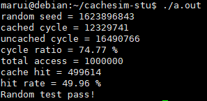

# 南京航空航天大学《计算机组成原理实验》报告

* 姓名：马睿
* 班级：1619304
* 学号：161930131
* 报告阶段：lab3
* 完成日期：2021.6.16
* 本次实验，我完成了所有内容。

----

## 目录

[TOC]

## 思考题

### 数据对齐和存储层次结构

数据对齐是为了保证访问的数据尽量在同一片区域里，访问时只需要访问一次即可。

访问一个没有对齐的存储空间时，需要在不同的区域里访问两次，增加了访问的次数。


## init_cache （20分）

### cache结构设计

* 思路

1. 因为采用随机替换，所以不需要用于替换算法的使用位；
2. 需要1位有效位和1位脏位
3. 数据区需要`64 * 8 = 2 ^ 9 = 512`位

4. 标记位需要根据传入的`total_size_width`和`associativity_width`来具体计算


* 代码

```C
typedef struct {
	uint8_t valid : 1;	  // 有效位,1位
	uint8_t modified : 1; // 脏位，1位
	uint32_t tag;	 // 标记位
	uint8_t data[BLOCK_SIZE];	 // 数据区，512位
} CacheSlot;
```


### cache初始化

* 思路

采用字节编址

1. 一位有效位
2. 因为块大小为`64B`，即`2^6`字节，所以块内地址需要6位
3. 内存地址为32位，块内地址为6位，所以主存块号是`32 - 6 = 26`位
4. 因为`cache`的数据区容量是`16KB`，块大小为`64B`，所以`cache`共有`256 = 2 ^ 8`行，又因为是4路组相联，所以共有`2 ^ 8/2 ^ 2 = 2 ^ 6 = 64`组。因此，`cache`组号需要6位。
5. 标记位需要`26 - 6 = 20`位

6. `cache`需要1位有效位；20位标记位；用于`cache`一致性维护的脏位（）；数据区 512位

脏位用来判断`cache`中的内容和内存中的内容是否一致，不一致一定要想办法一致。当处理器返回修改过后的数据给Cache时，脏位就会置1。如果脏位为1，则该数据应该被写入主存。

综上所述，`cache`和主存地址是这样划分的

```
主存地址：

		    20位					  6位			      6位
+-------------------------------------------------------------------+
|           标记        	  |	    cache组号		|	    块内地址       |
+-------------------------------------------------------------------+


cache：

  1位   1位       		 20位					     512位
+-------------------------------------------------------------------+
|有效位| 脏位 |    		   标记    			|		  数据区         |
+-------------------------------------------------------------------+

```


* 代码

根据上述思路，实现如下

```C
CacheSlot **cache;

int line_count;//cache总行数
int line_of_group;// 每组行数
int group_count;// cache组数
int group_id_width;// cache组号长度
int tag_width;// tag长度

void init_cache(int total_size_width, int associativity_width) {
	line_count = exp2(total_size_width) / BLOCK_SIZE;
	line_of_group = exp2(associativity_width);
	group_count = line_count / line_of_group;

	 /*2 ^ (total_size_width - BLOCK_WIDTH) / 2 ^ (associativity_width) = 2 ^ (group_id_width)
	 --> 行数/关联度 = 每组行数 
	 */
	group_id_width = total_size_width - BLOCK_WIDTH - associativity_width;
	tag_width = 32 - BLOCK_WITDH - group_id_width;
	cache = (CacheSlot * *)malloc(sizeof(CacheSlot *) * group_count);
	int i;
	for (i = 0; i < group_count; i++) {
		cache[i] = (CacheSlot *)calloc(line_of_group, sizeof(CacheSlot));
	}
	
	return;
}
```


## cache_read (30分)

* 思路

1. 按照`mem_read`的格式，将地址按字节对齐

2. 从主存地址中获得标记、组号和块内地址

3. 如果在相应的组中命中，则将数据按小段方式读出；

   否则进行随机替换；如果有要替换的位置的脏位为1，即需要写入到内存，则将其先写入内存，再从地址中取出数据到`cache`

* 代码

```C
uint32_t cache_read(uintptr_t addr) {
	try_increase(1); 
	uint32_t val;

	addr = addr & ~0x3;//使地址按字节对齐
	uint32_t tag = (addr >> (32 - tag_width)) & ~(~0 << tag_width); //得到标记
	uint32_t group_id = (addr >> 6) & ~(~0 << group_id_width); //得到组号
	uint32_t offset = addr & ~(~0 << BLOCK_WIDTH); //得到块内地址

	int i, j;
	for (i = 0;i < rows_of_group;i++) {//遍历相应组号中的所有行
		if (cache[group_id][i].valid && cache[group_id][i].tag == tag) {// 判断有效位和标记
			hit_increase(1); 
			val = 0;
			for (j = 3; j >= 0; j--) { //小端方式，所以先从大地址开始取数
				val *= 0x100;
				val += cache[group_id][i].data[offset + j];
			}
			return val;
		}
	}

	i = rand() % rows_of_group;// 随机替换
	if (cache[group_id][i].dirty == 1) {// 脏位为1需要先写回到内存中
		mem_write((cache[group_id][i].tag << group_id_width) + group_id, cache[group_id][i].data);
	}
	mem_read(addr >> BLOCK_WIDTH, cache[group_id][i].data);
	cache[group_id][i].tag = addr >> (32 - tag_width);
	cache[group_id][i].valid = 1;
	cache[group_id][i].dirty = 0;
	val = 0;
	for (j = 3; j >= 0; j--) {
		val *= 0x100;
		val += cache[group_id][i].data[offset + j];
	}

	return val;
}
```


## cache_write (30分)

* 思路

1. 按照`mem_write`的格式，将地址按字节对齐

2. 从主存地址中获得标记、组号和块内地址

3. 如果在相应的组中命中，则将数据写入`cache`，==令脏位为1==；

   如果没有无效的行，则进行随机替换；如果有要替换的位置的脏位为1，即需要写入到内存，则将数据写入`cache`，令脏位为1

以上就是写回法的策略

* 代码

```C
void cache_write(uintptr_t addr, uint32_t data, uint32_t wmask) {
	try_increase(1);
	uint32_t * p;

	addr = addr & ~0x3;
	uint32_t tag = (addr >> (6 + group_id_width)) & ~(~0 << tag_width);
	uint32_t group_id = (addr >> 6) & ~(~0 << group_id_width);
	uint32_t offset = addr & ~(~0 << BLOCK_WIDTH);

	int i;
	for (i = 0; i < rows_of_group; i++) {
		if (cache[group_id][i].valid && cache[group_id][i].tag == tag) {
			hit_increase(1);
			cache[group_id][i].dirty = 1;
			p = (uint32_t *)&cache[group_id][i].data[offset];
			*p = (*p & ~wmask) | (data & wmask);
			return;
		}
	}


	i = rand() % rows_of_group;
	if (cache[group_id][i].dirty == 1) {
		mem_write((cache[group_id][i].tag << group_id_width) + group_id, cache[group_id][i].data);
	}
	mem_read(addr >> BLOCK_WIDTH, cache[group_id][i].data);
	cache[group_id][i].tag = addr >> (32 - tag_width);
	cache[group_id][i].valid = 1;
	cache[group_id][i].dirty = 1;
	p = (uint32_t *)&cache[group_id][i].data[offset];
	*p = (*p & ~wmask) | (data & wmask);
	return;
}
```


## 最终结果截图（20分）




## 备注

助教真帅，连我都要避让三分[doge]


