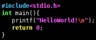
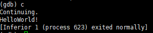
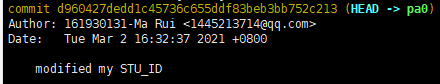

南京航空航天大学《计算机组成原理Ⅱ课程设计》报告

* 姓名：马睿
* 班级：1619304
* 学号：161930131
* 报告阶段：PA0
* 完成日期：2021.3.2
* 本次实验，我完成了所有内容。

## 目录

[TOC]

## 思考题

### Linux and Linux?

* ==RedHat==

  Red Hat Enterprise Linux是最受欢迎的Linux服务器操作系统之一，==几乎所有的Linux组件和各种软件都可以轻松地在其上使用。==

  ==特征：==

  * Red Hat Enterprise Linux附带了一系列保守的软件包；

  * 提供无bug且安全的服务器环境；

  * 适用于各种设备和协议；

  * 支持的体系结构：`X86`、POWER体系结构、z /体系结构，S / 390；

  * 提供一些出色的容器应用程序和云服务；

  * 确保高度集成系统。

    

* ==Debian==

  ==`Debian`前被称为Linux发行版之王，也是目前最流行的Linux服务器发行版。==它最初是在1993年推出的。它是最常用的Linux服务器，甚至`Ubuntu`也是基于`Debian`的。

  它提供了各种软件包管理器、各种`API`工具等，您会注意到使用它的服务器更安全、更稳定。现在让我们看看它的有用特性。

  ==特征：==

  * 易于设置为主服务器；
  * 提供更稳定的服务器环境；
  * 确保高度集成系统；
  * 兼容高级用户。

  

* ==Centos==

  `CentOS`是世界上使用的最好的Linux服务器发行版之一，占了全世界Linux服务器的30%。

  ==它是Red Hat Enterprise Linux的衍生产品，提供了稳定的服务器环境==。

  

  ==特征：==

  * 支持的`X86-64`架构；
  * 增加RPM包装系统；
  * 确保简单稳定的服务器环境；
  * 提供GUI、KDE和GNOME版本；
  * 主要bugs免费。


* ==Ubuntu==

  `Ubuntu`是众所周知的最佳`Linux Server Distro`，它能为您提供出色的用户体验。

  如果你是Linux世界的新手，选择`Ubuntu`作为你的服务器发行版将是最好的。使用此服务器，您可以做任何事情，例如启动Web服务器、部署容器等。

  它非常适合作为媒体服务器、电子邮件服务器或游戏服务器。

  

  ==特征==：

  - 由大型企业及相关技术支持；
  - 提供流畅稳定的服务器环境；
  - 与最常用的公共云兼容；
  - 支持各种架构，如`X86、ARMhf、Power、PPC64LE、ARM64、S390X`等；
  - 适用于各种设备和协议。


### Can't memory be larger?

​		一味的增加内存，增加到一定的程度之后，电脑运行速度便不只受内存影响了，而还有CPU本身的处理速度、线程的数量和附属硬件性能。因为内存变大，就像我们住的房间一样，寻找一个东西，物品存放的地方就多了起来，我们要是不勤快的话，寻找东西的速度就变慢。CPU和人一样，寻找数据的速度就变慢了，寻址速度变慢就意味着处理一条指令的时间就变缓。相反要是遇到一个勤快的人，也就是性能好的CPU，内存变大就会让它可以齐头并进做好多事情，这种情况下系统运行速度才会变快！这也就是为什么线程多的处理器，加大内存的话，会让电脑运行的更快，线程少的处理器，加大内存反正会拖慢电脑的运行速度，就是这个道理。

​		还有是附属硬件的性能也会影响电脑的运行速度，什么是附属硬件呢？主要是指硬盘和显卡。普通的机械硬盘数据读取速度要比固态硬盘（`SSD`）慢很多，所以直接影响电脑系统的启动速度，也就是为什么我们装一个固态硬盘后会秒开机了，就因为固态硬盘的读取速度快，使得系统启动变快。还有是独立显卡了，独显会独自处理许多图形数据，我们知道图形的处理对电脑性能要求都比较高，而独显本身不需要CPU参与，自己就可以处理许多图形数据，从而减轻主CPU负担，使得电脑变的流畅。


​		因为32位操作系统的地址空间为32位，地址总数为2^32，每个地址对应1Byte内存空间，这样，32位操作系统管理的最大内存空间限制为`2^32Byte=4*1024*1024*1024Byte`,即 `4GB`。


### Why Windows is quite 'fat'?

​		Windows有很多东西是一次性下好，但是`debian`默认安装的东西比Windows要少很多，很多东西都要之后自己去装。而且Windows有图形界面，占很大空间,许多软件还会有内存驻留.


### Why executing the 'poweroff' command requires superuser privilege?

​		防止发生意外，比如说关机的时候别的用户有文档没有保存，这时候直接关机就会导致别的用户丢失文档，但是如果是root用户，整个机器都一个人控制，所以就可以关机。


### 使用gcc编译helloworld并运行

​		在PA0.5中

### 使用gdb调试helloworld

​		在PA0.5中

### 使用make组织helloworld

​		在PA0.5中

### 在主机之间传输文件

​		在PA0.6中

### 提交⼀次 commit

​		在PA0.7中


### What happened?

​		make编译规则：

​		==target... : prerequisites ...==

​		     ==command==

​			 ==...==

​		==target==也就是一个目标文件，可以是==Object File==，也可以是执行文件。还可以是一个标签（Label），对于标签这种特性，在后续的“伪目标”章节中会有叙述。

​    	==prerequisites==就是，要生成那个target所需要的文件或是目标。

​    	==command==也就是make需要执行的命令。（任意的Shell命令）


​		在默认的情况下，输入make命令，那么make将会在当前目录下寻找名称叫做"Makefile"或"makefile"的文件。如果找到，他会找文件中存在的第一个目标文件(target),并把这个文件作为最终的文件。如果目标文件文件不存在或者是依赖文件的修改时间比.o文件的生成时间新，那么它就会执行后面所定义的命令。如果依赖文件也不存在则将会在当前文件中找目标为.o的依赖，如果找到该规则，再根据那一个规则生成.o文件，然后再执行当前的规则。


​		在执行make的过程中，一堆信息被输出到屏幕上是因为make日志输出到控制台了


### How will you do?


​	需要用到以下设备：

   - 输入设备：键盘

   - 输出设备：显示器

   - 外部存储：硬盘

   - 控制器：程序计数器、指令寄存器、指令译码器、时序产生器、操作控制器

   - 运算器

   - 内部存储器：用一个较小的内存即可

     

## 实验内容

### PA0.1  Installing a GNU/Linux VM

1. 打开 `Oracle VM VirtualBox Manager`.

   

2. 点击 `New` 按钮建立一个新的虚拟机；

3. 设定虚拟机名称为 `ics1`，选择操作系统类型为 `Debian (64-bit)`，然后点击 `Next`；（视频中说设置为`32-bit`，但是后面遇到了问题，所以改为了`64-bit`)

4. 设定内存大小，我给我的虚拟机设定了 `4096MB `的内存；

5. 因为电脑没有自带虚拟光驱的文件，所以在`Debian`官网上下载了`Debian.iso`

6. 断开网络连接

7. 选择一种语言。选择英语 - 英语，然后点击继续

8. `选择位置`。选择其他 -> 亚洲 -> 中国。

9. `配置区域语言`。只需保留默认设置（`美国-en_US.UTF-8`）并点击继续。

10. `配置键盘`。只需保留默认设置（美式英语），然后点击继续。

11. `从CD中加载安装程序组件`。只需等待。

12. `配置网络`。稍等片刻。
    网络自动配置失败。我们一开始就切断了网络，所以安装程序无法检测网络。不管警告信息，点击继续。
    `网络配置方法`。选择此时不要配置网络，点击继续。

13. `主机名`：保留默认设置（`debian`），点击继续。

14. `设置用户和密码`。使用真名汉语拼音作为用户名

15. `为的账户设置用户名`：与上一步中的用户名相同即可。
    `为新用户选择一个密码`：这个密码就是我们刚才创建的非root用户的密码。
    
16. 配置时钟（==Configure the clock==）。在没有设置网络的情况下，这一步会一闪而过。

17. 对磁盘进行分区（==Partition disks==）。这一步会引导你对磁盘进行分区，利用磁盘空间。
    分区方法（==Partitioning method==）：`use entire disk`
    选择要分区的磁盘（==Select disk to partition==）： `choose the only disk in the list`
    分区方案（==Select disk to partition==）：` All files in one partition (recommended for new users).`
    概述：你可以在这里看到所有分区信息。确保没有任何问题，选择==Finish partitioning and write changes to disk==，然后点击继续。
    将更改写入磁盘（==Write the changes to disks==）：选择 "是"，然后点击 "继续"。
    安装基础系统。只是等待。

18. 扫描另一张CD或DVD（==Scan another CD or DVD==）：选择 "否"，然后单击 "继续"。
    
19. 配置包管理器（==Configure the package manager==）。我们不需要使用提供的网络问题的镜像，将在之后配置它，所以做以下步骤。

    不使用网络镜像继续（==Continue without a network mirror==）？选择 "是"，然后点击 "继续"。
    参加软件包使用情况调查（==articipate in the package usage survey?==）？选择否。

20. `软件选择`。选择==standard system utilities==，然后点击继续。

21. 在硬盘上安装GRUB引导加载器（==Install the GRUB boot loader on a hard disk==）

    安装GRUB引导加载器到主引导记录（==Install the GRUB boot loader to the master boot record==）？选择 "是"，然后点击 "继续"。
    安装引导程序的设备（==Device for boot loader installation==）。选择 `/dev/sda` 并点击继续。

22. 打开网络连接，并确保确保光盘已被移除。


### PA0.2  First Step into Linux

1. 打开虚拟机，先登录系统：


2. 用命令

```bash
df -h
```

可以看到 `Debian` 占用了多少硬盘空间，这个空间比安装 Windows 要小得多


3. 用命令

```bash
su - # su - USERNAME 切换用户后，同时切换到新用户的工作环境中。
     # su USERNAME 切换用户后，不改变原用户的工作目录，及其他环境变量目录。
     # 讲义中的是su，有误
poweroff
```

​	关闭虚拟机


### PA0.3  Installing Basic Tools

1. 先利用命令`su`进入管理员用户，右键点击第二个==光盘==按钮，插入光盘


插入光盘后，按钮会变为蓝色，如下显示：


2. 插入光盘，用命令

```bash
apt-cdrom add
```


可见光盘插入成功

3. 安装`sudo`，允许以另一个用户（通常是root用户）的身份执行命令，这意味着不需要切换到root账户来执行系统管理命令或修改 root 账户拥有的文件`sudo`。命令：

```bash
apt install sudo
```


因为已经下载过了，所以这样显示了。

4. 利用`su -`命令切换到root用户，然后添加用户到`sudo`组。

```bash
addgroup marui sudo
```


接着输入两遍`exit`

5. 安装`vim`，命令：

 ```sudo apt install vim```


6. 使用`vim`


7. 安装`openssh-server`，命令：

```sudo apt install openssh-server```

同样已经安装，这里不再插入图片


### PA0.4  Installing More Tools

#### 配置虚拟机网络

1. 在开启虚拟机之前，点击==设置==

   

   

   

2. 再点击==网络 -- 高级 -- 端口转发==

   

   

   

3. 设置主机端口与子系统端口，并点击右侧的加号，点击 ==OK== 保存设置


4. 启动虚拟机，输入命令```ip addr```，得到

```
2: enp0s3: <BROADCAST,MULTICAST> mtu 1500 qdisc noop state DOWN group default qlen 1000
    link/ether 08:00:27:a4:55:95 brd ff:ff:ff:ff:ff:ff
```

5. 修改接口设置，输入命令：

```bash
cd /etc/network/
sudo cp interfaces interfaces.bak # 对文件进行备份
sudo vim interfaces
```

对文件修改为：


执行命令：```sudo service networking restart```（记得联网）


接口 `enp0s3` 被分配了一个 IP 地址

6. 测试网络，输入命令：

```bash
ping www.baidu.com -c 4
```


#### 添加APT源

7. 由于网络环境的原因，要把==源==换成中国大陆的，所以要进行以下修改：

```bash
cd /etc/apt/                          
sudo cp sources.list sources.list.bak 
sudo vim sources.list
```

8. 进入文件后，先将下面这行注释掉：

```
# deb cdrom:[Debian GNU/Linux 9.6.0 _Stretch_ - Official i386 NETINST 20181110-12:18]/ stretch main
```

然后在文件末尾追加以下几行

```bash
deb http://mirrors.aliyun.com/debian/ buster main non-free contrib
deb-src http://mirrors.aliyun.com/debian/ buster main non-free contrib
deb http://mirrors.aliyun.com/debian-security buster/updates main
deb-src http://mirrors.aliyun.com/debian-security buster/updates main
deb http://mirrors.aliyun.com/debian/ buster-updates main non-free contrib
deb-src http://mirrors.aliyun.com/debian/ buster-updates main non-free contrib
deb http://mirrors.aliyun.com/debian/ buster-backports main non-free contrib
deb-src http://mirrors.aliyun.com/debian/ buster-backports main non-free contrib
```

9. 通过以下命令更新apt源代码

```bash
sudo apt update
sudo apt upgrade -y
```

#### 安装PA所需软件

10. 再输入以下命令：

```bash
sudo apt install man                # 在线参考手册
sudo apt install build-essential    # build-essential packages, 包括二进制工具，gcc，make等
sudo apt install gcc-doc            # GCC document
sudo apt install gdb                # GNU 调试器
sudo apt install git                # 复原控制系统
sudo apt install gcc-multilib       # 一个用于编译项目的库
sudo apt install libreadline-dev    # 一个用于编译项目的库。
sudo apt install libsdl2-dev        # 一个用于编译项目的库
sudo apt install qemu-system-x86    # QEMU

# 如果想快速安装它们，可以使用。

sudo apt install man build-essential gcc-doc gdb git gcc-multilib libreadline-dev libsdl2-dev qemu-system-x86 -y
```


### PA0.5  More Exploration

#### 配置vim

1. 命令：

```bash
cp /etc/vim/vimrc ~/.vimrc # 复制文件或目录
cd ~
ls -a # 显示隐藏文件
vim .vimrc # 编辑配置文件
```

2. 将以下几行取消注释：

```bash
syntax on


set background=dark


if has("autocmd")  # 我的文件没有if和endif，所以要自己添加
  filetype plugin indent on
endif


set showmatch          
set ignorecase        
set smartcase          
set incsearch          


set hidden
```

#### 使用gcc编译helloworld并运行

2. 用命令`cd ~`将工作路径改为~。

3. 用命令` touch hello.c` 创建一个空文件。

4. 用命令`vim hello.c`编辑代码文件。

   

5. 用`ls`命令确定`hello.c`在当前工作路径下。

6. 执行命令`gcc -o ./hello hello.c`来编译它。

7. 再次执行`ls`命令，发现在当前路径下生成了一个新文件`hello`。

8. 用命令`./hello`执行新编译的文件


#### 使用gdb调试helloworld

9. 使用命令`gdb ./hello`在`GDB`中加载`hello`。

   

10. 键入`br main`在函数main的入口处做一个断点。

11. 键入`r`或`run`来执行加载的程序（hello）。


可以看到`GDB`在main的入口处停止了程序。

12. 键入`disas`查看当前函数中的反汇编。


13. 键入`c`或`continue`继续运行程序。



14. 键入`q`或`quit`退出。

#### 使用make组织helloworld

15. 新建一个目录：`mkdir helloproject/`

16. 将`hello.c`移动至新目录`mv hello.c helloproject/`

17. 命令：
```bash
cd helloproject/
touch Makefile # touch用于修改文件或者目录的时间属性,包括存取时间和更改时间。若文件不存在,系统会建立一个新的文件
vim Makefile
```

18. 添加编译规则：

```bash
hello: hello.c #冒号前面是目标，后面是依赖，意思是hello文件需要hello.c生成
	gcc hello.c -o ./hello #生成hello的命令
	   
.PHONY: clean # .PHONY是伪目标（因为clean不是要生成的东西，规则所定义的命令不是去创建目标文件，而是通过make命令行明确指定它来执行一些特点的命令）
		
clean:
	rm ./hello

run: hello
	./hello
```

19. 执行命令：

```bash
make # 编译

make clean # 删除项目（如果有代码bug，修改完bug后需要执行该命令）

make run # 运行
```


#### 检查VM的时间

​		虚拟机的时间通常会变快或变慢。为了使它能够正确记录Git日志，需要确保虚拟机的时间与北京的真实时间（GMT+8）相同。应该定期同步时间。

20. 命令：

```bash
sudo apt install ntpdate
sudo ntpdate ntp.ntsc.ac.cn # 与NTSC系统的NTP服务器同步
```

还可以手动调整时间（不推荐）

```bash
sudo date -s "YYYY-MM-DD HH:MM:SS"
```


### PA0.6  Logging in and Transferring Files via SSH

#### 通过 SSH ⼯具登录 Debian

​		由于虚拟机中只有一个小尺寸的终端，使用起来不是很方便。因此，建议通过SSH登录虚拟机

​		讲义和视频里是用`putty`，我使用的是`XShell 7`，效果一样

​		输入主机：`127.0.0.1`

​		端口号：`1224`

​		再输入用户名和密码即可


#### 在主机之间传输文件

​		讲义和视频里用的是`FileZilla`，我使用的是`WinSCP`，效果一样

​		同样输入主机、端口号、用户名、密码即可

​	


1. 在主机建立`test.txt`文件，内容为123
2. 将文本文件传输到虚拟机中
3. 在虚拟机中修改文本文件的内容为456
4. 将修改后的文件传回主机。

5. 成功


#### 配置 X11 服务器

用于图形显示

1. 安装`XMing`
2. 在虚拟机中安装 `xclock` 这个 X 协议测试软件图形时钟，命令

```bash
sudo apt install x11-apps
```

3. 在`XShell`中配置


4. 打开`XLaunch.exe`，命令：`xclock`


#### 备份虚拟机

5. 运行`Oracle VM VirtualBox Manager`
6. 点击`管理` -- `导出虚拟电脑`，选择要导出的虚拟机
7. 存储设置：选择保存虚拟机存档的保存路径，其他设置保持默认，然后单击 "下一步"。 
8. 导出即可

==以上操作会将虚拟机的所有内容打包成一个文件，其中包括设置和压缩的虚拟硬盘。当虚拟机遇到任何致命的错误，导致你的虚拟机无法使用时，你可以随时导入这些备份。养成经常备份的好习惯。==


### PA0.7 Acquiring Source Code for PAs

#### 获取PAs的源代码

1. 命令：

```bash
git clone https://gitee.com/nuaa-pa-2021/ics-pa.git ics2021
```

将创建一个名为`ics2021`的目录。这是`PAs`的项目目录

2. 输入命令进行git配置：

```bash
git config --global user.name "161930131-Ma Rui"
git config --global user.email "1445213714@qq.com"   
git config --global core.editor vim 
git config --global color.ui true
```

3. 输入命令：

```bash
cd ics2021
git branch -m master
bash init.sh
```


#### Git的用法

4. 可以通过以下方式列出所有分支

```bash
git branch
```

现在只有一个叫`* master`的分支。

5. 要创建一个新的分支，使用git checkout命令：

```bash
git checkout -b pa0
```

从现在开始，项目中所有文件的修改都将记录在分支`pa0`中

6. 修改`nemu/Makefile.git`中的STU_ID变量为：STU_ID=161930131 

7. 输入命令，来查看上次提交后修改的文件：

   ```git status```


8. 命令，来查看上次提交后的修改：

   ```git diff```


9. 命令：

```bash
git add .  # 将修改的内容添加到提交中（注意，有个点）
git commit # 会调用文本编辑器
```

10. 在第一行输入`modified my STU_ID`，其余内容保持不变

11. 命令，看到一个日志，上面标有学生ID和姓名：

```bash
git log
```



还可以在后面加入`--author=”161930131-Ma Rui"`，只查看该用户的

12. 现在通过以下方法切换回主分支

    ```git checkout master```

    打开``nemu/Makefile.git`，发现STU_ID仍然没有变化。通过命令`git log`，可以发现刚刚创建的提交日志已经消失了。

    这是git中分支的一个特点。不同分支中的修改是隔离的，这意味着修改一个分支中的文件不会影响其他分支。如果想把`pa0`合并到`master`，可以用`git merge`命令来做。

==不要忘记在每个阶段开始时建立一个新分支 `pa?`，不要把 `pa?` 合并到 `master`，也不要把新阶段的 `pa?` 合并到上个阶段的分支，否则检查脚本爬取 git log 时会错误地记录完成每个功能点的时间，导致被判定为抄袭等情况==


#### 编译和运行NEMU

13. 命令：

```bash
cd nemu/

make

git log
```

如果成功会显示这种：


否则会显示这种：

```bash
fatal: Unable to create '/home/user/ics2020/.git/index.lock': File exists.

If no other git process is currently running, this probably means a
git process crashed in this repository earlier. Make sure no other git
process is running and remove the file manually to continue.
```

如果失败，则命令：

```bash
make clean
make
```

==不定期查看自己的 git log, 检查是否与自己的开发过程相符==


#### Local Commit

虽然每次编译成功后，开发跟踪系统会跟踪代码变化，但跟踪记录并不适合开发。这是因为代码在大多数时候还是有bug的。同时也不容易识别那些无bug的跟踪记录。因此应该手动跟踪无错误代码

14. 命令：

```bash
git add . # 把文件标记为已解决状态，将快照保存到暂存区域
git commit --allow-empty -m "Empty"# 选项是必要的，因为通常开发跟踪系统已经提交了变更。没有这个选项，git会拒绝无改动的提交；将暂存区里的改动给提交到本地的版本库
```

然后用命令`git log`可以看到修改


#### Submission

15. 回到项目目录，命令：

```bash
cd ../

make submit
```

这个命令可以做3件事：

* 清理不必要的文件，以便提交

* 清理git中不必要的文件

* 创建一个包含源代码和报告的存档。存档位于项目目录的父目录下，并以Makefile中设置的学生ID命名。

如果没有任何问题，将存档转移到主机上。打开存档，仔细检查是否一切正常。而且可以手动将这个存档提交到网站。


要把代码推送到一个新的远程地址，应该创建一个新的远程点，命名为`myrepo`，仓库地址为：`https://gitee.com/Leslie-Chung/pa0.git`，执行命令：

```bash
git remote add myrepo https://gitee.com/Leslie-Chung/ics2021.git # 注意，不是origin分支
git push -u myrepo master # 参数 -u 会将 myrepo 设置为默认的远程点
git push myrepo pa0
```

将其他分支推送到服务器上的操作也是一样的。


上传成功


## 遇到的问题及解决办法

1. 遇到问题：设置虚拟光驱后无法进行保存，显示错误==Virtualbox 硬件加速配置页中已启用硬件虚拟化，但主机并不支持。需要禁用硬件虚拟化才能启动虚拟机==

   解决方案：通过修改BIOS设置，让主机允许运行虚拟机

2. 遇到问题： ==VirtualBox虚拟机报错 ：this kernel requires an an x86-64 cpu。 Unable to boot – please use a kernel appropriate for your CPU==

   解决方案：将`Debian 32-bit` 改为 `Deibian 64-bit`，因为我在官网上下载的Debian.iso是64位的，不匹配。

3. 遇到问题： ==marui is not in the sudoers file==

   解决方案：切换为root用户，然后输入`visudo`命令

   在打开的文件修改为：

   

4. 遇到问题：==apt-get update报“  Temporary failure resolving 'mirrors.aliyun.com'  "==

   解决方案：

   ```bash
   sudo vim /etc/resolv.conf
   
   加入：
   nameserver 8.8.8.8
   nameserver 8.8.4.4
   
   重起网卡：
   sudo /etc/init.d/networking restart
   ```


5. 遇到问题：上传项目至`github`时

   

   解决方案：因为查阅资料并对配置进行修改后仍然无效，所以放弃使用`github`，而用`gitee`

## 实验心得

​		万事开头难，所有项目在最开始的步骤——配置环境，是最难也是最耗时间的。假期也是利用Linux部署一个项目，花费了近半个月的时间，不过还好，为这次实验奠定了一些基础，使得对Linux的部分命令还是比较熟悉的。

​		中间遇到的困难比较多，大部分可以通过讲义和视频来解决，少部分通过百度得到了合适的解决方案，有一个问题通过请教助教得到了帮助。我在实验过程中，不仅将步骤记录了下来，还记录了许多操作和命令意义，这样可以使得我对整个实验过程理解更深，而不是盲目的执行一串串命令。

## 其他备注

无