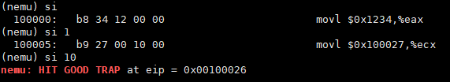
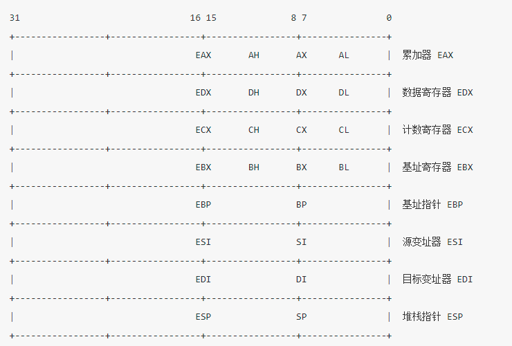

# 南京航空航天大学《计算机组成原理Ⅱ课程设计》报告

* 姓名：马睿

* 班级：1619304

* 学号：161930131

* 报告阶段：PA1.1

* 完成日期：2021.3.22

* 本次实验，我完成了所有内容。

# 目录

[TOC]

## 思考题

### 一、存放的是什么？

*为什么是存放指令的存放地址而不是指令本身呢？*

存放指令的地址可以通过当前指令地址和当前指令长度得到下一条指令地址，从而一直执行下去。否则不知道下一条指令是哪一条。


### 二、贵圈真乱

```
					+---------------------------------+ 
					|      "Hello World" program      |
					+---------------------------------+
					|      	  Abstract Machine        |
					+---------------------------------+ 
					|      Simulated x86 hardware     |
					+---------------------------------+ 
					|               NEMU              |
					+---------------------------------+ 
					|            GNU/Linux            |
					+---------------------------------+ 
					| VirtualBox (Simulated Hardware) |
					+---------------------------------+ 
					|      Host Operating System      |
					+---------------------------------+ 
					|        Computer hardware        |
					+---------------------------------+
```


### 三、虚拟机和模拟器的区别

模拟器其实也是虚拟机的一种，和虚拟机的差别在于，模拟器使用固化的操作系统，不能随意更改操作系统，且结构简单，不能随意添加虚拟硬件设备。


### 四、从哪开始阅读代码呢

从`main`函数开始执行。

应该从`nemu/src/main.c`开始阅读。


### 五、究竟要执行多久

 `void cpu_exec(uint64_t n)`的参数是 64位⽆符号数。当传⼊的参数为`-1`时，它将被解释为64位的⽆符号整数，64位⽆符号整数的最⼤值。

同时，该函数中让`cpu`不断执⾏指令的是⼀个for循环，`for (; n>0 ;n--) `，n非常大时可以保证`cpu`持续不断地执⾏指令，直到执⾏完所有的指令，而避免指令还没执⾏完就提前停止执行。


### 六、谁来指示程序的结束?

`CRT`（显示器）在收到`main`函数返回值后，将这个值传递了`Win32API ExitProcess`，当程序执行这个`API`时，操作系统将终止应用程序并释放整个进程资源，然后进程死亡。


### 七、为什么会这样?

数据的排列顺序分为大端法和小端法。大端法将最高有效字节数据存储在小地址单元中，最低有效字节存放在大地址单元中；小端法相反。

`Linux`采用的是小端法，而将字节进行拆分操作时，是先从低地址位进行获取，所以 4 字节为单位打印和以 1 字节为单位打印时相比，顺序会不一样。


### 八、Git Log截图

在 `pa1` 分⽀下使⽤命令 `git log --oneline` 并截图


### 九、Git Branch截图


### 十、远程git仓库提交截图


## 实验内容

### PA1.1.1 实现寄存器结构体

实现在`nemu/include/cpu/reg.h`中的结构体`CPU_state`：

```c
typedef struct {
  union {
    union {
      unsigned int _32;
      unsigned short _16;
      unsigned char _8[2];
    } gpr[8];
    struct {
      rtlreg_t eax, ecx, edx, ebx, esp, ebp, esi, edi;
    };//这些元素各自使用各自的空间,且每个元素与相应的gpr[i]共用一个地址
  };

  /* Do NOT change the order of the GPRs' definitions. */

  /* In NEMU, rtlreg_t is exactly uint32_t. This makes RTL instructions
   * in PA2 able to directly access these registers.
   */
  union{
    vaddr_t eip;
    unsigned short ip;
  };
  union{
    unsigned int eflags;
    unsigned short flags;
  };
} CPU_state;
```

对于第一个`union`来说，`gpr[i]`中的元素共用一个空间，`gpr[i]`与`gpr[j]`之间使用不同空间（`0<= i,j < 8`）；其次，`struct`中的元素占用不同的空间，而且从左往右来看，每个元素又与其对应的`gpr[i]`共用同一个空间。

剩余的两个`union`同理。


测试样例：

执行`make run`


### PA1.1.2 实现单步执行

声明并定义函数

```c
static int cmd_si(char *args){
  char *arg = strtok(NULL, " ");//因为si指令已经被捕获，所以只需读出数字即可
  int n;
  if (arg){
    n = atoi(arg);
    if (n < -1) {
      printf("Input Digit Error!\n");
      return 0;
    }
  }
  else n = 1;//缺省
  cpu_exec(n);
  return 0;
}
```


将`si`命令加入指令列表中：


测试样例：

`si 1`，`si`，`si -1`，`si 10`




### PA1.1.3 修改⼀次打印步数上限

观察`cpu_exec()`函数（`cpu_exec()` 模拟了 CPU 的工作方式：不断执行指令。）

```c
for (; n > 0; n --) {
    exec_wrapper(print_flag);
```


`exec_wrapper()`函数让 CPU 执行当前 `%eip` 指向的一条指令，然后更新 `%eip`。参数`print_flag`的初始化为`bool print_flag = n < MAX_INSTR_TO_PRINT;`。


```c
if (print_flag) {
    puts(decoding.asm_buf);
}
```

由此可见，如果该值为真，则会执行指令。


所以修改`MAX_INSTR_TO_PRINT`为无限大，则输入所有合法值（`n >= -1`）后，就会根据`n` 一直执行程序，直到`n == 0`。

而`n` 的类型为`unsigned int`，对应的无限大也就是`-1`。


在`nemu\src\monitor\cpu-exec.c`中修改：

```c
#define MAX_INSTR_TO_PRINT -1
```


然后执行命令，`si 5`，`si 10`，`si 15`，`si 1000000`

测试样例：


### PA1.1.4 实现打印寄存器功能

代码实现：

```c
void reg_display(){
  int i;
  for (i = R_EAX; i <= R_EBX; i++){
    printf("%s:\t0x%-8x\t%u\n", regsl[i], reg_l(i), reg_l(i));
    printf("%s:\t0x%-8x\t%u\n", regsw[i], reg_w(i), reg_w(i));
    printf("%s:\t0x%-8x\t%u\n", regsb[i], reg_b(i), reg_b(i));
    printf("%s:\t0x%-8x\t%u\n", regsb[i + 4], reg_b((i + 4)), reg_b((i + 4)));
    printf("\n");
  }
  printf("\n");
  for (; i <= R_EDI; ++i) {
    printf("%s:\t0x%-8x\t%u\n", regsl[i], reg_l(i), reg_l(i));
    printf("%s:\t0x%-8x\t%u\n", regsw[i], reg_w(i), reg_w(i));
    printf("\n");
  }
  printf("\n");
  printf("eip:\t0x%-8x\t%u\n", cpu.eip, cpu.eip);
  printf("ip:\t0x%-8x\t%u\n", cpu.ip, cpu.ip);
  printf("\n");
  printf("eflags:\t0x%-8x\t%u\n", cpu.eflags, cpu.eflags);
  printf("flags:\t0x%-8x\t%u\n", cpu.flags, cpu.flags);
}

static int cmd_info(char *args){
  char *arg = strtok(NULL, " ");
  if(arg == NULL){
    printf("A parameter is missing!\n");
    return 0;
  }
  if (strcmp(arg, "r") == 0){
    reg_display();
  }
  else if (strcmp(arg, "w") == 0) {
  }
  else{
    printf("Unknown command '%s'\n", arg);
  }

  return 0;
}
```


将`cmd_info`命令加入指令列表中：


执⾏命令`info r` ， `si 5` 后再次执⾏`info r`。


### PA1.1.5 实现扫描内存功能

代码实现：

```c
static int cmd_x(char *args){
  char *arg1 = strtok(NULL, " ");
  char *arg2 = strtok(NULL, " ");
  if (arg1 == NULL || arg2 == NULL) {
    printf("A parameter is missing!\n");
    return 0;
  }
  int n = atoi(arg1); //读取要读取的次数
  uint32_t addr = 0;
  sscanf(arg2, "%x", &addr); //读取起始位置
  if (n < 1){
    printf("Invalid arguments for x!\n");
    return 0;
  }
  int i;
  uint32_t data;
  printf("Address         Dword block\n");
  //循环使用 vaddr_read 函数来读取内存
  for (i = 1; i <= n; i++, addr += 4){
    data = vaddr_read(addr, 4);
    printf("0x%08x\t", addr);
    printf("0x%08x\t\n", data);
  }
  return 0;
}
```


> `nemu`的内存通过在 `nemu/src/memory/memory.c` 中定义的大数组 `pmem` 来模拟。
>
> `vaddr_read(vaddr_t addr, int len)`函数用来访问模拟内存，前一个参数是要访问的虚拟地址，后一个是扫描长度。该函数会返回地址中的数据，类型为`unsigned int`。


加入命令列表：


执⾏命令 `x 4 0x100000` 。


### PA1.1.6 实现扫描内存字节单位显示

代码实现：

```c
void byteSequence_dispaly(uint32_t data){
  printf("   ...  ");
  uint32_t byte[4];
  byte[0] = data & 0x000000ff;
  byte[1] = (data & 0x0000ff00) >> 8;
  byte[2] = (data & 0x00ff0000) >> 16;
  byte[3] = (data & 0xff000000) >> 24;
  int i;
  for(i = 0; i < 4; i++){
    printf("%02x ",byte[i]);
  }
  printf("\n");
}


static int cmd_x(char *args){
  char *arg1 = strtok(NULL, " ");
  char *arg2 = strtok(NULL, " ");
  if (arg1 == NULL || arg2 == NULL) {
    printf("A parameter is missing!\n");
    return 0;
  }
  int n = atoi(arg1); //读取要读取的次数
  uint32_t addr = 0;
  sscanf(arg2, "%x", &addr); //读取起始位置
  if (n < 1){
    printf("Invalid arguments for x!\n");
    return 0;
  }
  int i;
  uint32_t data;
  printf("Address         Dword block  ...  Byte sequence\n");
  //循环使用 vaddr_read 函数来读取内存
  for (i = 1; i <= n; i++, addr += 4){
    data = vaddr_read(addr, 4);
    printf("0x%08x\t", addr);
    printf("0x%08x", data);
    byteSequence_dispaly(data);
  }
  return 0;
}
```


执⾏命令 `x 4 0x100000` 


## 遇到的问题及解决办法

在阅读讲义时，看到这个图非常不理解：为什么`EAX`在中间位置，而不是在`31`的地方，以为上方的数字对应其位数。




在请教学长之后知道了：

> `EAX`在中间是因为，它能表示的数据范围是0~31，它在哪个范围内就将其放置在哪个区间的中心位置；
>
> 再例如AH，它在8~15位之间，则它能表示相应的数据，也就是`AX`的高八位。


## 实验心得

- 此次实验让我大开眼界，了解到原来可以用C语言来模拟一台计算机，感觉非常神奇；

- 在阅读代码的同时也让我觉得，一个标准的C语言项目也是需要很深的功底去编写的，而且库函数也很丰富，之前自己在写C程序的时候也就是用了简单的几个库函数；
- 无符号数、位运算、匿名`union`与`struct`的搭配使用，这些都是在之前的程序设计课程上接触的比较少的，这次实验也让我更加了解了它们的一些用法。


## 其他备注

无