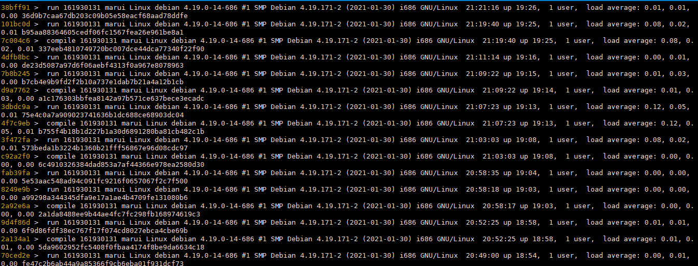
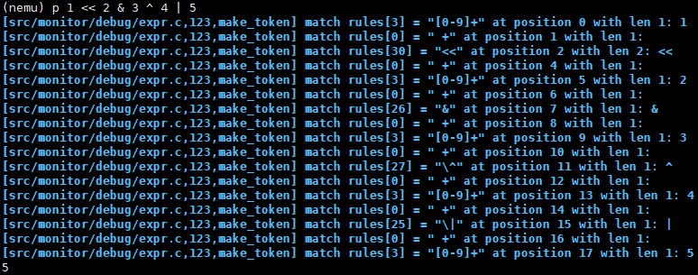

# 南京航空航天大学《计算机组成原理Ⅱ课程设计》报告

* 姓名：马睿

* 班级：1619304

* 学号：161930131

* 报告阶段：PA1.2 & 1.3

* 完成日期：2021.4.6

* 本次实验，我完成了所有内容。

# 目录

[TOC]

## 思考题

### 一、有什么办法？

利用中缀表达式进行求值，最主要是用了两个栈：一个栈用来保存需要计算的数据（操作数栈），一个用来保存计算优先符（运算符栈）。


### 二、一些简单的正则表达式

- 以 `0x` 开头的 `32` 位十六进制整数

  `0x[a-fA-F0-9]{1,8}`


- 英文字母和数字组成的字符串

  `[a-fA-Z0-9]+`


- C 语言中的变量名或函数名（也就是符合变量的命名规则）

  `[a-fA-Z_]+[a-fA-F0-9_]* `


- 学号 - 姓名 - PA1.1.pdf，如 `161722222 - 张三 - PA1.1.pdf`。（提示： `[\u4e00-\u9fa5]` 将匹配一个汉字）

  `[0-9]{9} - [\u4e00-\u9fa5]{1，5} - PA1.1.pdf`


### 三、这是为什么？

因为`C`语言的字符串里`\`也是转义字符，想要用`C`语言表示正则表达式中的转义字符`\`，需要用`\\`来表示。


### 四、如何处理以上的问题？

在将输入表达式字串存储在字符串中之前，判断长度是否大于`31`，如果大于则显示错误信息，然后终止程序。


### 五、递归求值的过程？

如果表达式中存在子表达式，那么先对子表达式进行递归操作再运算，直到表达式为一个数时终止递归，并返回值表达式的值。

例如：

```c
	4+3*(2+1)
--> 4	+	3*(2+1)
    expr + expr
--> 4	+	3	*	(2+1)
    expr + expr * expr
--> 4	+	3	*	(2	 +	1)
    expr + expr * (expr + expr)
--> 4	+	3	*	(2	 +1)
    expr + expr * (expr + number)    
--> 4	+	3	*	(2+1)
    expr + expr * (number + number)
--> 4	+	3	*3
    expr + expr * number
--> 4	+	3*3
    expr + number * number
--> 4	+9
    expr + number
--> 4+9
    number + number
--> 13
    number
```


### 六、体验监视点

```
watch [-l|-location] expr [thread-id] [maskvalue]
为一个表达式设置一个监视点。当表达式expr被程序写入且其值发生变化时，GDB将中断。

rwatch [-l|-location] expr [thread-id] [maskvalue] 。
设置一个监视点，当程序读取 expr 的值时，该监视点将中断。

awatch [-l|-location] expr [thread-id] [maskvalue] 。
设置一个监视点，当程序读取或写入expr时，该监视点将被中断。
```


注意事项：

- 如果命令中包含`[thread-id]`参数，那么只有当标识的线程改变了`expr`的值时，`GDB`才会中断。如果任何其他线程改变了 `expr` 的值，`GDB`将不会中断。

- 参数`-location`告诉`GDB`监视由`expr`引用的内存。在这种情况下，`GDB`将计算`expr`，获取结果的地址，并监视该地址处的内存。结果的类型用来确定观察内存的大小。如果表达式的结果没有地址，那么`GDB`将打印一个错误。

- `[mask maskvalue]`参数允许创建掩码监视点。掩码指定在将下位机访问的地址与监视点地址进行匹配时，应忽略地址的某些位（掩码中被重置的位）。因此，一个带掩码的监视点会同时监视多个地址--那些未被掩码的位与监视点地址中未被掩码的位相同的地址。

- 如果你要监视一个以数字形式输入的地址的变化，你需要对它进行反引用，因为地址本身只是一个永远不会改变的常数。`GDB`拒绝创建一个监视一个永不变化的值的看点。

  ```
  (gdb) watch 0x600850
  不能观察常量值 0x600850
  
  (gdb) watch *(int *) 0x600850
  Watchpoint 1: *(int *) 6293584
  ```

  

- 当监视本地（自动）变量或涉及此类变量的表达式超出范围时，也就是当执行离开定义这些变量的块时，`GDB`会自动删除监视点。特别是，当被调试的程序终止时，所有的局部变量都会离开范围，因此只有监视全局变量的监视点仍然被设置。如果你重新运行程序，需要重新设置所有这样的观察点。一种方法是在主函数的入口处设置一个代码断点，当主函数断点时，设置所有的监视点。


```
							生成可执行文件
touch test.c
vim test.c
gcc -g test.c -o test   编译

							gdb常用命令
							
gdb test 用gdb执行test
r or run：执行程序
c or continue：继续运行程序
start：单步执行，运行程序，停在第一执行语句

1、默认情况下，run 指令会一直执行程序，直到执行结束。如果程序中手动设置有断点，则 run 指令会执行程序至第一个断点处；
2、start 指令会执行程序至 main() 主函数的起始位置，即在 main() 函数的第一行语句处停止执行（该行代码尚未执行）。
可以这样理解，使用 start 指令启动程序，完全等价于先在 main() 主函数起始位置设置一个断点，然后再使用 run 指令启动程序。另外，程序执行过程中使用 run 或者 start 指令，表示的是重新启动程序。
```

1. 使用适当的 `GDB` 命令新建两个监视点：

`watch $eip`，`watch $eax`


2. 使用`GDB` 命令显示当前所有监视点的列表：

`info watchpoints 或 i watchpoints 或 i watch`


3. 运行程序，使程序命中监视点至少一次


4. 使用 `GDB `命令删除任意一个之前设置的监视点：

`d 2 或 delete 2`，其中2是指监视点的`Num`（见上图）


5. 不退出 `GDB`，重新运行程序，使程序不能在被删除的监视点上命中。

`run 或 r 或 start`


### 七、科学起名

`stdlib.h`中定义了`free`函数，使用 `free` 来作为头指针的名字。


### 八、温故而知新

此处`static`的作用是声明作用域，静态全局变量只能在定义该变量的源文件内有效，其它源文件中不能使用它。

### 九、 一点也不能长？

指令的长度是 1 个字节是必须的。

如果替换断点指令的长度超过1个字节，可能会被迫覆盖下一条指令的一部分，这将使该指令乱码，并可能产生完全无效的指令。


### 十、“随心所欲”的断点

如果把断点设置在指令的非⾸字节，`gdb`会停⽌进程并且意外退出。 

1. 先生成可执行文件`gcc -g test.c -o test`
2. 用`gdb`执行调试可执行文件：`gdb test`
3. 查看指令地址`layout asm`


4. 开启程序：`start`


5. 设置断点：`b *0x4011c9`


6. 运行程序：`c`


原因分析：断点如果设置在非⾸字节，那么在指令的⾸字节就不会检测到断点，就会继续执行。但是原指令发生了变化，导致一个新的指令，该指令的具体操作可能产生异常，所以退出。


### 十一、NEMU的前世今生

模拟器是用于模拟一个系统内部并实现其功能的软件，而调试器是一种用于调试其它程序的计算机程序及工具。

`gdb`主要功能的实现基于系统函数`ptrace`，该函数可以让父进程观察和控制其子进程的检查、执行。


### 十二、尝试通过目录定位关注的问题


### 十三、理解基础设施

`GDB`：500 * 0.9 * 20 * 30 = 4500min = 75h

简易调试器：75 / 3 = 25h

节省了50小时


### 十四、查阅i386手册

1. `EFLAGS`寄存器中的CF位是什么意思：进位标志

   P33 ~ 34

   


2. `ModR/M`字节是什么：里面包含操作码并指定操作数是在寄存器中还是在内存中。

P38 ~ 39


P241 ~ 242


3. `mov`指令的具体格式是怎么样的：P345 ~ P351


### 十五、shell 命令

包含空行：

```shell
find . -name *.[ch] |xargs cat|wc -l
```

得到完成`PA1`后的总行数：4264

切换到`master`分支得到框架的总行数：3497

编辑`Makefile`文件：


去除空行：

```shell
find . -name *.[ch] |xargs cat|grep -v ^$|wc -l
```

得到完成`PA1`后的总行数：3568

切换到`master`分支得到框架的总行数：2826


### 十六、使用`man`

```shell
CFLAGS   += -O2 -MMD -Wall -Werror -ggdb $(INCLUDES)
```


1. `man gcc`，再利用`/想要搜索的关键字`进行搜索，按`n`查看下一条，`N`查看上一条

2. `/-Werror`

   

   作用：要求`gcc`将所有的警告当成错误进行处理

   

   `/-Wall`
             

   作用：打开`gcc`的所有警告。

使用两者的目的：

1. 详细查错
2. 把警告直接当作错误处理，避免在之后会引起其他错误的出现。


### 十七、`git log`和远程git仓库提交截图





## 实验内容

`PA1.2`：除了`cmd_p`命令加在`nemu/src/debug/ui.c`外，其余都加在`nemu/src/debug/expr.c`中


### PA1.2.1 编写匹配规则(1) + (2)

注意：

​	先检测16进制，再检测10进制，否则`0x`会被当做`0 `和`x`。（`!=` 要写在`!`前面......）

```c
enum {
  TK_NOTYPE = 256,
  TK_EQ,
  TK_HEX,
  TK_DEC,
  /*TK_EAX,
  TK_EBX,
  TK_ECX,
  TK_EDX,
  TK_EDI,
  TK_ESI,
  TK_EBP,
  TK_ESP,
  TK_EIP,*/
  TK_REG,
  TK_NQ,
  TK_AND,
  TK_OR,
  TK_MINUS,//负号
  TK_DEREF,//指针解引用
  TK_LE,
  TK_GE,
  TK_ML,
  TK_MR
};

static struct rule {
  char *regex;
  int token_type;
} rules[] = {
    {" +", TK_NOTYPE},    // spaces
  	{"==", TK_EQ},         // equal
	{"0x[0-9a-fA-F]{1,8}", TK_HEX}, //先检测16进制，再检测10进制，否则0x会被当做0  x
	{"[0-9]+", TK_DEC},
	/*{"\\$eax", TK_EAX},
  	{"\\$ebx", TK_EBX},
  	{"\\$ecx", TK_ECX},
  	{"\\$edx", TK_EDX},
  	{"\\$edi", TK_EDI},
  	{"\\$esi", TK_ESI},
  	{"\\$ebp", TK_EBP},
  	{"\\$esp", TK_ESP},
  	{"\\$eip", TK_EIP},*/
	{"\\$[a-zA-Z]{2,3}", TK_REG},    
    {"\\(", '('},
  	{"\\)", ')'},
    {"\\+", '+'},
    {"-", '-'},
  	{"\\*", '*'},
 	{"/", '/'},
    {"!=", TK_NQ},
  	{"&&", TK_AND},
  	{"\\|\\|", TK_OR},
  	{"!", '!'},
    
    {"~", '~'},
    {"%", '%'},
    {"\\|", '|'},
    {"&", '&'},
    {"\\^", '^'},
    {"<=", TK_LE},
    {">=", TK_GE},
    {"<<", TK_ML},
    {">>", TK_MR},
    {"<", '<'},
    {">", '>'}
};
```


### PA1.2.2 添加 p命令

声明并定义函数

```c
static int cmd_p(char * args);
...
static int cmd_p(char * args){
    bool success = true;
   	uint32_t value = expr(args,&success);
   	if(success){
		printf("%u\n", value);
	}    
    return 0;
}
```


将`p`命令加入指令列表中：

```c
static struct {
  char *name;
  char *description;
  int (*handler) (char *);
} cmd_table [] = {
  {"help", "Display informations about all supported commands", cmd_help },
  { "c", "Continue the execution of the program", cmd_c },
  { "q", "Exit NEMU", cmd_q },
  { "si","Usage: si [N]\n"\
          "     Execute the program with N(default: 1) step", cmd_si },
  { "info", "Show information about registers with argument 'r' and show information about watchpoint with argument 'w'", cmd_info},
  { "x", "Usage: x [N] [EXPR]\n" \
      "    Calculate the value of the expression EXPR, and output N consecutive 4 bytes starting from EXPR in hexadecimal form", cmd_x },
  { "p", "Usage: p [EXPR]\n" "    Calculate the value of the expression EXPR", cmd_p},
  /* TODO: Add more commands */
};
```


测试样例：


### PA1.2.3 识别并存储 token

完善`make_token`：

```c
static bool make_token(char *e) {
  	int position = 0;
  	int i;
  	regmatch_t pmatch;
	if(e == NULL) return false;
  	nr_token = 0;

   	while (e[position] != '\0') {
	    /* Try all rules one by one. */	
        for (i = 0; i < NR_REGEX; i ++) {
            if (regexec(&re[i], e + position, 1, &pmatch, 0) == 0 && pmatch.rm_so == 0) {
            char *substr_start = e + position;
            int substr_len = pmatch.rm_eo;

            Log("match rules[%d] = \"%s\" at position %d with len %d: %.*s",
                i, rules[i].regex, position, substr_len, substr_len, substr_start);
            position += substr_len;

            /* TODO: Now a new token is recognized with rules[i]. Add codes
             * to record the token in the array `tokens'. For certain types
             * of tokens, some extra actions should be performed.
             */
			if(substr_len >= 32){
                printf("%.*s  The length of the substring is too long.\n", substr_len, substr_start);
                //在用*%.\*s*时,后面跟着两个参数,一个表示输出数据占得位置的大小,一个表示要输出的内容
                return false;
			}

			if(nr_token >= 32) {
				printf("The count of tokens(nr_token) is out of the maximum count(32)\n");
                return false;
		}
            switch (rules[i].token_type) {
                case TK_NOTYPE: 
                    break;
                case TK_DEC:
                case TK_HEX:
                    strncpy(tokens[nr_token].str, substr_start, substr_len);
                    tokens[nr_token].str[substr_len] = '\0';
                    
                default:
                    tokens[nr_token].type = rules[i].token_type;
                    nr_token++;
                    break;
            }
                
            break;
            }
        }

        if (i == NR_REGEX) {	
            printf("no match at position %d\n%s\n%*.s^\n", position, e, position, "");
            return false;
        }
    }

    return true;
}
```


测试样例：

`p 1 + 0x2/3 - (!3 && (4 || 5))`


`p -1 == (*$eip != $eip)`


### PA1.2.4 实现括号匹配

思路：

​	先看左右括号以及数量是否匹配，如果符合，则再看最外层有没有被`()`包含；

​	最后再看去除最外层的`()`后，其余的括号是否匹配


代码实现：

```c
bool check_parentheses(int, int);
bool check_parentheses(int p, int q){
    bool lr = false;
    if (tokens[p].type == '(' && tokens[q].type == ')'){
        lr = true;
    }
    int i, l = 0;//l用来记录左括号的数量
    for(i = p; i <= q; i++){// 先看括号是否匹配
        if(tokens[i].type == '(')  l++;
		else if(tokens[i].type == ')')	l--;
        if(l < 0){
            /*右括号先出现，如())*/
            printf("Bad Expression!\n");
			assert(0);            
        }
    }
    if(l != 0){//左括号数量 > 右
		printf("Bad Expression!\n");
		assert(0);           
    }
    
    /*括号匹配，但是最外层没有()
    	4 + 3 * (2 - 1)
    */
    if(!lr) return false; 

    /*考虑这种情况
    	(4 + 3) * (2 - 1)
    */
    //此时 l == 0
    q-- , p++;
	
    for(i = p; i <= q; i++){
        if(tokens[i].type == '(')  l++;
		else if(tokens[i].type == ')')	l--;
        if(l < 0){
            return false;
        }
    }
    return true;
}
```


测试样例：

`p (2 - 1)`


`p (4 + 3 * (2 - 1))`


`p 4 + 3 * (2 - 1)`


`p (4 + 3)) * ((2 - 1)`


`p (4 + 3) * (2 - 1)`


### PA1.2.5 寻找当前子表达式的中心操作符

思路：

​	先判断是否为运算符；如果是，判断它的等级，等级高于已经遍历过的运算符，则跳过；如果小于等于，则重新赋值；特殊情况：当运算符是单目运算符的时候，最左面的优先级最小。
​			检测到左括号，则一直跳过，直到找到右括号。 注意：不会存在括号不匹配的情况，如果存在程序已经终止


代码实现：

```c
int op_priority(int op){ //获取运算符优先级
	int level;
	switch (op) {
		case TK_OR:// ||
			level = 1;
			break;
		case TK_AND:// &&
			level = 2;
			break;
        case '|':
        	level = 3;
            break;
        case '^':
        	level = 4;
            break;
        case '&':
        	level = 5;
            break;
		case TK_EQ:// ==  !=
		case TK_NQ:
			level = 6;
			break;
        case '<':
        case '>':
        case TK_LE:
        case TK_GE:
        	level = 7;
            break;
        case TK_ML:
        case TK_MR:
        	level = 8;
            break;        
		case '+':
		case '-':
			level = 9;
			break;
		case '*':
		case '/':
        case '%':
			level = 10;
            break;	
		case TK_DEREF:// 解引用
        case TK_MINUS:// 负号
        case '!':
        case '~':
			level = 11;//level == 11 一般都是单目运算符
			break;	
		default://不会出现，因为在使用正则表达式匹配时会扫描该运算符存不存在
			assert(0);
	}	
	return level;
}

int compare(int i, int pos){
	int priorityi = op_priority(tokens[i].type);
	int prioritypos = op_priority(tokens[pos].type);
    if(priorityi == prioritypos && prioritypos == 11) return 1;//如果是单目运算符，则最前面的优先级最小(即递归要从最前面的运算符开始)
	return priorityi - prioritypos; 
}

bool is_op(int ch){//是否为运算符
	return ch == '+' || ch == '-' || ch == '*' || ch == '/'
			|| ch == '!' || ch == TK_AND || ch == TK_OR || ch == TK_EQ || ch == TK_NQ || ch == TK_DEREF || ch == TK_MINUS || ch == '|' || ch == '&' || ch == '^' || ch == '<' || ch == '>' || ch == TK_LE || ch == TK_GE || ch == TK_ML || ch == TK_MR || ch == '%' || ch == '~';
}

int find_dominated_op(int p, int q){
	/*先判断是否为运算符
	如果是，判断它的等级，等级高于已经遍历过的运算符，则跳过；如果小于等于，则重新赋值；
	检测到（，则一直跳过，直到找到）  注意：不会存在括号不匹配的情况，如果存在程序已经终止 
	*/
	int pos = -1, i, opType, l = 0;//l 进行括号匹配 
	for(i = p; i <= q; i++){
		opType = tokens[i].type;

		if(l == 0 && is_op(opType)){
			if(pos == -1 || compare(i, pos) <= 0) pos = i; //如果是第一个运算符，或者i的优先级小于等于pos的
		}
		else if(opType == '(') l++;
		else if(opType == ')') l--;
	}
    return pos;
}
```


### 选做任务：带有负数的表达式求值

思路：

​	判断`-`的前一个`token`的类型是不是寄存器、数字、右括号，如果是则`-`不是负号

​	如果`-`是第一个`token`，则也是负号


代码实现：

```c
bool opEvalMinus(int op){
    switch(op){
		case TK_OR:// ||
		case TK_AND:// &&
		case TK_EQ:// ==  !=
		case TK_NQ:
		case '+':
		case '-':
		case '*':
		case '/':
        case '(':
        case '!':
        case '|':
        case '&':
        case '^':
        case '<':
        case '>':
        case '%':
        case '~':
        case TK_LE:
        case TK_GE:
        case TK_ML:
        case TK_MR:
        case TK_DEREF:
        case TK_MINUS:// 负号
            return true;              
		default:
     		return false;
    }
}

uint32_t expr(char *e, bool *success) {
    if (!make_token(e)) {
    *success = false;
    return 0;
	}
/* TODO: Implement code to evaluate the expression. */
    int i;
    for (i = 0; i < nr_token; i ++) {
       	if (tokens[i].type == '-' && (i == 0 || opEvalMinus(tokens[i - 1].type) )) {
           	tokens[i].type = TK_MINUS;
        }
    }
}
```


测试样例

`p 1 + -1`


`p --1`


`p --1---1`


### PA1.2.6 实现指针解引用

思路：

​	判断`*`的前一个`token`的类型是不是寄存器、数字、右括号，如果是则`*`不是指针解引用

​	如果`*`是第一个`token`，则也是指针解引用


代码实现：

```c
bool opEvalDeref(int op){
    switch(op){
		case TK_OR:// ||
		case TK_AND:// &&
		case TK_EQ:// ==  !=
		case TK_NQ:
		case '+':
		case '-':
		case '*':
		case '/':
        case '(':
        case '!':
        case '|':
        case '&':
        case '^':
        case '<':
        case '>':
        case '%':
        case '~':
        case TK_LE:
        case TK_GE:
        case TK_ML:
        case TK_MR:            
        case TK_DEREF:
        case TK_MINUS:// 负号
            return true;             
		default:
     		return false;
    }
}

uint32_t expr(char *e, bool *success) {
    if (!make_token(e)) {
    *success = false;
    return 0;
	}
/* TODO: Implement code to evaluate the expression. */
    ...
    for (i = 0; i < nr_token; i ++) {
        if (tokens[i].type == '*' && (i == 0 || opEvalDeref(tokens[i - 1].type))) {
            tokens[i].type = TK_DEREF;
        }
    }
}
```


测试样例：

`p *$eip`


`p -*$eip`


### PA1.2.7 实现表达式求值

思路：

​	`p == q`：如果是寄存器、十进制、十六进制数，则直接返回相应的值，此时肯定达到了递归终止的条件

​	如果成功匹配括号，则对括号内的表达式递归求值

​	否则，找到表达式中优先级最低的运算符位置，然后根据其单目 / 双目计算子表达式。


​	其次，在表达式求值之前，要先判断 `* ` 是乘法还是指针解引用、 `-`是减法还是负号。


代码实现：

```c
uint32_t is_reg(char *str){
    int i;
    for(i = R_EAX; i <= R_EDI; ++ i) {
		if(strcmp(str, regsl[i]) == 0) return reg_l(i);
	}
	for(i = R_AX; i <= R_DI; ++ i){
		if(strcmp(str, regsw[i]) == 0) return reg_w(i);
	}
	for(i = R_AL; i <= R_BH; ++ i){
		if(strcmp(str, regsb[i]) == 0) return reg_b(i);
	}
    if(strcmp(str, "eip") == 0) return cpu.eip;
    printf("Reg doesn't exit!\n");
    assert(0);
}

uint32_t eval(int p, int q) {
  	if (p > q) {
		printf("Wrong: p > q\n");
		assert(0);
  	}
    else if(p == q){
		switch (tokens[q].type) {
/*      		case TK_EAX:
       			return cpu.eax;
            case TK_EBX:
                return cpu.ebx;
            case TK_ECX:
                return cpu.ecx;
            case TK_EDX:
                return cpu.edx;
            case TK_EDI:
                return cpu.edi;
            case TK_ESI:
                return cpu.esi;
            case TK_EBP:
                return cpu.ebp;
            case TK_ESP:
                return cpu.esp;
            case TK_EIP:
                return cpu.eip;*/
            case TK_REG:
                return is_reg(tokens[q].str + 1);
            case TK_DEC:
                return atoi(tokens[p].str);
            case TK_HEX:
                uint32_t hexNum = 0;
                sscanf(tokens[p].str, "%x", &hexNum);
                return hexNum;
            default:
                assert(0);
    	}
    }
    else if(check_parentheses(p, q) == true) {
        return eval(p + 1, q - 1);
    }
    else {
        int op, val1, val2;
        op = find_dominated_op(p, q);
        if(op == p){//单目运算
            switch (tokens[op].type) {
                case '~':
                    return ~eval(op + 1, q);
                case TK_MINUS:
                    return -eval(op + 1, q);
        		case '!':
                    return !eval(op + 1, q);
        		case TK_DEREF:
                    return vaddr_read(eval(op + 1, q), 4);
        		default:
                    assert(0);
    		}
        }
        val1 = eval(p, op - 1);
        val2 = eval(op + 1, q);
        switch (tokens[op].type) {//双目运算
            case '+':
                return val1 + val2;
            case '-':
                return val1 - val2;
            case '*':
                return val1 * val2;
            case '/':
                return val1 / val2;
            case '%':
                return val1 % val2;
            case '|':
                return val1 | val2;
            case '&':
                return val1 & val2;
            case '<':
                return val1 < val2;   
            case '>':
                return val1 > val2;
            case '^':
                return val1 ^ val2;                 
            case TK_EQ:
                return val1 == val2;
            case TK_NQ:  
                return val1 != val2;
            case TK_AND:
                return val1 && val2;
            case TK_OR:
                return val1 || val2;
            case TK_LE:
                return val1 <= val2;
            case TK_GE:
                return val1 >= val2;
            case TK_ML:
                return val1 << val2;
            case TK_MR:
                return val1 >> val2;
            default: 
                assert(0);
    	}
    }
    return 0;//其实不会执行到这个
}

uint32_t expr(char *e, bool *success) {
	if (!make_token(e)) {
		*success = false;
		return 0;
  	}
    int i;
    for (i = 0; i < nr_token; i ++) {
        if (tokens[i].type == '*' && (i == 0 || opEvalDeref(tokens[i - 1].type)) {
            tokens[i].type = TK_DEREF;
        }
    }
    for (i = 0; i < nr_token; i ++) {
        if (tokens[i].type == '-' && (i == 0 || opEvalMinus(tokens[i - 1].type)) {
            tokens[i].type = TK_MINUS;
        }
    }
  	return eval(0, nr_token - 1);
}
```


测试样例：

先执行`info r`


再执行`p $eax`


`p $eip == 0x100000`


`p *$eip`


`p 2 * ($eax + $ebx)`


`p ~0xffffffff % 3 >> 1`


`p 1 << 2 & 3 ^ 4 | 5`




`p 1 >=2 || 4<=3 || 5>6 || 7<8`


其他运算符样例已经在前面的任务中展示。


### 选做任务：实现x命令使用表达式求值

修改`cmd_x`函数，返回表达式表示的值

```c
static int cmd_x(char *args){
    char *arg1 = strtok(NULL, " ");
  	char *arg2 = strtok(NULL, " ");
    if (arg1 == NULL || arg2 == NULL) {
        printf("A parameter is missing!\n");
        return 0;
    }
  	int n = atoi(arg1); //读取要读取的次数

  	if (n < 1){
    	printf("Invalid arguments for x!\n");
    	return 0;
  	}
   	char *arg3 = strtok(NULL, " ");
	while(arg3 != NULL){
		strcat(arg2, arg3);
		arg3 = strtok(NULL, " ");
	}
    
  	int i;
  	uint32_t data, addr;
   	bool success = true;
	addr = expr(arg2, &success);
	if(!success) return 0;
  	printf("Address         Dword block  ...  Byte sequence\n");
  	//循环使用 vaddr_read 函数来读取内存
  	for (i = 1; i <= n; i++, addr += 4){
    	data = vaddr_read(addr, 4);
    	printf("0x%08x\t", addr);
    	printf("0x%08x", data);
  	  	byteSequence_dispaly(data);
  	}
  	return 0;
}
```


测试样例：

`x 4 0x100000`


`x 4 $eip`


在此之后先将`make_token()`函数中的`Log`语句注释了，不然会输出许多匹配正则表达式的信息。


### PA1.3.1 监视点结构体

修改`nemu\include\monitor\watchpoint.h`

```c
typedef struct watchpoint
{
  int NO; //监视点的序号
  struct watchpoint *next;
  char expr[32];
  uint32_t new_val;
  uint32_t old_val;
  uint8_t type;//0 is watchpoint, 1 is breakpoint，为后续的软件断点准备
} WP;

WP* new_wp();
void free_wp(WP *wp);
```


### PA1.3.2 监视点池的管理

修改`nemu\src\monitor\debug\watchpoint.c`

```c
WP* new_wp(){
    if(free_ == NULL) {
		printf("There is no more memory to set watchpoint. You should delete some watchpoints to free memory.\n");
		return NULL;
	}
    WP* p = free_;
	free_ = free_->next;
    p->next = head;
    head = p;
    return head;
}

void free_wp(WP *wp){
    if(head == NULL){
		printf("There is no watchpoint to free.\n");
		return ;
	}
    if(wp == head){
		head = head->next;
		wp->next = free_;
		free_ = wp;	
		return ;
	}
    WP *p = head;
	while(p->next != wp) p = p->next;
	p->next = wp->next;
	wp->next = free_;
	free_ = wp;
}
```


### PA1.3.3 监视点加入调试器

修改`nemu\src\monitor\debug\ui.c`

1. `w` 命令：根据给予的表达式 `expr` 设置一个新的监视点

```c
在 ui.c 中声明
static int cmd_w(char *args);
static int cmd_d(char *args);

static int cmd_w(char *args){
    char *arg1 = strtok(NULL, " ");
    if(arg1 == NULL){
        printf("A parameter is missing!\n");
        return 0;
    }
    char *arg2 = strtok(NULL, " ");
	while(arg2 != NULL){
		strcat(arg1, arg2);
		arg2 = strtok(NULL, " ");
	}
    
    int NO = set_watchpoint(arg1);
    if(NO != -1){
        bool success = true;
    	printf("Set watchpoint #%d\n", NO);
  		printf("expr      = %s\n", args);
        printf("old value = 0x%08x\n", expr(args, &success));
    }
    return 0;
}
```


2. `d` 命令：根据给予的监视点编号 `NO` 删除该监视点：

```c
static int cmd_d(char *args)
{
  	char *arg = strtok(NULL, " ");
	if(arg == NULL){
        printf("A parameter is missing!\n");
        return 0;        
    }
  	int NO = atoi(args);
    if(NO < 0){
        printf("Invalid arguments for d!\n");
        return 0;           
    }
  	if(delete_watchpoint(NO)){
        printf("Watchpoint/breakpoint %d deleted\n", NO);
    }
	else{
        printf("Watchpoint/breakpoint %d not found\n", NO);
    }
  	return 0;
}
```


3. `info w` 命令：显示当前所有监视点

```c
static int cmd_info(char *args){
	char *arg = strtok(NULL, " ");
    if(arg == NULL){
        printf("A parameter is missing!\n");
    	return 0;
  	}
  	if (strcmp(arg, "r") == 0){
    	reg_display();
  	}
  	else if (strcmp(arg, "w") == 0) {
        list_watchpoint();
  	}
  	else{
    	printf("Unknown command '%s'\n", arg);
  	}
  	return 0;
}
```


在`src/monitor/cpu-exec.c`的`cpu_exec`函数调用`scan_watchpoint`，并引入头文件`monitor/watchpoint.h`

```c
void cpu_exec(uint64_t n)
{
	...

  	for (; n > 0; n--){
    /* Execute one instruction, including instruction fetch,
     * instruction decode, and the actual execution. */
    	exec_wrapper(print_flag);

#ifdef DEBUG
        WP *p = scan_watchpoint();
    	if (p){
            printf("Hit watchpoint %d at address %#010x\n", p->NO, cpu.eip);
      		printf("expr      = %s\n", p->expr);
      		printf("old value = 0x%08x\n", p->old_val);
      		printf("new value = 0x%08x\n", p->new_val);
      		printf("promgram paused\n");
            p->old_val = p->new_val;
      		nemu_state = NEMU_STOP;
      		return;
    	}
#endif
	...
  	}
	...
}
```


将`cmd_w`、`cmd_d`添加到命令列表：

```c
static struct {
  char *name;
  char *description;
  int (*handler) (char *);
} cmd_table [] = {
  	...
    { "info", "Show information about registers with argument 'r' and show information about watchpoint with argument 'w'", cmd_info},
  	{ "w", "Usage: w [EXPR]\n" "    set watchpoint for the [EXPR].", cmd_w},
    { "d", "usage: d [N]\n" "    delete watchpoint whose id is N", cmd_d},
};
```


### PA1.3.4 监视点主要功能

修改`nemu\src\monitor\debug\watchpoint.c`：

```C
在 watchpoint.c 中声明
int set_watchpoint(char *e);    //给予一个表达式e，构造以该表达式为监视目标的监视点，并返回编号
bool delete_watchpoint(int NO); //给予一个监视点编号，从已使用的监视点中归还该监视点到池中
void list_watchpoint(void);     //显示当前在使用状态中的监视点列表
WP* scan_watchpoint(void);      //扫描所有使用中的监视点，返回触发的监视点指针，若无触发返回NULL

int set_watchpoint(char *e){
    WP* wp = new_wp();
    if(wp == NULL) return -1;
    memset(wp->expr, 0, sizeof(wp->expr));
    strcpy(wp->expr, e);
    wp->type = 0;
    bool success = true;
    wp->old_val = expr(e, &success);
	if(!success){
		printf("set watchpoint failed. Please check your exprssion!\n");
		free_wp(wp);
        return -1;
	}
    return wp->NO;
}

bool delete_watchpoint(int NO)
{
  	WP *wp = head;
  	while (wp && wp->NO != NO){
    	wp = wp->next;
  	}
  	if (wp){
    	free_wp(wp);
    	return true;
  	}
  	else  return false;
}

void list_watchpoint(void)
{
  	if(head == NULL) {
		printf("There is no watchpoints!\n");
		return;
	}
  	printf("NO  Expr            Old Value\n");
  	WP *p = head;
  	while (p) {
    	if (p->type == 0) {
      		printf("%2d  %-16s%#010x\n", p->NO, p->expr, p->old_val);
    	}
        
    	p = p->next;
  	}
}

WP* scan_watchpoint(){
    WP *p = head;
    bool success;
    uint32_t new_value = 0;
    while(p){
        if(p->type == 0){
        	success = true;
        	new_value = expr(p->expr, &success);
        	if(p->old_val != new_value){
            	p->new_val = new_value;
            	return p;
        	}
        }
        p = p->next;
    }
    return NULL;
}
```


测试样例：

`w $eax`，`w $eip`，`info w`，`d 1`，`info w`


`c`


### PA1.3.5 使用模拟断点


### 选做任务 实现软件断点

参考`http://www.voidcn.com/article/p-sdcuyscy-bme.html`和`https://eli.thegreenplace.net/2011/01/27/how-debuggers-work-part-2-breakpoints`

#### 硬件中断和软件中断

硬件中断：通常是专用的电信号，附加了特殊的“响应电路”。该电路注意到中断的激活，并使CPU停止其当前执行，保存其状态，并跳转到该中断的处理程序所在的预定义地址。处理程序完成工作后，CPU从停止处恢复执行。

软件中断在原理上与之相似。


#### INT 3 指令

INT 3指令生成一个特殊的一字节操作码（CC），用于调用调试异常处理程序。（此一个字节的形式很有价值，因为它可用于用断点替换任何指令的第一个字节，包括其他一个字节的指令，而不会覆盖其他代码）。

要在跟踪的进程中的某个目标地址处设置断点，调试器将执行以下操作：

1. 记住存储在目标地址中的数据

2. 将目标地址的第一个字节替换为int 3指令（指令码均替换为 `0xcc`）

   

然后，当调试器要求OS运行该进程时，该进程将运行并最终到达`int3`处，它将停止并由OS发送一个信号。这是调试器再次进入的地方，接收到其子级（或跟踪的进程）已停止的信号。然后：

1. 将目标地址处的int 3指令替换为原始指令
2. 将跟踪的进程的==指令指针减 1== 。这是必要的，因为该指令指针现在指向`INT 3`的下一条指令。
3. 允许用户以某种方式与流程进行交互，因为流程仍在所需的目标地址处暂停。这是调试器允许您窥视变量值，调用堆栈等的部分。
4. 当用户希望继续运行时，调试器将负责将断点放回目标地址（因为在步骤1中已将其删除），除非用户要求取消断点。（可能该处是循环）

断点异常（INT 3）属于陷阱类异常，当CPU产生异常时，其程序指针是指向导致异常的下一条指令的，==因为导致该异常的指令已经执行完成==。但是，现在我们观察到的结果却是指向导致异常的这条指令的。这是为什么呢？简单地说，是操作系统为了支持调试对程序指针做了调整。


先完成第一个任务：程序开始运行时（`c` 命令或 `si x` 命令），根据当前断点列表中所存储信息，将列表中的地址上的指令码均替换为 `0xcc`，并保存该地址上实际字节；

```c
在 watchpoint.c 中引入 memory/memory.h 头文件
int set_breakpoint(char *e)
{
    WP* wp = new_wp();
    if(wp == NULL) return -1;
    memset(wp->expr, 0, sizeof(wp->expr));
    wp->type = 1; //断点
    bool success = true;
    
    wp->old_val = expr(e, &success); //old_value保存 设置断点的地址（程序执行到该地址处中断）
	if(!success){
		printf("set breakpoint failed. Please check your exprssion!\n");
		free_wp(wp);
        return -1;
	}
	wp->new_val = 0;
    /*初始为0；
    当程序到达断点之后（注意是之后），此时需要将eip - 1。这是必要的，因为该eip现在指向断点的后一个指令，并将new_val设置为2
    当值为2的时候，要恢复断点（可能该处是循环等情况），再将其值设置为0
    */
  	*wp->expr = *(char *)guest_to_host(wp->old_val);//expr保存原来的操作码
    
    /*
    #define guest_to_host(p) ((void *)(pmem + (unsigned)p))
    convert the guest physical address in the guest program to host virtual address in NEMU 
    */
  	*(char *)guest_to_host(wp->old_val) = 0xcc;//从内存中修改断点地址对应的操作码（机器指令中，第一个字节就是操作码）为0xcc

  	return wp->NO;
}

static int cmd_b(char *args)
{
    char *arg1 = strtok(NULL, " ");
    if(arg1 == NULL){
        printf("A parameter is missing!\n");
        return 0;
    }
    char *arg2 = strtok(NULL, " ");
	while(arg2 != NULL){
		strcat(arg1, arg2);
		arg2 = strtok(NULL, " ");
	}
    
    int NO = set_breakpoint(arg1);
    if(NO != -1){
        bool success = true;
        uint32_t address = expr(args, &success);
    	printf("Set breakpoint #%d\n", NO);
  		printf("address   = %#010x\n", address);
        printf("old value = 0x%08x\n", vaddr_read(address, 4));
    }
    return 0;
}
```

加入到命令列表

```c
static struct {
  char *name;
  char *description;
  int (*handler) (char *);
} cmd_table [] = {
  	...
    {"b", "b EXPR:set a breakpoint for eip as the value of EXPR", cmd_b},
};
```


`d`命令只需修改一下`printf`语句即可：

```c
static int cmd_d(char *args){
   ...
   printf("Watchpoint/breakpoint %d deleted\n", NO); 
}
```


再完成第二个任务：程序命中 `0xcc` 指令码时，`NEMU` 执行 `int3` 的指令处理函数。处理函数的逻辑为：将原有指令替换回所有被 `int3` 所占据的位置，并设置 `nemu_state` 变量为 `NEMU_STOP` 。


设置`0xcc`指令码的指令处理函数，在`nemu/src/cpu/exec/exec.c`中（从`PA2`得知）

（先了解一下`opcode_entry`的定义）

```c
typedef struct {
  DHelper decode;// typedef void (*DHelper) (vaddr_t *);
  EHelper execute;// typedef void (*EHelper) (vaddr_t *);
  int width;
  /*译码函数, 执行函数, 以及操作数宽度*/
  /*通过查表的方式得知这条指令的操作数和操作码。这个过程叫译码*/
} opcode_entry;
```


找到对应的译码查找表数组`opcode_table`，这一张表通过操作码 `opcode` 来索引，每一个 `opcode` 对应相应指令的译码函数, 执行函数, 以及操作数宽度。


找到操作码`0xcc`的位置，设置执行函数（程序命中 `0xcc` 指令码时，`NEMU` 执行 `int3` 的指令处理函数）

```c
opcode_entry opcode_table [512] = {
    ...
/* 0xcc */  EX(int3), EMPTY, EMPTY, EMPTY,
    
    /*
    该文件中有以下的宏定义
    #define EXW(ex, w)         {NULL, concat(exec_, ex), w}
	#define EX(ex)             EXW(ex, 0)
	#define EMPTY              EX(inv)
	
	所以EX(int3) == EXW(int3, w) == {NULL, concat(exec_, int3), w}
	                            == {NULL, exec_int3, w}
    */
    
    ...
}
```


因为还有如下的宏定义：

```c
#define make_EHelper(name) void concat(exec_, name) (vaddr_t *eip)
```

所以，`exec_int3()` 函数得通过宏 `make_EHelper` 来定义


```c
在src/cpu/exec/all-instr.h 中声明该函数！！
引用 monitor/watchpoint.h 、monitor/monitor.h 头文件
在src/cpu/exec/system.c中定义
    
make_EHelper(int3) {
    /*int3 指令的执行函数
    根据上方的宏定义，等价于 exec_int3(vaddr_t *eip){}
    */
  	print_asm("Breakpoint (eip = %0#10x)", cpu.eip);
  	printf("\33[1;31mnemu: HIT BREAKPOINT\33[0m at eip = %0#10x\n\n", cpu.eip);
    //上面两个输出仿照nemu/src/cpu/exec/special.c 的 make_EHelper(nemu_trap) 函数
  	recover_int3();
  	nemu_state = NEMU_STOP;
}
```

```c
声明在 watchpoint.h 中
引入 cpu/reg.h
定义 在watchpoint.c 因为要head指针
void recover_int3() {
  	WP *p = head;
	while (p) {
    	if (p->type == 1 && p->old_val == cpu.eip){//到了断点位置
      		*(char *)guest_to_host(p->old_val) = *p->expr;//恢复
            p->new_val = 1;
      		break;
    	}
    	p = p->next;
  	}
}
```


修改`scan_watchpoint`函数

```c
WP* scan_watchpoint(){
  WP *p = head;
  bool success;
  uint32_t new_value = 0;
  while(p){
    if(p->type == 0){
      success = true;
      new_value = expr(p->expr, &success);
      if(p->old_val != new_value){
        p->new_val = new_value;
        return p;
      }
    }
    else{
      if(p->new_val == 1){//eip回退1
        cpu.eip -= 1;
        p->new_val = 2;
      }
      else if(p->new_val == 2){
        *p->expr = *(char *)guest_to_host(p->old_val);
        *(char *)guest_to_host(p->old_val) = 0xcc;
        p->new_val = 0;
      }
    }
    
    p = p->next;
  }
  return NULL;
}

```


## 遇到的问题及解决办法

1. 在switch的case中声明变量出现的错误：


​	由于`switch`的几个case语句在同一个作用域（因为`case` 语句只是标签，它们共属于一个`swtich`语句块），所以如果在某个`case`下面声明变量的话，对象的作用域是在俩个花括号之间 也就是整个`switch`语句，其他的`case`语句也能看到，这样的话就可能导致错误。


​	解决方案：在`case`语句后边加大括号


2. `eip=0x00100006`处的指令未实现。


原因：在检测到断点后，`eip`指向断点指令的后一条指令，不应该从该处继续进行程序。

解决方法：在检测到断点==之后==，将`eip`回退1。


3. 问题：`gdb` 中添加监视点`w i`时，显示`No symbol “***” in current context`

   原因：`gcc`与`gdb`的版本不匹配

   解决方法：下载`gdb-8.3`

## 实验心得

这次实验花费了好长时间，时间主要花在了表达式的括号匹配和软件断点模块。

括号匹配并不是非常难，但是要考虑各种情况，不仅仅是简单的检测左括号是否有相应右括号匹配。

最最耗时间的就是软件断点模块了，这个模块涉及到一些更底层的代码，例如如何找到指令码、如何添加执行函数、如何修改指令码等，除了讲义外还要查阅许多信息。

最后成功的做出了所有任务，还是比较有成就感的。

## 其他备注

无