# 南京航空航天大学《计算机组成原理Ⅱ课程设计》报告

* 姓名：马睿

* 班级：1619304

* 学号：161930131

* 报告阶段：PA2.1

* 完成日期：2021.4.23

* 本次实验，我完成了所有内容。

# 目录

[TOC]

## 思考题

### 一、增加了多少？

包括了一条指令的内容：操作码和操作数


### 二、是什么类型？

表项是`opcode_entry`结构体类型

```c
typedef struct {
  DHelper decode;  
  //译码函数指针  typedef void (*DHelper) (vaddr_t *);
  EHelper execute;
  //执行函数指针  typedef void (*EHelper) (vaddr_t *);
  int width; //操作数长度
} opcode_entry;
```

`NEMU`通过这个表项中的值得知操作数长度、译码函数、执行函数等信息的。


### 三、操作数结构体的实现

```C
typedef struct {
  uint32_t type; //操作数类型
  int width; //操作数长度
  union {
    uint32_t reg; //寄存器寻值
    rtlreg_t addr; //内存寻值
    uint32_t imm; //无符号立即数
    int32_t simm; //有符号立即数
  };
  rtlreg_t val; //操作数解码后的值，即通过union获取到的值
  char str[OP_STR_SIZE]; //操作数的字符串表示
} Operand;
```


### 四、复现宏定义

```c
make_EHelper(mov)
    void concat(exec_, mov) (vaddr_t *eip) --> 
    void exec_mov (vaddr_t *eip)
    
make_EHelper(push)
    void exec_push (vaddr_t *eip)
    
make_DHelper(I2r)
    void decode_I2r (vaddr_t *eip)
    
IDEX(I2a, cmp)
    IDEXW(I2a, cmp, 0) -->
    {concat(decode_, I2a), concat(exec_, cmp), 0} -->
	{decode_I2a, exec_cmp, 0}
    
EX(nop)
    EXW(nop, 0)-->
    {NULL, concat(exec_, nop), 0}
	{NULL, exec_nop, 0}
    
make_rtl_arith_logic(and)
	static inline void concat(rtl_, and) (rtlreg_t* dest, const rtlreg_t* src1, const rtlreg_t* src2) { *dest = concat(c_, and) (*src1, *src2); } \
	static inline void concat3(rtl_, and, i) (rtlreg_t* dest, const rtlreg_t* src1, int imm) { *dest = concat(c_, and) (*src1, imm); }

-->
    
   	static inline void rtl_and(rtlreg_t* dest, const rtlreg_t* src1, const rtlreg_t* src2) { *dest = c_and(*src1, *src2);} \
	static inline void rtl_andi(rtlreg_t* dest, const rtlreg_t* src1, int imm) { *dest = c_and(*src1, imm); } 
```


### 五、立即数背后的故事

需要注意的问题：数据是大端存储还是小端存储，需要如何读取

第一种情况：大端存储，小端方式读取

第二种情况：小端存储，大端方式读取

对于这两种情况，需要将读取的字节序列逆序存储。


### 六、神奇的 eflags

这里的溢出是指两个数运算的结果超出其类型所能表示的范围，如果只用仅为标志位 `CF` 是不可以代替 `OF` 的功能的，例如，`1 + -1 = 0`没有产生溢出，但是有进位。

如何获取`OF`的值：判断两个数得到其相应的补码后符号位是否相同，再判断结果的符号位是否与其相同，满足前者但不满足后者时，`OF = 1`；否则为0。


### 七、Git Branch 和  Git Log 截图

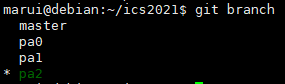

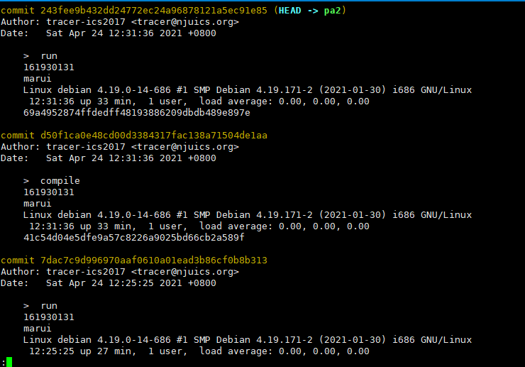

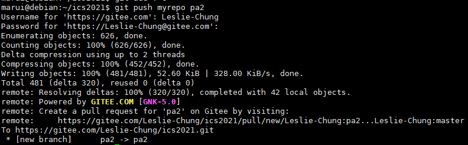


## 实验内容

### PA2.1.1 实现标志寄存器

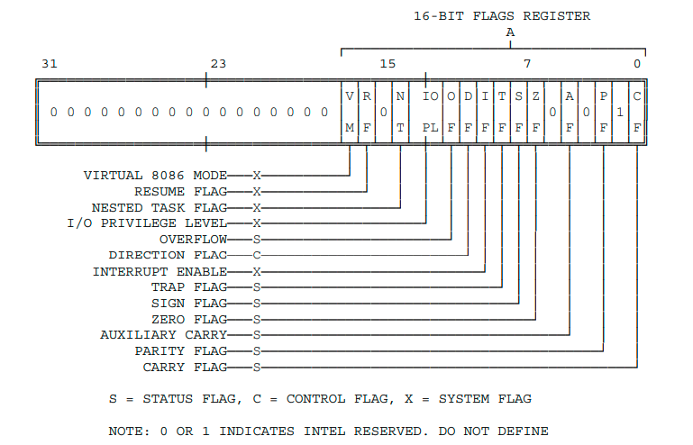

利用位域，实现`EFLAGS`寄存器，根据上图为每个符号位由低到高设置位域

修改`nemu/include/cpu/reg.h`

```c
typedef struct {
...
    struct{
        uint32_t CF :1;
        uint32_t ONE :1;
        uint32_t :4;
        uint32_t ZF :1;
        uint32_t SF :1;
        uint32_t :1;
        uint32_t IF :1;
        uint32_t :1;
        uint32_t OF :1;
        uint32_t :20;
      } eflags;
} CPU_state;
```


并在`nemu/src/monitor/monitor.c`的`restart`函数中初始化，根据`i386`手册的`P174`声明，`EFLAGS`应该初始化位`0x2`：

```c
引入头文件stdlib.h
#include <stdlib.h> 
...
static inline void restart() {
    cpu.eip = ENTRY_START;

	unsigned a = 0x2;
  	memcpy(&cpu.eflags,&a,sizeof(cpu.eflags));
    ...
}
```

实现所有指令对标志位的设置在任务2中实现。


### PA2.1.2 实现所有 RTL 指令

修改`nemu/include/cpu/rtl.h`

```c
static inline void rtl_mv(rtlreg_t* dest, const rtlreg_t *src1) {//mov
  *dest = *src1;
}

static inline void rtl_not(rtlreg_t* dest) {//按位取反
  *dest = ~(*dest);
}

static inline void rtl_sext(rtlreg_t* dest, const rtlreg_t* src1, int width) { 
  // dest <- signext(src1[(width * 8 - 1) .. 0])，符号扩展
  //width是src1的宽度
  int32_t val = *src1;
  *dest = (val << (32 - width * 8)) >> (32 - width * 8);
  //左移判断操作数最高位是否为1，再进行算术右移，实现符号位扩展
}

static inline void rtl_push(const rtlreg_t* src1) {
  cpu.esp -= 4;
  vaddr_write(cpu.esp, 4, *src1);
}

static inline void rtl_pop(rtlreg_t* dest) {
  *dest = vaddr_read(cpu.esp, 4);
  cpu.esp += 4;
}

static inline void rtl_eq0(rtlreg_t* dest, const rtlreg_t* src1) {
  *dest = *src1 == 0 ? 1 : 0;
}

static inline void rtl_eqi(rtlreg_t* dest, const rtlreg_t* src1, int imm) {
  *dest = *src1 == imm ? 1 : 0;
}

static inline void rtl_neq0(rtlreg_t* dest, const rtlreg_t* src1) {
  *dest = *src1 != 0 ? 1 : 0;
}

static inline void rtl_msb(rtlreg_t* dest, const rtlreg_t* src1, int width) {
  // dest <- src1[width * 8 - 1]，获取最高有效位
  *dest  = (*src1 >> (width * 8 - 1)) & 0x1;
}

static inline void rtl_update_ZF(const rtlreg_t* result, int width) {
  // eflags.ZF <- is_zero(result[width * 8 - 1 .. 0])
  t0 = *result << (32 - width * 8);
  cpu.eflags.ZF = t0 ? 0 : 1;
}

static inline void rtl_update_SF(const rtlreg_t* result, int width) {
  // eflags.SF <- is_sign(result[width * 8 - 1 .. 0])
  unsigned flag = *result  & 0x1 << (width * 8 - 1);
  cpu.eflags.SF = flag ? 1 : 0;
}


#define make_rtl_setget_eflags(f) \
  static inline void concat(rtl_set_, f) (const rtlreg_t* src) { \
     cpu.eflags.f = *src\
  } \
  static inline void concat(rtl_get_, f) (rtlreg_t* dest) { \
     *dest = cpu.eflags.f;\
  }
```


### PA2.1.3 实现 6 条 x86 指令

参考：`i386`手册`P414`的`One-Byte Opcode Map`；其中操作码的高阶四位作为操作码表中某一行的索引表的索引；低阶四位作为该表的列的索引。

操作数由形式为`Zz`的两个字符代码来识别。前一个字母指定寻址方法，后一个字母指定操作数的类型。见`P412`


#### call

##### 指令概述

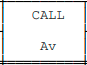

A代表直接地址：指令没有`modR/M`字节；操作数的地址被编码在指令中（立即数）；没有基数寄存器、索引寄存器或比例因子可以应用

v代表字或双字，取决于操作数的属性。


`i386`手册对应内容`P275`：

```
Opcode   Instruction   Clocks   
E8  cd    CALL rel32    7+m 

Description ：Call near, displacement relative to next instruction

rel32    表示32位相对地址

cd 是扩展操作码
```


##### 指令实现

添加表项，因为操作数是直接地址，所以译码函数使用`make_DHelper(I)`；操作数为4个字节

```c
/* 0xe8 */  IDEXW(J, call, 4), EMPTY, EMPTY, EMPTY,
```

使用`make_DHelper(J)`，还需要完善`decode_op_SI`，修改`nemu/src/cpu/decode/decode.c`

```c
static inline make_DopHelper(SI) {
  assert(op->width == 1 || op->width == 4);

  op->type = OP_TYPE_IMM;

  t0 = instr_fetch(eip, op->width);
  rtl_sext(&t0, &t0, op->width);
  op->simm = t0;
  rtl_li(&op->val, op->simm);

#ifdef DEBUG
  snprintf(op->str, OP_STR_SIZE, "$0x%x", op->simm);
#endif
}
```


`CALL`指令的实现步骤：

1. 将返回地址入栈（`PUSH`）
2. 跳转到指定地址处执行，将 `decoding.is_jmp` 设为 `1`, 并将 `decoding.jmp_eip` 设为跳转目标地址来实现


修改`nemu/src/cpu/exec/control.c`

```c
make_EHelper(call) { 
  rtl_push(eip); //eip == decoding.seq_eip
  decoding.is_jmp = 1;

  print_asm("call %x", decoding.jmp_eip);
}
```


在 `nemu/src/cpu/exec/all-instr.h` 中声明执行函数

`make_EHelper(call)`


成功：

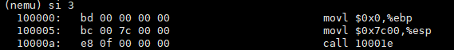


#### push

##### 指令概述

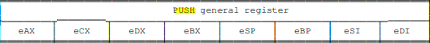


`i386`手册对应内容`P367`：

```
Opcode		Instruction 	Clocks 	Description
50 + /r 	  PUSH r32 		  2 	Push register dword

r32 == reg32 == 32位寄存器
```

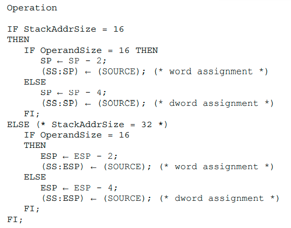


##### 指令实现

添加表项，因为操作数是寄存器，所以译码函数使用`make_DHelper(r)`；又因为该指令横跨了8个字节，所以要占用`0x50~0x57`

```c
/* 0x50 */	IDEX(r, push), IDEX(r, push), IDEX(r, push), IDEX(r, push),
/* 0x54 */	IDEX(r, push), IDEX(r, push), IDEX(r, push), IDEX(r, push),
```


`PUSH`指令的实现步骤：

1. `R[esp] <-- R[esp] - 4`
2. 将一个双字从指定寄存器送到`M[R[esp]]`中

即`rtl_push`操作


修改`nemu/src/cpu/exec/data-mov.c`：

```c
make_EHelper(push) {
  rtl_push(&id_dest->val);

  print_asm_template1(push);
}
```


在 `nemu/src/cpu/exec/all-instr.h` 中声明执行函数

`make_EHelper(push)`


成功：

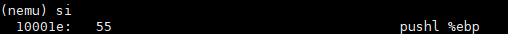


#### pop

##### 指令概述

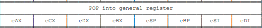


`i386`手册对应内容`P361`：

```
Opcode		Instruction 	Clocks 		
58 + rd 	  POP r32 		  4 

Description：Pop top of stack into dword registe
```

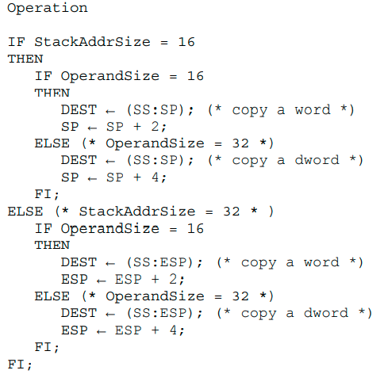


##### 指令实现

添加表项，因为操作数是寄存器，所以译码函数使用`make_DHelper(r)`；又因为该指令横跨了8个字节，所以要占用`0x58~0x5f`

```c
/* 0x58 */  IDEX(r, push), IDEX(r, push), IDEX(r, push), IDEX(r, push),
/* 0x5c */  IDEX(r, push), IDEX(r, push), IDEX(r, push), IDEX(r, push),
```


`POP`指令的实现步骤：

1. 将一个双字从`M[R[esp]]`中取出送到指定寄存器
2. `R[esp] <-- R[esp] + 4`

即`rtl_pop`操作


修改`nemu/src/cpu/exec/data-mov.c`：

```c
make_EHelper(pop) {
  rtl_pop(&t0); // 将M[R[esp]]的值赋给t0
  operand_write(id_dest, &t0); // 将t0 的值送到指定寄存器中
  print_asm_template1(pop);
}
```


在 `nemu/src/cpu/exec/all-instr.h` 中声明执行函数

`make_EHelper(push)`


成功：

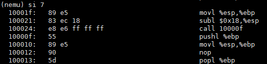


#### sub

##### 指令概述

不带借位的减法指令，`sbb`为带借位的减法指令

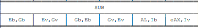

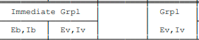

数据传输方向：`Eb <-- Gb`

一个寄存器当寄存器的宽度取决于操作数的属性时，可以使用`eXX`形式的寄存器标识符，如`eAX`表示`AX`或`EAX`。


`i386`手册对应内容`P404`：

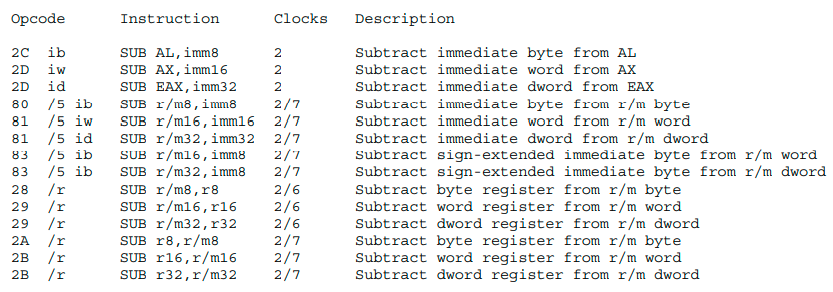

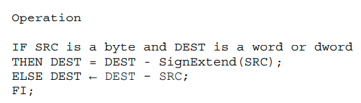

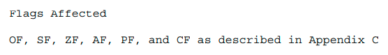


对于`0x28~0x2b`，因为操作数是寄存器 到 `r/m`，所以译码函数使用`make_DHelper(G2E)`；

对于`0x2c~0x2d`，因为操作数是立即数 到 `EAX/AX/AL`，所以译码函数使用`make_DHelper(I2a)`；


对于`0x80、0x81、0x83`，是一个指令组`gp1`，`sub`指令的扩展操作码为`101`，所以在第6个位置，对应的译码函数和宽度已经给出，所以只需要添加执行函数即可


##### 指令实现

添加表项：

```c
0x28、0x2a、0x2c的操作数为字节，0x29、0x2b、0x2d的为w/d
0x80~0x81 /5 的操作数为b/w/d

/* 0x28 */  IDEXW(G2E, sub, 1), IDEX(G2E, sub), IDEXW(E2G, sub, 1), IDEX(E2G, sub),
/* 0x2c */  IDEXW(I2a, sub, 1), IDEX(I2a, sub), EMPTY, EMPTY,

/* 0x80 */	IDEXW(I2E, gp1, 1), IDEX(I2E, gp1), EMPTY, IDEX(SI2E, gp1), //该代码已经给出

/* 0x80, 0x81, 0x83 都是gp1*/
make_group(gp1,
    EMPTY, EMPTY, EMPTY, EMPTY,
    EMPTY, EX(sub), EMPTY, EMPTY)
```


`SUB`指令的实现步骤：

1. 如果`src` 是 `b` 且 `dest` 是 `w/d`，则对`src`进行符号扩展

2. `dest = dest - src`，并更新标志位

修改`nemu/src/cpu/exec/arith.c`

```c
make_EHelper(sub) {
  if (id_src->width == 1 && id_dest->width >= 2){
    rtl_sext(&id_src->val, &id_src->val, id_dest->width);
  }

  rtl_sub(&t2, &id_dest->val, &id_src->val); // t2 = dest->val - src->val 
  rtl_sltu(&t3, &id_dest->val, &t2);         // t3 = dest->val < dest->val - src->val 正常情况下是0，如果借位为1
  operand_write(id_dest, &t2);               // dest->reg = t2 或 dest->mem = t2

  rtl_update_ZFSF(&t2, id_dest->width); //更新ZF 和 SF

  rtl_set_CF(&t3);                   // 判断是否有借位

  //减法时，两个数的符号相异才可能溢出
  rtl_xor(&t0, &id_dest->val, &id_src->val); // t0 = dest->val ^ src->val，判断dest和src最高位是否相异，相异为1
  rtl_xor(&t1, &id_dest->val, &t2);          // t1 = dest->val ^ (dest->val - src->val)，判断dest和结果最高位是否相异，相异为1
  rtl_and(&t0, &t0, &t1);                    // t0 = t0 & t1
  rtl_msb(&t0, &t0, id_dest->width);         // 获取t0的最高有效位（8*width - 1）
  rtl_set_OF(&t0);                           // 判断是否溢出

  print_asm_template2(sub);
}
```


在 `nemu/src/cpu/exec/all-instr.h` 中声明执行函数

`make_EHelper(sub)`


成功：

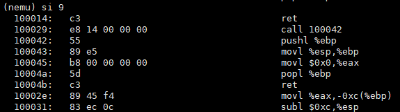


#### xor

##### 指令概述

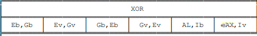


`i386`手册对应内容`P411`：

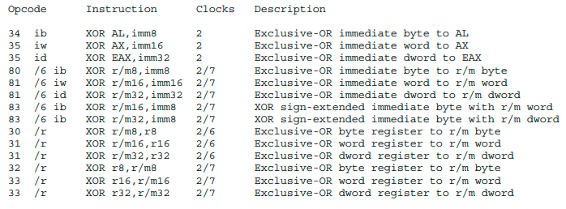

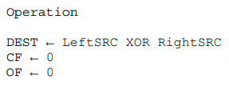

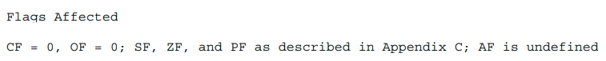


对于`0x30~0x33`，因为操作数是寄存器 到 `r/m`，所以译码函数使用`make_DHelper(G2E)`；

对于`0x34~0x35`，因为操作数是立即数 到 `EAX/AX/AL`，所以译码函数使用`make_DHelper(I2a)`；


对于`0x80、0x81、0x83`，是一个指令组`gp1`，`xor`指令的扩展操作码为`110`，所以在第7个位置，对应的译码函数和宽度已经给出，所以只需要添加执行函数即可


##### 指令实现

添加表项：

```c
/* 0x30 */	IDEXW(G2E, xor, 1), IDEX(G2E, xor), IDEXW(E2G, xor, 1), IDEX(E2G, xor),
/* 0x34 */	IDEXW(I2a, xor, 1), IDEX(I2a, xor), EMPTY, EMPTY,

/* 0x80, 0x81, 0x83*/
make_group(gp1,
    EMPTY, EMPTY, EMPTY, EMPTY,
    EMPTY, EX(sub), EX(xor), EMPTY)
```


`XOR`指令的实现步骤：

1. `dest = leftsrc ^ rightsrc`
2. `CF = 0, OF = 0`

修改`nemu/src/cpu/exec/logic.c`

```c
make_EHelper(xor) {
  rtl_xor(&t0, &id_dest->val, &id_src->val);
  operand_write(id_dest, &t0);

  rtl_update_ZFSF(&t0, id_dest -> width);
  
  // CF = 0, OF = 0
  t1 = 0;
  rtl_set_CF(&t1);
  rtl_set_OF(&t1);
  
  print_asm_template2(xor);
}
```


在 `nemu/src/cpu/exec/all-instr.h` 中声明执行函数

`make_EHelper(xor)`


`dummy`中没有该指令


#### ret

##### 指令概述


`i386`手册对应内容`P378`：

```
Opcode		Instruction 	Clocks 		Description
C3 			  RET 			10+m 		Return (near) to caller
```

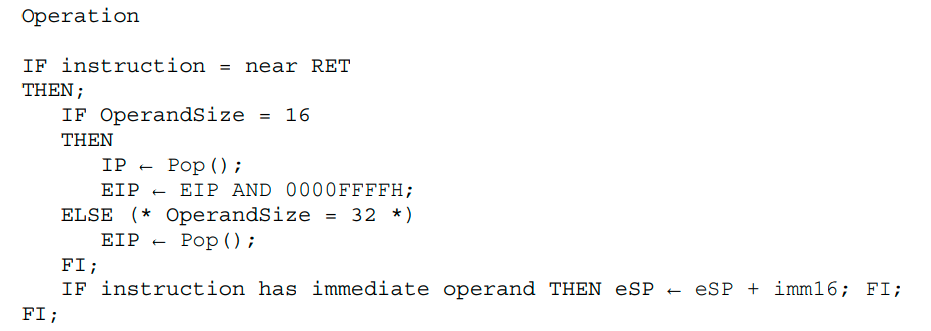


##### 指令实现

因为无操作数，所以不需要译码函数

添加表项：

```c
/* 0xc0 */	IDEXW(gp2_Ib2E, gp2, 1), IDEX(gp2_Ib2E, gp2), EMPTY, EX(ret),
```


`RET`指令的实现步骤：

将返回地址从栈顶取出（`POP`），并送到`EIP`寄存器中

修改`nemu/src/cpu/exec/control.c`

```c
make_EHelper(ret) {
  rtl_pop(&decoding.jmp_eip);
  decoding.is_jmp = 1;
  
  print_asm("ret");
}
```


在 `nemu/src/cpu/exec/all-instr.h` 中声明执行函数

`make_EHelper(ret)`


成功：

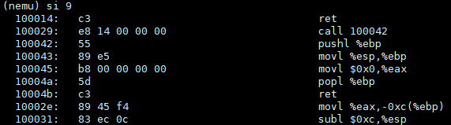


### PA2.1.4 成功运行 dummy

在完成上述六条指令后，运行`dummy`得到：

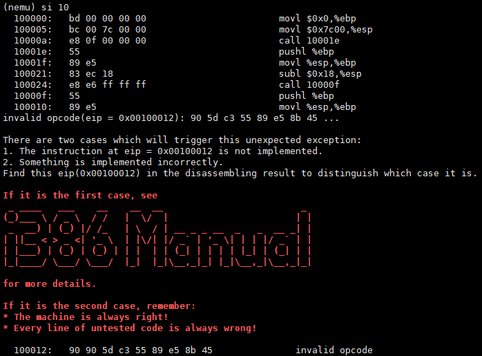

打开`dummy-x86-nemu.txt`并对比报错信息，发现还要加入`nop`指令


#### nop

##### 指令概述

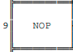

`i386`手册对应内容`P355`：

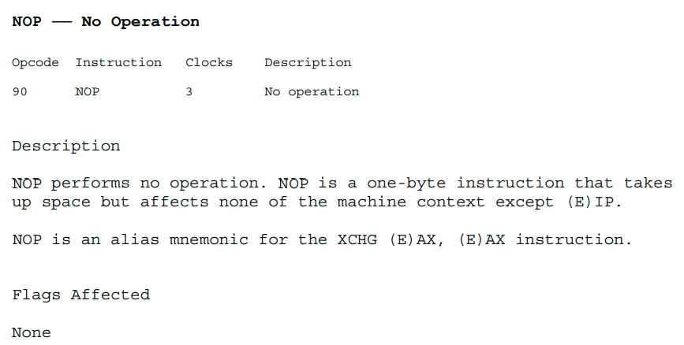


##### 指令实现

什么都不操作，所以直接添加表项即可

```c
/* 0x90 */	EX(nop), EMPTY, EMPTY, EMPTY,
```

在 `nemu/src/cpu/exec/all-instr.h` 中声明执行函数

`make_EHelper(nop)`


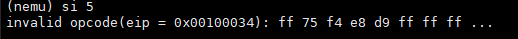

实现之后发现，还要加入`grp5`中的`push`指令


#### grp5

##### 指令实现

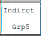

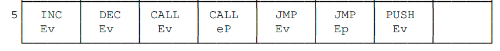

`push`指令的扩展操作码为`110`，所以在第7个位置，对应的译码函数和宽度已经给出，所以只需要添加执行函数即可

```c
/* 0xff */
make_group(gp5,
    EMPTY, EMPTY, EMPTY, EMPTY,
    EMPTY, EMPTY, EX(push), EMPTY)
```


最终运行成功

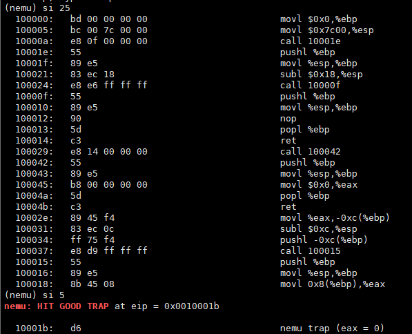


### PA2.1.5 实现 Diff-test

在`NEMU`中执行完一条指令后， 把 `NEMU` 的 8 个通用寄存器和 `eip` 与从 `QEMU` 中读出的寄存器的值进行比较, 如果发现值不一样, 就输出相应的提示信息, 并将 `diff` 标志设置为 `true`

```c
void difftest_step(uint32_t eip) {
  ...
  if (cpu.eax != r.eax) {
    printf("eax error!!!    nemu: %#010x    qemu: %#010x\n", cpu.eax, r.eax);
    diff = true;
  }
  if (cpu.ecx != r.ecx) {
    printf("ecx error!!!    nemu: %#010x    qemu: %#010x\n", cpu.ecx, r.ecx);
    diff = true;
  }
  if (cpu.edx != r.edx) {
    printf("edx error!!!    nemu: %#010x    qemu: %#010x\n", cpu.edx, r.edx);
    diff = true;
  }
  if (cpu.ebx != r.ebx) {
    printf("ebx error!!!    nemu: %#010x    qemu: %#010x\n", cpu.ebx, r.ebx);
    diff = true;
  }
  if (cpu.esp != r.esp) {
    printf("esp error!!!    nemu: %#010x    qemu: %#010x\n", cpu.esp, r.esp);
    diff = true;
  }
  if (cpu.ebp != r.ebp) {
    printf("ebp error!!!    nemu: %#010x    qemu: %#010x\n", cpu.ebp, r.ebp);
    diff = true;
  }
  if (cpu.esi != r.esi) {
    printf("esi error!!!    nemu: %#010x    qemu: %#010x\n", cpu.esi, r.esi);
    diff = true;
  }
  if (cpu.edi != r.edi) {
    printf("edi error!!!    nemu: %#010x    qemu: %#010x\n", cpu.edi, r.edi);
    diff = true;
  }

  if (cpu.eip != r.eip) {
    printf("eip error!!!    nemu: %#010x    qemu: %#010x\n", cpu.eip, r.eip);
    diff = true;
  }
  ...
}
```

然后将`common.h`中宏定义注释符删除

```c
#define DIFF_TEST
```


运行程序：

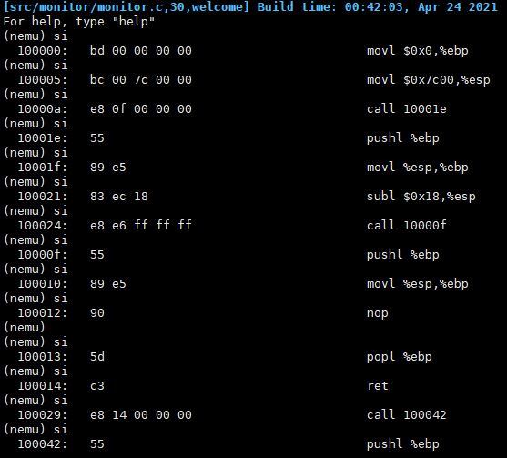

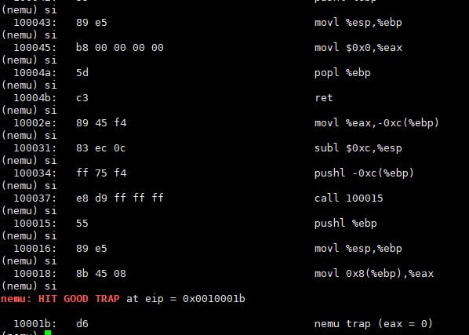


## 遇到的问题及解决办法

1. 问题：函数未实现

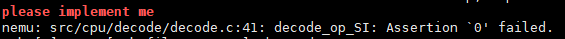

实现该函数时，发现`call`指令的译码函数可以用`make_DHelper(J)`，于是将原来的代码进行了修改

之前的代码如下：

```c
/* 0xe8 */  IDEXW(I, call, 4), EMPTY, EMPTY, EMPTY,
make_EHelper(call) { //CALL [NEAR PTR] DST
  // the target address is calculated at the decode stage
  rtl_push(eip);
  decoding.is_jmp = 1;
  rtl_add(&decoding.jmp_eip, eip, &id_dest->val);

  print_asm("call %x", decoding.jmp_eip);
}
```

修改后的代码已在实验内容中体现


2. 问题：指令实现有误

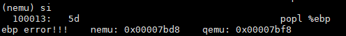

在实现 `Diff-test` 并运行程序后，出现了这样的错误，在请教学长之后发现，`pop`指令实现的有问题，没有将 `M[R[esp]]` 中的值送入到指定的寄存器，而仅仅是将其读取了出来，修改代码后运行成功。以下是原先的代码：

```c
make_EHelper(pop) {
  rtl_pop(&id_dest->val);

  print_asm_template1(pop);
}
```

误以为`id_dest->val`就是指定的寄存器，应该通过`id_dest->reg 和 id_dest->width `找到其正确的寄存器


## 实验心得

因为在`PA1.2 & 1.3`中的软件断点处接触了指令的一些知识，所以这次入手较快一些。相比之前的内容，这次所要实现的功能更加细致化，出错率更高了，必须要仔细阅读讲义，尤其是`i386`手册的相关内容；调试也更难、更需要技巧了。

在实现 `Diff-test` 并运行程序后，发现程序出了问题，起初觉得是自己实现的有问题，但是看了好久之后觉得没有问题，应该是`QEMU`的代码有问题，然后请教学长，利用`x 4 0x7bd8`命令查看后发现确实是自己实现的有问题，以后应该时刻牢记：给出的框架是没有问题的！！！


## 其他备注

无