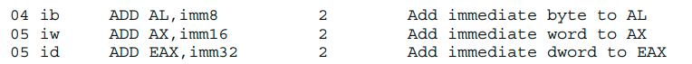
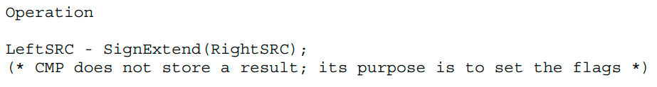
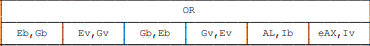
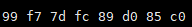
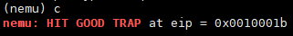
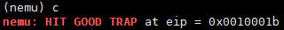
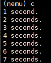
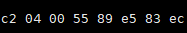

# 南京航空航天大学《计算机组成原理Ⅱ课程设计》报告

* 姓名：马睿

* 班级：1619304

* 学号：161930131

* 报告阶段：PA2.2&2.3

* 完成日期：2021.5.15

* 本次实验，我完成了所有内容。

# 目录

[TOC]

## 思考题

### 一、什么是 API？

`API`（`Application Programming Interface`，应用程序接口）是一些预先定义的接口（如函数、HTTP接口），或指软件系统不同组成部分衔接的约定。用来提供应用程序与开发人员基于某软件或硬件得以访问的一组例程，而又无需访问源码，或理解内部工作机制的细节。


### 二、AM 属于硬件还是软件？

我认为`AM`属于硬件，它是一个理论模型，在硬件的基础上把这些计算机相关的需求抽象成统一的`API`提供给软件，为程序运行提供了最基本的软件支持。

我认为`AM`和操作系统类似，操作系统是直接运行在硬件之上的，是一个系统软件，提供了对应用软件的支持；而`AM`也是运行在`NEMU`上的软件，提供`API`给程序，如讲义里所说，它是描述的是`ISA`, 是不同`ISA`的抽象。


### 三、堆和栈在哪里?

堆的空间和栈是在运行时从内存中进行分配的（运行时可执行目标文件与虚拟地址空间进行存储器映像）：

堆在可读写数据段后面`4KB`对齐的高地址处，通过`malloc`库函数动态向高地址分配空间；栈则是从用户空间的最大地址往低地址方向增长。

因为它们会动态地、频繁地发生变化，所以没有放入可执行文件里面。


### 四、回忆运行过程

* 读取`$(AM_HOME)/Makefile.check`中的默认参数。
* `ARCH=x86-nemu`：设置让程序编译到 `x86-nemu` 的 `AM` 中

* `ALL=dummy`：找到`tests`目录下的`dummy.c`文件。

* `run`：设置`NAME`、`SRCS`等参数，最终调用 `nexus-am/am/arch/x86-nemu/img/run` 来启动 `NEMU`，并运行`dummy`。


### 五、神奇的eflags

```
+-----+-----+------------------------------------+
| SF  |  OF |                实例                 |
+-----+-----+------------------------------------+
|  0  |  0  |               2 - 1                |
+-----+-----+------------------------------------+
|  0  |  1  |           (2 ^ 31) - 1             |
+-----+-----+------------------------------------+
|  1  |  0  |              -1 - 1                |
+-----+-----+------------------------------------+
|  1  |  1  |        (2 ^ 31 - 1) - (-1)         |
+-----+-----+------------------------------------+
```


### 六、这是巧合吗？

假设都是32位长度

* `above`表示`(unsigned)op2 > (unsigned)op1`，对应`ja`
* `below`表示`(unsigned)op2 < (unsigned)op1`，对应`jb`
* `greater`表示`(int)op2 > (int)op1`，对应`jg`
* `less`表示`(int)op2 < (int)op1`，对应`jl`

前两者是无符号比较，后两者是带符号比较


### 七、nemu的本质

实现`a = x + y`

```
label1:
	x = x - 1;
	a = a + 1; 
jne x, label1 

label2:
	y = y - 1;
	a = a + 1;
jne y, label2 
```


我认为还缺少人机交互功能的用户界面，如输入输出、图形处理等.


### 八、设备是如何工作的？

通过寄存器的方式同`CPU`通讯，就像在计算机内部的寄存器一样，为其进行编址，再通过总线进行数据传输，从而与设备进行通讯。


### 九、CPU 需要知道设备是如何工作的吗？

不需要，`CPU`只需要将数据传输到设备上，其余的工作由设备操作。

设备在接收到数据之后，对其进行判断，然后进行相应的操作。类似于取指、译码、执行的操作。


### 十、什么是驱动？

驱动程序全称设备驱动程序，是添加到操作系统中的特殊程序，其中包含有关硬件设备的信息。此信息能够使计算机与相应的设备进行通信。驱动程序是硬件厂商根据操作系统编写的配置文件，可以说没有驱动程序，计算机中的硬件就无法工作。

驱动程序是用来运行、使用硬件的；操作系统利用指令来管理硬件，并提供人机交互功能的用户界面。


### 十一、cpu知道吗？

不需要知道


### 十二、再次理解volatile

加关键字：


去掉关键字：


如果代码中的地址 `0x8048000` 被映射到一个设备寄存器，且不加`volatile`关键字会导致程序进入死循环。


### 十三、hello world运行在哪里？

不一样。

`Hello World` 程序运行在操作系统之上；这个`hello`程序运行在`AM`层上


### 十四、如何检测很多个键同时被按下？

每个按键有对应按下和松开的码数，它们互不相同，当按下多个键时，状态寄存器的标志设置为 `1`，并将其将相应的所有键盘码放入数据寄存器，除非此时没有按键被按下；计算机只需要识别相应的按键来执行相应的操作。


### 十五、编译与链接Ⅰ

- 去掉`static`：无报错。


- 去掉`inline`


报错：在`decode.h exec.h modrm.c`中定义了但未使用`rtl_mul`函数

原因：它们引入了`rtl.h`文件，所以预处理会将函数定义复制到源文件中，又因为没有使用所以报错。

- 去掉两者


报错：在所有可重定位目标文件中重复定义了相应`rtl`函数

原因：它们引入了`rtl.h`文件，所以预处理会将函数定义复制到源文件中，因为重复定义（强符号）所以报错。


### 十六、编译与链接Ⅱ

1. 只加一处

在 `nemu/include/common.h` 中添加一行 `volatile static int dummy;` 然后重新编译 `NEMU`。重新编译后的 `NEMU` 含有 29 个 `dummy` 变量的实体


```shell
readelf -s build/nemu | grep ' dummy$' | wc -l

readelf -s：显示符号
grep：在符号中查找指定的dummy
wc -l用来查看有dummy符号的行数
dummy前面加空格是为了去掉一些类似xxxdummy的符号

凡在单引号中的所有特殊字符（如空格）均被忽略（但是单引号内的还是要搜索的值）。在双引号中的大部分特殊字符都会被忽略，但某些保留（如$）。
引号相关详见https://www.jb51.cc/bash/390918.html
```


2. 两处都加

再在 `nemu/include/debug.h` 中添加一行 `volatile static int dummy;` 然后重新编译 `NEMU`。 `dummy` 变量的实体还是 29 个。 


原因：每个包含`common.h`和`debug.h`头文件的源文件都会有一个`dummy`变量实体，并且将两个文件中的`dummy`视为 1 个（以某一个为准）。


3. 两处初始化

为两处 `dummy` 变量进行初始化: `volatile static int dummy = 0;` 然后重新编译 `NEMU`。发现报错了


原因：重复定义变量。之前没报错是因为没有初始化，是弱符号；初始化后变为强符号，强符号不能被多次定义。


### 十七、I/O 端口与接口

1. 端口映射 I/O 编址方式

采用端口映射 I/O 的编址方式下, I/O 端口的地址从 `0000H` 开始, 系统板保留 1K 个 I/O 端口, 那么系统 I/O 地址的范围是`0x0 ~ 0x399`，原因：

`1K = 1024 = 0x400 `个端口，又因为是端口映射 I/O 的编址方式，所以一个二进制数代表一个端口，所以是`0x0 ~ 0x399`。


假如总共采用 16 条地址线编址, 用户设计扩展接口时可以使用的端口的地址范围是`0x0 ~ 0xffff`。（`2 ^ 16 - 1 = 0xffff`）


2. CPU的信号参与什么设备的选通或控制

`CPU`通过磁盘控制器与磁盘和主存进行数据读写。

这期间CPU传输了读写命令、磁盘逻辑块号、主存起始地址等信息，并接受了来自磁盘控制器的”中断请求“等信息。


### 十八、git log截图


## 实验内容

### PA2.2.1 实现剩余所有 x86 指令

#### add.c


##### LEA指令


因为已经实现，所以直接填表

```c
  /* 0x8c */	EMPTY, IDEX(lea_M2G, lea), EMPTY, EMPTY,
```

将`make_EHelper(lea)`加入`nemu/src/cpu/exec/all-instr.h`


##### Grp1


###### ADD指令

- 指令概述


- 指令实现

借鉴`make_EHelper(adc)`，修改`arth.c`

```C
make_EHelper(add) {
  rtl_add(&t2, &id_dest->val, &id_src->val); 
  operand_write(id_dest, &t2);

  rtl_update_ZFSF(&t2, id_dest->width);

  rtl_sltu(&t0, &t2, &id_dest->val);
  rtl_set_CF(&t0);

  rtl_xor(&t0, &id_dest->val, &id_src->val);
  rtl_not(&t0);
  rtl_xor(&t1, &id_dest->val, &t2);
  rtl_and(&t0, &t0, &t1);
  rtl_msb(&t0, &t0, id_dest->width);
  rtl_set_OF(&t0);    
}
```


###### OR指令

- 指令概述


- 指令实现

修改`logic.c`

```C
make_EHelper(or) {
  rtl_or(&t0, &id_dest->val, &id_src->val);
  operand_write(id_dest, &t0);
  rtl_update_ZFSF(&t0, id_dest->width);
  t1 = 0;
  rtl_set_CF(&t1);
  rtl_set_OF(&t1);

  print_asm_template2(or);
}
```


###### ADC指令和SBB指令

因为已经实现，所以直接填表即可。


###### AND指令

- 指令概述


- 指令实现

修改`logic.c`

```C
make_EHelper(and) {
  rtl_and(&t0, &id_dest->val, &id_src->val);
  operand_write(id_dest, &t0);
  rtl_update_ZFSF(&t0, id_dest->width);
  t1 = 0;
  rtl_set_CF(&t1);
  rtl_set_OF(&t1);

  print_asm_template2(and);
}
```


###### CMP指令

- 指令概述


- 指令实现

修改`arith.c`

```C
make_EHelper(cmp) {
  rtl_sext(&id_src->val, &id_src->val, id_src->width);
  rtl_sub(&t2, &id_dest->val, &id_src->val);
  rtl_sltu(&t0, &t2, &id_dest->val); 

  rtl_update_ZFSF(&t2, id_dest -> width);
  rtl_set_CF(&t0);

  rtl_xor(&t0, &id_dest->val, &id_src->val); // t0 = dest->val ^ src->val，判断dest和src最高位是否相异，相异为1
  rtl_xor(&t1, &id_dest->val, &t2);          // t1 = dest->val ^ (dest->val - src->val)，判断dest和结果最高位是否相异，相异为1
  rtl_and(&t0, &t0, &t1);                    // t0 = t0 & t1
  rtl_msb(&t0, &t0, id_dest->width);         // 获取t0的最高有效位（8*width - 1）
  rtl_set_OF(&t0);                           // 判断是否溢出

  print_asm_template2(cmp);
}
```


填表：

```c
make_group(gp1,
    EX(add), EX(or), EX(adc), EX(sbb),
    EX(and), EX(sub), EX(xor), EX(cmp))
```


在`all-instr.h`中加入

```C
make_EHelper(add);
make_EHelper(or);
make_EHelper(adc);
make_EHelper(sbb);
make_EHelper(and);
make_EHelper(cmp);
```


##### JMP指令


指令已经实现，只需填表即可

```C
  /* 0xe8 */	IDEXW(J, call, 4), IDEX(J, jmp), EMPTY, IDEXW(J, jmp, 1),
```


在`all-instr.h`中加入

```C
make_EHelper(jmp);
```


##### Jcc指令


- 指令概述


黄色处是`or`


不影响标志位


- 指令实现

指令没有完全实现，还需要修改`cc.c`文件中的`rtl_setcc`函数：

```C
void rtl_setcc(rtlreg_t* dest, uint8_t subcode) {
  bool invert = subcode & 0x1;
  enum {
    CC_O, CC_NO, CC_B,  CC_NB,
    CC_E, CC_NE, CC_BE, CC_NBE,
    CC_S, CC_NS, CC_P,  CC_NP,
    CC_L, CC_NL, CC_LE, CC_NLE
  };

  // TODO: Query EFLAGS to determine whether the condition code is satisfied.
  // dest <- ( cc is satisfied ? 1 : 0)
  switch (subcode & 0xe) {
    case CC_O: // OF == 1
      rtl_get_OF(&t0);
    	break;
    case CC_B: // CF == 1
      rtl_get_CF(&t0);
    	break;
    case CC_E: // ZF == 1
      rtl_get_ZF(&t0);
    	break;
    case CC_BE: // CF == 1 or ZF == 1 
    	rtl_get_CF(&t0);
    	rtl_get_ZF(&t1);
    	rtl_or(&t0, &t0, &t1);
    	break;
    case CC_S: // SF == 1 
    	rtl_get_SF(&t0);
    	break;
    case CC_L: // SF != OF
    	rtl_get_SF(&t0);
    	rtl_get_OF(&t1);
    	rtl_xor(&t0, &t0, &t1);
    	break;
    case CC_LE: // ZF == 1 or SF != OF
    	rtl_get_SF(&t0);
    	rtl_get_OF(&t1);
    	rtl_xor(&t0, &t0, &t1);
    	rtl_get_ZF(&t1);		
    	rtl_or(&t0, &t0, &t1);
    	break;
    default: panic("should not reach here");
    case CC_P: panic("n86 does not have PF");
  }
  *dest = t0;
  if (invert){
    rtl_xori(dest, dest, 0x1);
  }
}
```


填表(译码函数中已经进行了符号扩展)：

```C
  /* 0x70 */	IDEXW(J, jcc, 1), IDEXW(J, jcc, 1), IDEXW(J, jcc, 1), IDEXW(J, jcc, 1),
  /* 0x74 */	IDEXW(J, jcc, 1), IDEXW(J, jcc, 1), IDEXW(J, jcc, 1), IDEXW(J, jcc, 1),
  /* 0x78 */	IDEXW(J, jcc, 1), IDEXW(J, jcc, 1), IDEXW(J, jcc, 1), IDEXW(J, jcc, 1),
  /* 0x7c */	IDEXW(J, jcc, 1), IDEXW(J, jcc, 1), IDEXW(J, jcc, 1), IDEXW(J, jcc, 1),
```


在`all-instr.h`中加入

```C
make_EHelper(jcc);
```


##### ADD指令


- 指令概述





- 指令实现

指令已经实现，只需填表即可

```C
  /* 0x00 */	IDEXW(G2E, add, 1), IDEX(G2E, add), IDEXW(E2G, add, 1), IDEX(E2G, add),
  /* 0x04 */	IDEXW(I2a, add, 1), IDEX(I2a, add), EMPTY, EMPTY,
```


##### LEAVE指令


- 指令概述


不影响标志位


- 指令实现

修改`data-mov.c`

```C
make_EHelper(leave) {
  if (decoding.is_operand_size_16) {
    rtl_mv((rtlreg_t *)&reg_l(R_SP), (rtlreg_t *)&reg_l(R_BP));
    rtl_pop((rtlreg_t *)&reg_w(R_BP));
  }
  else {
    rtl_mv((rtlreg_t *)&reg_l(R_ESP), (rtlreg_t *)&reg_l(R_EBP));
    rtl_pop((rtlreg_t *)&reg_l(R_EBP));
  }

  print_asm("leave");
}
```

填表：

```C
  /* 0xc8 */	EMPTY, EX(leave), EMPTY, EMPTY,
```


在`all-instr.h`中加入

```C
make_EHelper(leave);
```


##### CMP指令


- 指令概述





- 指令实现

修改`arith.c`

```C
make_EHelper(cmp) {
  rtl_sext(&id_src->val, &id_src->val, id_src->width);
  rtl_sub(&t2, &id_dest->val, &id_src->val); // t2 = dest->val - src->val 
  rtl_sltu(&t3, &id_dest->val, &t2);         // t3 = dest->val < dest->val - src->val 正常情况下是0，如果借位为1
  rtl_update_ZFSF(&t2, id_dest->width); //更新ZF 和 SF

  rtl_set_CF(&t3);                   // 判断是否有借位

  //减法时，两个数的符号相异才可能溢出
  rtl_xor(&t0, &id_dest->val, &id_src->val); // t0 = dest->val ^ src->val，判断dest和src最高位是否相异，相异为1
  rtl_xor(&t1, &id_dest->val, &t2);          // t1 = dest->val ^ (dest->val - src->val)，判断dest和结果最高位是否相异，相异为1
  rtl_and(&t0, &t0, &t1);                    // t0 = t0 & t1
  rtl_msb(&t0, &t0, id_dest->width);         // 获取t0的最高有效位（8*width - 1）
  rtl_set_OF(&t0);                           // 判断是否溢出

  print_asm_template2(cmp);
}
```


填表：

```C
  /* 0x38 */	IDEXW(G2E, cmp, 1), IDEX(G2E, cmp), IDEXW(E2G, cmp, 1), IDEX(E2G, cmp),
  /* 0x3c */	IDEXW(I2a, cmp, 1), IDEX(I2a, cmp), EMPTY, EMPTY,
```

在`all-instr.h`中加入

```C
make_EHelper(cmp);
```


##### SETcc双字节指令


- 指令概述


该指令是两个字节的操作码，所以还要看后一个字节是什么指令


发现是`setcc`指令


- 指令实现

指令已经实现，填表即可。注意是要填在译码表的双字节处：

```C
  /* 0x90 */	IDEXW(E, setcc, 1), IDEXW(E, setcc, 1), IDEXW(E, setcc, 1), IDEXW(E, setcc, 1),
  /* 0x94 */	IDEXW(E, setcc, 1), IDEXW(E, setcc, 1), IDEXW(E, setcc, 1), IDEXW(E, setcc, 1),
```


在`all-instr.h`中加入

```C
make_EHelper(setcc);
```


##### MOVZX双字节指令


- 指令概述


- 指令实现

指令已经实现，填表即可。填在译码表的双字节处：

```C
  /* 0xb4 */	EMPTY, EMPTY, IDEXW(mov_E2G, movzx, 1), IDEXW(mov_E2G, movzx, 2),
```

因为用不到`dest->val`，所以`dest`在译码时不需要`load`，因此使用`mov_E2G`而不是`E2G`


在`all-instr.h`中加入

```C
make_EHelper(movzx);
```


##### Grp5


###### INC指令

- 指令概述


- 指令实现

修改`arith.c`

```C
make_EHelper(inc) {
  t3 = 1;
  rtl_add(&t2, &id_dest->val, &t3);
  rtl_sltu(&t0, &t2, &id_dest->val);    // dest + src < dest，没有进位则应该是0
  operand_write(id_dest, &t2);

  rtl_update_ZFSF(&t2, id_dest->width);
  rtl_set_CF(&t0);

  rtl_xor(&t0, &id_dest->val, &t3); // dest ^ src，判断最高位是否相异，相异为1
  rtl_not(&t0); // ~(dest ^ src)，如果最高位相异，则取反后为0
  rtl_xor(&t1, &id_dest->val, &t2); // dest ^ (dest + src) 判断dest和结果最高位是否相异，相异为1
  rtl_and(&t0, &t0, &t1); // ~(dest ^ src) & (dest ^ (dest + src))，如果最高位相同且dest与结果的最高位相异，则溢出
  rtl_msb(&t0, &t0, id_dest->width);
  rtl_set_OF(&t0);

  print_asm_template1(inc);
}
```


###### DEC指令

- 指令概述


- 指令实现

修改`arith.c`

```C
make_EHelper(dec) {

  t3 = 1;
  rtl_sub(&t2, &id_dest->val, &t3); // t2 = dest->val - src->val
  rtl_sltu(&t3, &id_dest->val, &t2);         // t3 = dest->val < dest->val - src->val 正常情况下是0，如果借位为1
  operand_write(id_dest, &t2);               // dest->reg = t2 或 dest->mem = t2

  rtl_update_ZFSF(&t2, id_dest->width); //更新ZF 和 SF

  rtl_set_CF(&t3);                   // 判断是否有借位

  //减法时，两个数的符号相异才可能溢出
  rtl_xor(&t0, &id_dest->val, &t3); // t0 = dest->val ^ src->val，判断dest和src最高位是否相异，相异为1
  rtl_xor(&t1, &id_dest->val, &t2);          // t1 = dest->val ^ (dest->val - src->val)，判断dest和结果最高位是否相异，相异为1
  rtl_and(&t0, &t0, &t1);                    // t0 = t0 & t1
  rtl_msb(&t0, &t0, id_dest->width);         // 获取t0的最高有效位（8*width - 1）
  rtl_set_OF(&t0);                           // 判断是否溢出

  print_asm_template1(dec);
}
```


###### CALL(/2)指令

- 指令概述


- 指令实现

修改`control.c`

```C
make_EHelper(call_rm) {
  rtl_push(eip);
  decoding.jmp_eip = id_dest->val;
  decoding.is_jmp = 1;

  print_asm("call *%s", id_dest->str);
}
```


###### JMP(/4)指令

- 指令概述


- 指令实现

该指令已经实现，填表即可。


`Call(/3)`和`Jmp(/5)`因为要获取段寄存器的值，所以没有实现

填表：

```c
make_group(gp5,
    EX(inc), EX(dec), EX(call_rm), EMPTY,
    EX(jmp_rm), EMPTY, EX(push), EMPTY)
```


在`all-instr.h`中加入

```C
make_EHelper(inc);
make_EHelper(dec);
make_EHelper(call_rm);
make_EHelper(jmp_rm);
```


完成`add.c`


#### add-longlong.c


##### Jcc双字节指令


- 指令概述


- 指令实现

指令已经实现，填表即可

```C
  /* 0x80 */	IDEX(J, jcc), IDEX(J, jcc), IDEX(J, jcc), IDEX(J, jcc),
  /* 0x84 */	IDEX(J, jcc), IDEX(J, jcc), IDEX(J, jcc), IDEX(J, jcc),
  /* 0x80 */	IDEX(J, jcc), IDEX(J, jcc), IDEX(J, jcc), IDEX(J, jcc),
  /* 0x84 */	IDEX(J, jcc), IDEX(J, jcc), IDEX(J, jcc), IDEX(J, jcc),
```


##### ADC指令


- 指令概述


- 指令实现

该指令已经实现，填表即可

```c
  /* 0x10 */	IDEXW(G2E, adc, 1), IDEX(G2E, adc), IDEXW(E2G, adc, 1), IDEX(E2G, adc),
  /* 0x14 */	IDEXW(I2a, adc, 1), IDEX(I2a, adc), EMPTY, EMPTY,
```


##### OR指令


- 指令概述




- 指令实现

该指令已经实现，填表即可

```c
  /* 0x08 */	IDEXW(G2E, or, 1), IDEX(G2E, or), IDEXW(E2G, or, 1), IDEX(E2G, or),
  /* 0x0c */	IDEXW(I2a, or, 1), IDEX(I2a, or), EMPTY, EX(2byte_esc),
```


##### TEST指令


- 指令概述


- 指令实现

修改`logic.c`

```C
make_EHelper(test) {
  rtl_and(&t0, &id_dest->val, &id_src->val);
  rtl_update_ZFSF(&t0, id_dest->width);
  t1 = 0;
  rtl_set_CF(&t1);
  rtl_set_OF(&t1);

  print_asm_template2(test);
}
```


填表：

```c
  /* 0x84 */	IDEXW(G2E, test, 1), IDEX(G2E, test), EMPTY, EMPTY,
```

在`all-instr.h`中加入

```C
make_EHelper(test);
```


运行成功


#### bit.c


##### PUSH指令


- 指令概述


- 指令实现

指令已经实现，填表即可

```C
  /* 0x68 */	EMPTY, EMPTY, IDEXW(push_SI, push, 1), EMPTY,
```

因为是将操作数压入4个字节的空间中（`ESP = ESP - 4`）中，需要将操作数进行符号扩展。

> 操作数 = `0xffff`，`dest->width = 2`，此时就需要将操作数进行符号扩展。


##### Grp2


###### ROL指令

- 指令概述

```
C1 /0 ib ROL r/m16,imm8  Rotate 16 bits r/m word left imm8 times
C1 /0 ib ROL r/m32,imm8  Rotate 32 bits r/m dword left imm8 times
```


- 指令实现

修改`logic.c`

```c
make_EHelper(rol) {
  t0 = id_dest->val;
  t1 = id_src->val;
  while(t1){
    rtl_msb(&t2, &t0, id_dest->width);
    t0 = t0 << 1 + t2;
    t1--;
  }
  rtl_set_CF(&t0);
  operand_write(id_dest, &t0);
  if(id_src->val == 1){
    rtl_msb(&t0, &id_dest->val, id_dest->width);
    rtl_get_CF(&t1);
    rtl_xor(&t0, &t0, &t1);
    t0 = !t0;
    rtl_set_OF(&t0);
  }

  print_asm_template2(rol);
}
```


###### SHL指令

- 指令概述

```
C0 /4 ib SHL r/m8,imm8  Multiply r/m byte by 2, imm8 times
C0 /4 ib SAL r/m8,imm8  Multiply r/m byte by 2, imm8 times
C1 /4 ib SAL r/m16,imm8  Multiply r/m word by 2, imm8 times
C1 /4 ib SAL r/m32,imm8  Multiply r/m dword by 2, imm8 times
C1 /4 ib SHL r/m16,imm8  Multiply r/m word by 2, imm8 times
C1 /4 ib SHL r/m32,imm8  Multiply r/m dword by 2, imm8 times
```


- 指令实现

修改`logic.c`

```c
make_EHelper(shl) {
  // unnecessary to update CF and OF in NEMU
  rtl_shl(&t0, &id_dest->val, &id_src->val);
  operand_write(id_dest, &t0);
  rtl_update_ZFSF(&t0, id_dest->width);
  print_asm_template2(shl);
}
```


###### SHR指令

- 指令概述

```
C0 /5 ib SHR r/m8,imm8  Unsigned divide r/m byte by 2, imm8 times
C1 /5 ib SHR r/m16,imm8  Unsigned divide r/m word by 2, imm8 times
C1 /5 ib SHR r/m32,imm8  Unsigned divide r/m dword by 2, imm8 times
```


- 指令实现

修改`logic.c`

```c
make_EHelper(shr) {
  // unnecessary to update CF and OF in NEMU
  rtl_shr(&t0, &id_dest->val, &id_src->val);
  operand_write(id_dest, &t0);
  rtl_update_ZFSF(&t0, id_dest->width);
  print_asm_template2(shr);
}
```


###### SAR指令

- 指令概述

```
C0 /7 ib SAR r/m8,imm8  Signed divide^(1) r/m byte by 2, imm8 times
C1 /7 ib SAR r/m16,imm8  Signed divide^(1) r/m word by 2, imm8 times
C1 /7 ib SAR r/m32,imm8  Signed divide^(1) r/m dword by 2, imm8 times
```


- 指令实现

修改`logic.c`

```c
make_EHelper(sar) {
  // unnecessary to update CF and OF in NEMU  
  rtl_sext(&t0, &id_dest->val, id_dest->width);
  rtl_sar(&t0, &t0, &id_src->val);
  operand_write(id_dest, &t0);
  rtl_update_ZFSF(&t0, id_dest->width);
  print_asm_template2(sar);
}
```


填表：

```C
make_group(gp2,
    EX(rol), EMPTY, EMPTY, EMPTY,
    EX(shl), EX(shr), EMPTY, EX(sar))
```


在`all-instr.h`中加入

```C
make_EHelper(rol);
make_EHelper(shl);
make_EHelper(shr);
make_EHelper(sar);
```


##### AND指令


- 指令概述


- 指令实现

该指令已经实现，填表即可

```C
  /* 0x20 */	IDEXW(G2E, and, 1), IDEX(G2E, and), IDEXW(E2G, and, 1), IDEX(E2G, and),
  /* 0x24 */	IDEXW(I2a, and, 1), IDEX(I2a, and), EMPTY, EMPTY,
```


##### Grp3


###### TEST指令

- 指令概述

```
F6 /0 ib TEST r/m8,imm8  AND immediate byte with r/m byte
F7 /0 iw TEST r/m16,imm16  AND immediate word with r/m word
F7 /0 id TEST r/m32,imm32  AND immediate dword with r/m dword
```

- 指令实现

该指令已经实现，填表即可


###### NOT指令

- 指令概述

```
F6 /2 NOT r/m8  Reverse each bit of r/m byte
F7 /2 NOT r/m16  Reverse each bit of r/m word
F7 /2 NOT r/m32  Reverse each bit of r/m dword

r/m ← NOT r/m;
```

不影响符号位

- 指令实现

```
make_EHelper(not) {
  rtl_not(&id_dest->val);
  operand_write(id_dest, &id_dest->val);

  print_asm_template1(not);
}
```


###### NEG指令

- 指令概述

```
F6 /3 NEG r/m8  Two's complement negate r/m byte
F7 /3 NEG r/m16  Two's complement negate r/m word
F7 /3 NEG r/m32  Two's complement negate r/m dword

IF r/m = 0 THEN CF ← 0 ELSE CF ← 1; FI;
r/m ← - r/m;
```


- 指令实现

```
make_EHelper(neg) {
  t0 = id_dest->val != 0 ;
  rtl_set_CF(&t0);
  t0 = -id_dest->val;
  rtl_update_ZFSF(&t0,id_dest->width);
  operand_write(id_dest, &t0);

  t0 = 0;
  if ((1 << (8 * id_dest->width - 1)) == id_dest->val){
    t0 = 1;
  }
  rtl_set_OF(&t0);

  print_asm_template1(neg);
}
```


###### MUL指令

- 指令概述

```
F6 /4 MUL AL,r/m8  Unsigned multiply (AX ← AL * r/m byte)
F7 /4 MUL AX,r/m16  Unsigned multiply (DX:AX ← AX * r/m word)
F7 /4 MUL EAX,r/m32  Unsigned multiply (EDX:EAX ← EAX * r/m dword)
```

- 指令实现

指令已经实现，填表即可


###### IMUL指令

- 指令概述

```
F6 /5 IMUL r/m8 9-14/12-17 AX← AL * r/m byte
F7 /5 IMUL r/m16 9-22/12-25 DX:AX ← AX * r/m word
F7 /5 IMUL r/m32 9-38/12-41 EDX:EAX ← EAX * r/m dword
```

- 指令实现

指令已经实现，填表即可


###### DIV指令

- 指令概述

```
F6 /6 DIV AL,r/m8  Unsigned divide AX by r/m byte (AL=Quo, AH=Rem)
F7 /6 DIV AX,r/m16  Unsigned divide DX:AX by r/m word (AX=Quo, DX=Rem)
F7 /6 DIV EAX,r/m32  Unsigned divide EDX:EAX by r/m dword (EAX=Quo, EDX=Rem)
```

- 指令实现

指令已经实现，填表即可


###### IDIV指令

- 指令概述

```
F6 /6 DIV AL,r/m8  Unsigned divide AX by r/m byte (AL=Quo, AH=Rem)
F7 /6 DIV AX,r/m16  Unsigned divide DX:AX by r/m word (AX=Quo, DX=Rem)
F7 /6 DIV EAX,r/m32  Unsigned divide EDX:EAX by r/m dword (EAX=Quo, EDX=Rem)
```

- 指令实现

指令已经实现，填表即可


填表：

```
make_group(gp3,
    IDEX(test_I, test), EMPTY, EX(not), EX(neg),
    EX(mul), EX(imul1), EX(div), EX(idiv))
```


在`all-instr.h`中加入

```C
make_EHelper(not);
make_EHelper(neg);
make_EHelper(mul);
make_EHelper(imul1);
make_EHelper(div);
make_EHelper(idiv);
```


运行成功


#### bubble-sort.c


##### INC指令


- 指令概述


```
40 + rw INC r16 Increment word register by 1
40 + rd INC r32 Increment dword register by 1
```

- 指令实现

该指令已经实现，填表即可

```c
  /* 0x40 */	IDEX(r, inc), IDEX(r, inc), IDEX(r, inc), IDEX(r, inc),
  /* 0x44 */	IDEX(r, inc), IDEX(r, inc), IDEX(r, inc), IDEX(r, inc),
```


运行成功


#### dummy.c

运行成功


#### fact.c


##### DEC指令


- 指令概述


```
48+rw DEC r16  Decrement word register by 1
48+rw DEC r32  Decrement dword register by 1
```

- 指令实现

该指令已经实现，填表即可

```c
  /* 0x48 */	IDEX(r, dec), IDEX(r, dec), IDEX(r, dec), IDEX(r, dec),
  /* 0x4c */	IDEX(r, dec), IDEX(r, dec), IDEX(r, dec), IDEX(r, dec),
```


##### IMUL双字节指令


- 指令概述


```
0F AF /r IMUL r16,r/m16  word register ← word register * r/m word
0F AF /r IMUL r32,r/m32  dword register ← dword register * r/m dword
```

- 指令实现

已经实现，填表即可

```C
  /* 0xac */	EMPTY, EMPTY, EMPTY, IDEX(E2G, imul2),
```

加入`all-instr.h`中

```
make_EHelper(imul2);
```


运行成功


#### fib.c

运行成功


#### goldbach.c


##### CWD指令




- 指令概述


```
 cbw -- sign-extend byte in %al to word in %ax； 
 cwde -- sign-extend word in %ax to long in %eax； 
 cwd -- sign-extend word in %ax to long in %dx:%ax； 
 cdq -- sign-extend dword in %eax to quad in %edx:%eax； 
 对应的AT&T语法的指令为cbtw，cwtl，cwtd，cltd
```

所以实现的是`make_EHelper(cltd)`

- 指令实现

修改`data-mov.c`

```C
make_EHelper(cltd) { // CWD & CDQ
  
  if (decoding.is_operand_size_16){
    short t = reg_w(R_AX);
    if (t < 0){
      reg_w(R_DX) = 0xffff;
    }
    else reg_w(R_DX) = 0;
  }
  else {
    int t = reg_l(R_EAX);
    if(t < 0){
      reg_l(R_EDX) = 0xffffffff;
    }
    else reg_l(R_EDX) = 0;
  }

  print_asm(decoding.is_operand_size_16 ? "cwtl" : "cltd");
}
```


填表：

```C
  /* 0x98 */	EMPTY, EX(cltd), EMPTY, EMPTY,
```


加入`all-instr.h`

```
make_EHelper(cltd);
```


运行成功


#### hello-str.c


##### PUSH指令


- 指令概述


```
68 PUSH imm16  Push immediate word
68 PUSH imm32  Push immediate dword
```

- 指令实现

直接填表即可

```C
	/* 0x68 */	IDEX(push_SI, push), EMPTY, IDEXW(push_SI, push, 1), EMPTY,
```


##### MOVSX双字节指令


- 指令概述


```
0F BE /r MOVSX r16,r/m8  Move byte to word with sign-extend
0F BE /r MOVSX r32,r/m8  Move byte to dword, sign-extend
0F BF /r MOVSX r32,r/m16  Move word to dword, sign-extend
```

- 指令实现

直接填表即可

```C
  /* 0xbc */	EMPTY, EMPTY, IDEXW(mov_E2G, movsx, 1), IDEXW(mov_E2G, movsx, 2),
```

在`all-instr.h`中加入

```
make_EHelper(movsx);
```


运行成功


#### if-else.c

运行成功


#### leap-year.c

运行成功


#### load-store.c

运行成功


#### matrix-mul.c

运行成功


#### max.c

运行成功


#### min3.c

运行成功


#### mov-c.c

运行成功


#### movsx.c

运行成功


#### mul-longlong.c

运行成功


#### pascal.c

运行成功


#### prime.c

运行成功


#### quick-sort.c

运行成功


#### recursion.c

运行成功


#### select-sort.c

运行成功


#### shift.c

运行成功




#### shuixianhua.c

运行成功


#### string.c

运行成功


#### sub-longlong.c


##### SBB指令


- 指令概述

```
18 /r SBB r/m8,r8  Subtract with borrow byte register from r/m byte
19 /r SBB r/m16,r16  Subtract with borrow word register from r/m word
19 /r SBB r/m32,r32  Subtract with borrow dword from r/m dword
1A /r SBB r8,r/m8  Subtract with borrow byte register from r/m byte
1B /r SBB r16,r/m16  Subtract with borrow word register from r/m word
1B /r SBB r32,r/m32  Subtract with borrow dword register from r/m dword
1C ib SBB AL,imm8  Subtract with borrow immediate byte from AL
1D iw SBB AX,imm16  Subtract with borrow immediate word from AX
1D id SBB EAX,imm32  Subtract with borrow immediate dword from EAX
```

- 指令实现

直接填表

```C
  /* 0x18 */	IDEXW(G2E, sbb, 1), IDEX(G2E, sbb), IDEXW(E2G, sbb, 1), IDEX(E2G, sbb),
  /* 0x1c */	IDEXW(I2a, sbb, 1), IDEX(I2a, sbb), EMPTY, EMPTY,
```


运行成功


#### sum.c

运行成功


#### switch.c

运行成功


#### to-lower-case.c

运行成功


#### unalign.c

运行成功


#### wanshu.c

运行成功




### PA2.2.2 通过⼀键回归测试


### PA2.2.3 捕捉死循环


### PA2.3.1 IN/OUT 指令

#### 加入 IOE

在 `nemu/include/common.h` 中定义宏 `HAS_IOE`

```C
--//#define HAS_IOE
++ #define HAS_IOE
```

打开`XLaunch.exe`并执行`make run`


#### IN指令

- 指令概述


- 指令实现

```c
make_EHelper(in) {
  t0 = pio_read(id_src->val, id_src->width);
  operand_write(id_dest, &t0);

  print_asm_template2(in);

#ifdef DIFF_TEST
  diff_test_skip_qemu();
#endif
}
```


填表：

```C
/* 0xe4 */	IDEXW(in_I2a, in, 1), IDEX(in_I2a, in), EMPTY, EMPTY,

/* 0xec */	IDEXW(in_dx2a, in, 1), IDEX(in_dx2a, in), EMPTY, EMPTY,
```


在`all-instr.h`中加入

```
make_EHelper(in);
```


#### OUT指令

- 指令概述


- 指令实现

```c
make_EHelper(out) {
  pio_write(id_dest->val, id_dest->width, id_src->val);

  print_asm_template2(out);

#ifdef DIFF_TEST
  diff_test_skip_qemu();
#endif
}
```


填表：

```C
  /* 0xe4 */	IDEXW(in_I2a, in, 1), IDEX(in_I2a, in), IDEXW(out_a2I, out, 1), IDEX(out_a2I, out),

  /* 0xec */	IDEXW(in_dx2a, in, 1), IDEX(in_dx2a, in), IDEXW(out_a2dx, out, 1), IDEX(out_a2dx, out),
```


在`all-instr.h`中加入

```
make_EHelper(out);
```


#### 运⾏ nexus-am/apps/hello 程序

`nexus-am/am/arch/x86-nemu/src/trm.c` 中定义宏 `HAS_SERIAL`

```C
--//#define HAS_SERIAL
++ #define HAS_SERIAL
```


在 `nexus-am/apps/hello` 目录下键入`make run`


### PA2.3.2 实现时钟设备

#### 实现 IOE 抽象

实现`_uptime`函数，修改`nexus-am/am/arch/x86-nemu/src/ioe.c`

```c
unsigned long _uptime() {// 返回系统启动后经过的毫秒数
  return inl(RTC_PORT) - boot_time;
  //boot_time是系统启动的时间，在_ioe_init初始化
}
```


#### 运行 timetest

在 `nexus-am/tests/timetest` 目录下键入`make run`




### PA2.3.3 运行跑分项目

先注释掉`nemu/include/common.h` 中的 `DEBUG` 和 `DIFF_TEST`宏


#### dhrystone

```shell
cd nexus-am/apps/dhrystone
make run
```


#### coremark

```shell
cd nexus-am/apps/coremark
make run
```


##### CBW指令


- 指令概述


- 指令实现

修改`data-mov.c`

```C
make_EHelper(cwtl) { // CBW & CWDE
  if (decoding.is_operand_size_16) {
    rtl_sext((rtlreg_t *)&reg_w(R_AX), (rtlreg_t *)&reg_b(R_AL), 1);
  }
  else {
    rtl_sext((rtlreg_t *)&reg_l(R_EAX), (rtlreg_t *)&reg_w(R_AX), 2);
  }

  print_asm(decoding.is_operand_size_16 ? "cbtw" : "cwtl");
}
```


填表：

```C
  /* 0x98 */	EX(cwtl), EX(cltd), EMPTY, EMPTY,
```

在`all-instr.h`中加入

```
make_EHelper(cwtl);
```


##### SETcc双字节指令


- 指令概述


```
0F 9F SETG r/m8 4/5 Set byte if greater (ZF=0 or SF=OF)
0F 9D SETGE r/m8 4/5 Set byte if greater or equal (SF=OF)
0F 9C SETL r/m8 4/5 Set byte if less (SF≠OF)
0F 9E SETLE r/m8 4/5 Set byte if less or equal (ZF=1 and SF≠OF)
0F 9E SETNG r/m8 4/5 Set byte if not greater (ZF=1 or SF≠OF)
0F 9C SETNGE r/m8 4/5 Set if not greater or equal (SF≠OF)
0F 9D SETNL r/m8 4/5 Set byte if not less (SF=OF)
0F 9F SETNLE r/m8 4/5 Set byte if not less or equal (ZF=1 and SF≠OF)
0F 9B SETNP r/m8 4/5 Set byte if not parity (PF=0)
0F 99 SETNS r/m8 4/5 Set byte if not sign (SF=0)
0F 9A SETP r/m8 4/5 Set byte if parity (PF=1)
0F 9A SETPE r/m8 4/5 Set byte if parity even (PF=1)
0F 9B SETPO r/m8 4/5 Set byte if parity odd (PF=0)
0F 98 SETS r/m8 4/5 Set byte if sign (SF=1)
```


- 指令实现

直接填表即可

```C
  /* 0x98 */	IDEXW(E, setcc, 1), IDEXW(E, setcc, 1), IDEXW(E, setcc, 1), IDEXW(E, setcc, 1),
  /* 0x9c */	IDEXW(E, setcc, 1), IDEXW(E, setcc, 1), IDEXW(E, setcc, 1), IDEXW(E, setcc, 1),
```


#### microbench

```shell
cd nexus-am/apps/microbench
make run
```


##### RET指令



- 指令概述


```
C2 iw RET imm16  Return (near), pop imm16 bytes of parameters
```

- 指令实现

需要修改一下之前的`ret`指令

```C
make_EHelper(ret) {
  rtl_pop(&decoding.jmp_eip);
  decoding.is_jmp = 1;
  if (id_dest->width == 2 && id_dest->val) {
    cpu.esp += id_dest->val;
  }

  print_asm("ret");
}
```


填表

```C
  /* 0xc0 */	IDEXW(gp2_Ib2E, gp2, 1), IDEX(gp2_Ib2E, gp2), IDEXW(I, ret, 2), EX(ret),
```


不知道为什么没有显示分数，测试时也没有报错。


然后换了一下`bench.c`文件，就成功了（很奇怪）


### PA2.3.4 实现键盘设备

#### 实现 IOE 抽象

修改`ioe.c`

```C
int _read_key() {
  if (inb(0x64) == 1) {//如果有按键
    return inl(0x60); //检测按键
  }
  return _KEY_NONE;
}
```


#### 运行 keytest

在 `nexus-am/tests/keytest ` 目录下键入`make run`


### PA2.3.5 添加内存映射 I/O

#### 实现 IOE 抽象

```C
/*
void _draw_rect(const uint32_t *pixels, int x, int y, int w, int h);绘制pixels指定的矩形，其中按行存储了w*h的矩形像素，绘制到(x, y)坐标。像素颜色由32位整数确定，从高位到低位是00rrggbb（不论大小端），红绿蓝各8位。
*/
    
void _draw_rect(const uint32_t *pixels, int x, int y, int w, int h) {
  int len = sizeof(uint32_t) * ( (x + w >= _screen.width) ? _screen.width - x : w );//判断绘制时是否会超出屏幕宽度，len是要绘制的宽度
  //判断
  uint32_t *p_fb = &fb[y * _screen.width + x];//fb是屏幕的像素，从(x,y)开始绘制
  for (int j = 0; j < h; j ++) { //按从上向下绘制
    if (y + j < _screen.height) {//如果没有超出屏幕
      memcpy(p_fb, pixels, len); //将矩形一行的颜色绘制在里面
    }
    else {
      break;
    }
    p_fb += _screen.width; //准备绘制下一行
    pixels += w; //矩形下一行的颜色
  }
}
```


#### 添加内存映射I/O

```C
#include "device/mmio.h"

uint32_t paddr_read(paddr_t addr, int len) {
  int mmio_id = is_mmio(addr);
    if (mmio_id != -1) {
    return mmio_read(addr, len, mmio_id);
  }
  return pmem_rw(addr, uint32_t) & (~0u >> ((4 - len) << 3));
}

void paddr_write(paddr_t addr, int len, uint32_t data) {
  int mmio_id = is_mmio(addr);
  if (mmio_id != -1) {
    mmio_write(addr, len, data, mmio_id);
  }
  else memcpy(guest_to_host(addr), &data, len);
}
```


#### 运行 videotest

在 `nexus-am/tests/videotest ` 目录下键入`make run`


运行时电脑很卡


### PA2.3.6 运行打字小游戏


电脑太菜了，游戏的字母下来好慢。


## 遇到的问题及解决办法

1. 受`ModR_M`结构体的启发，修改了一下`EFLAGS`的实现及其初始化

修改`reg.h`

```c
  union {
    struct{
      uint32_t CF :1;
      uint32_t ONE :1;
      uint32_t :4;
      uint32_t ZF :1;
      uint32_t SF :1;
      uint32_t :1;
      uint32_t IF :1;
      uint32_t :1;
      uint32_t OF :1;
      uint32_t :20;
    };
    rtlreg_t value;
  } eflags;
```

修改`monitor.c`的`restart`函数：

```C
static inline void restart() {
  /* Set the initial instruction pointer. */
  cpu.eip = ENTRY_START;
  cpu.eflags.value = 2;
  ...
}
```


2. `add`函数有`bug`

```C
make_EHelper(add){
  rtl_add(&t2, &id_dest->val, &id_src->val); // +
  rtl_sltu(&t0, &t2, &id_dest->val);    // dest + src < dest，没有进位则应该是0
  operand_write(id_dest, &t2);

  rtl_update_ZFSF(&t2, id_dest->width);
  rtl_set_CF(&t0);

  rtl_xor(&t0, &id_dest->val, &id_src->val); // dest ^ src，判断最高位是否相异，相异为1
  rtl_not(&t0); // ~(dest ^ src)，如果最高位相异，则取反后为0
  rtl_xor(&t1, &id_dest->val, &t2); // dest ^ (dest + src) 判断dest和结果最高位是否相异，相异为1
  rtl_and(&t0, &t0, &t1); // ~(dest ^ src) & (dest ^ (dest + src))，如果最高位相同且dest与结果的最高位相异，则溢出
  rtl_msb(&t0, &t0, id_dest->width);
  rtl_set_OF(&t0);
}
```

这个是最初的版本，在运行时发现有问题，与`adc`比较后也没发现哪里有问题（但是好像是会导致`set_CF`错误），就按照`adc`重新写了一遍。


2. `sar`函数

```C
make_EHelper(sar) {
  // unnecessary to update CF and OF in NEMU
  rtl_sar(&t0, &id_dest->val, &id_src->val);
  operand_write(id_dest, &t0);
  rtl_update_ZFSF(&t0, id_dest->width);
  print_asm_template2(sar);
}
```

这是原先的代码，应该先将`dest->val`进行符号扩展。

> 加入`ax = 0x8000`，现在要`ax`算数右移 7 位，如果直接调用`rtl_sar`，会令`a = 0x0000 8000`，然后`a >>= 7`，得到的低 16 位是一个正数，显然应该是一个负数。


3. `rtl_update_ZFSF`函数

```C
static inline void rtl_update_ZF(const rtlreg_t* result, int width) {
  // eflags.ZF <- is_zero(result[width * 8 - 1 .. 0])
  t0 = *result << (32 - width * 8);
  cpu.eflags.ZF = t3 ? 0 : 1;
}

static inline void rtl_update_SF(const rtlreg_t* result, int width) {
  // eflags.SF <- is_sign(result[width * 8 - 1 .. 0])
  cpu.eflags.SF = (*result >> (width * 8 - 1)) & 0x1;
}

static inline void rtl_update_ZFSF(const rtlreg_t* result, int width) {
  rtl_update_ZF(result, width);
  rtl_update_SF(result, width);
}
```

一个很不明显的`bug`！！！，在传参数的时候，`result`有时候会是`&t0`，然后！！！我在`rtl_update_ZF`又修改了`t0`！！！，导致后续使用出问题！！！把`t0`替换成别的变量！！！

以后不应该轻易使用`t0~t3`。`add`函数应该也是这个问题

## 实验心得

这次完成的时间特别长，主要是对照手册实现指令的时间比较长，为了以防万一把相应的`grpx`的指令都实现了。

在跑第二个项目的时候出现了两三个`bug`，都是指令实现的有问题，有之前实现的函数的问题，也有这次 PA 实现的问题，好在有`diff_test`可以`debug`——找到出现问题的指令，然后根据上下文观察是哪个指令实现的有问题。不过机子比较垃圾，要等好久才能到出现`bug`的地方，浪费了好多时间。

因为`nemu-log`文件太大，所以删掉了，不知道为什么再运行项目的时候就不出现这个文件了（应该是测试的时候会有这个文件）。


## 其他备注

无