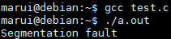

# 南京航空航天大学《计算机组成原理Ⅱ课程设计》报告

* 姓名：马睿

* 班级：1619304

* 学号：161930131

* 报告阶段：PA3.1

* 完成日期：2021.6.3

* 本次实验，我完成了所有内容。

# 目录

[TOC]

## 思考题

### 一、什么是操作系统？

操作系统是管理计算机硬件与软件资源的计算机程序。操作系统需要处理如管理与配置内存、决定系统资源供需的优先次序、控制输入设备与输出设备、操作网络与管理文件系统等基本事务。操作系统也提供一个让用户与系统交互的操作界面。


### 二、我们不⼀样，吗？

我觉得他们没有差距，可以把 `Nanos-lite` 看作一个和 `PA2` 中这些测试用例同等地位的一个 AM 程序，只不过更复杂一些。


### 三、操作系统的实质

操作系统就是一个较为大型的应用程序，它和直接运行在硬件上的程序无实质差别。


### 四、程序真的结束了吗？

`_start`处定义的启动代码主要是一系列过程调用：

1. 调用`__libc_init_first`和`init`，进行初始化；
2. 调用`atexit()`对程序正常结束时需要调用的函数进行登记注册，这些函数将由`exit()`函数自动调用执行
3. 调用可执行目标中的主函数`main()`
4. 调用`_exit()`过程，结束进程的执行，返回到操作系统内核。


### 五、触发系统调用

修改`test.c`

```c
#include<stdio.h>
const char str[] = "Hello world!\n";

int main() {
  asm volatile ("movl $4, %eax;"      // system call ID, 4 = SYS_write
                "movl $1, %ebx;"      // file descriptor, 1 = stdout
                "movl $str, %ecx;"    // buffer address
                "movl $13, %edx;"      // length
                "int $0x80");

  return 0;
}
```


### 六、有什么不同？

和函数调用的过程类似；可以将系统调用的服务程序理解为一个比较特殊的“函数”，因为他们都需要在调用函数前保存现场，之后再将其恢复。

这个“服务程序”和我们的“用户编写的函数”不同之处在于，前者需要在内核和应用程序之间不同切换，使用不同的堆栈；后者不需要进行切换。


### 七、段错误

编译只是将源程序翻译成汇编语言程序，而不知道程序会访问到哪些地址，所以在编译阶段不能发现潜在的段错误。

段错误通常是程序访问了缺页、地址越界、越权访问、越级访问。


### 八、对比异常与函数调用

因为他们所处的环境不一样（特权级不同），因此进行异常处理之前要保存更多的信息，还需切换堆栈。


### 九、诡异的代码

因为在执行`irq_handle`这个函数之前，通过`pusha`形成了`trap frame`（陷阱帧）的数据结构，为了保护现场，需要`pushl %esp`操作。


### 十、注意区分事件号和系统调用号

事件号是未处理的一个系统调用事件的编号，此时还没有识别；

系统调用号是已经识别了的系统调用的编号。可以去执行的系统调用处理函数。


### 十一、打印不出来？

因为控制台是行缓冲，也就是说所以在执行到`printf`时并不是直接打印，而是放在缓冲区里面，每次遇到换行符时才会把缓存区内容实际输出到控制台。这个程序触发段错误时缓冲区里面的内容没来得及打印出来，程序就被终止了。

写成`printf("I am here!\n");`即可。




### 十二、理解文件管理函数

- `fs_open()`：根据文件名对目标文件进行匹配，如果匹配到则让读写指针为0，并返回文件序号；匹配失败则报错。
- `fs_read()`：先判断文件序号是否大于2，再通过`fd`参数获取读写指针偏移量和大小，用文件大小减去文件读写指针位置作为剩余字节数，比较剩余字节数和要读取文件的长度作为最终要读取的文件大小。最后从`ramdisk`或`dispinfo`中读取数据到`buf`中。
- `fs_write()`：找到最终要读取的文件大小（和`fs_read()`一样），如果文件序号是标准输出的时候就打印到屏幕上面，否则通过`ramdisk`写入文件
- `fs_lseek()`：根据文件序号获取文件的大小和读写指针的位置，再根据`whence`选择新的读写偏移量并返回。
- `fs_close()`：直接返回`0`,因为不需要真的关闭。


### 十三、不再神秘的秘技

编写游戏代码时产生的bug，没有对数据的有效性等信息进行检验。


### 十四、必答

`/bin/pal`程序编译后存在`ramdisk`文件中，`make run`后运行`nemu`，并在`nemu`上运行`Nanos-lite`。`Nanos-lite`再加载位于`ramdisk`的`/bin/pal`程序。

`PAL_LoadGame()`调用`nanos.c`里面的`fread()`库函数读取存档信息并进行初始化操作。

`redraw()`调用`NDL_DrawRect`来更新像素矩阵，之后把VGA显存抽象成文件，最后`nemu`把文件通过`I/O`接口显示到屏幕上面。


### 十五、`git log`和`git branch`截图


## 实验内容

### PA3.1.1 实现 loader

根据讲义的描述，修改`nanos-lite/src/loader.c`

```C
// 从ramdisk中`offset`偏移处的`len`字节读入到`buf`中
void ramdisk_read(void *buf, off_t offset, size_t len);
// 把`buf`中的`len`字节写入到ramdisk中`offset`偏移处
void ramdisk_write(const void *buf, off_t offset, size_t len);
// 返回ramdisk的大小, 单位为字节
size_t get_ramdisk_size();
uintptr_t loader(_Protect *as, const char *filename){
  ramdisk_read(DEFAULT_ENTRY, 0, get_ramdisk_size());
  return (uintptr_t)DEFAULT_ENTRY;
}
```

在 `nanos-lite/` 目录下`make update`，并`make run`


### PA3.1.2 中断机制前的准备工作

正确添加 `IDTR`和 `CS`寄存器，并初始化


查阅`i386`手册得到`CS`和`IDTR`寄存器结构：

> 
>
> 


实现：

```C
typedef struct {
	union {
		union {
			unsigned int _32;
			unsigned short _16;
			unsigned char _8[2];
 		} gpr[8];//gpr[i]共用一个空间，gpr[i]与gpr[j]之间使用不同空间
		struct {
			rtlreg_t eax, ecx, edx, ebx, esp, ebp, esi, edi;
		};//这些元素各自使用各自的空间,且每个元素与相应的gpr[i]共用一个地址
	};
	union{
		vaddr_t eip;
		unsigned short ip;
	};
  	union {
    	struct{
      	uint32_t CF :1;
      	uint32_t ONE :1;
      	uint32_t :4;
      	uint32_t ZF :1;
        uint32_t SF :1;
        uint32_t :1;
      	uint32_t IF :1;
      	uint32_t :1;
      	uint32_t OF :1;
      	uint32_t :20;
    };
    	rtlreg_t value;
  	} eflags;
  	struct{
    	uint16_t limit;
    	uint32_t base;
  	} idtr;
  	uint16_t cs;
} CPU_state;
```


修改`nemu/src/monitor/monitor.c`：

```c
static inline void restart() {
  /* Set the initial instruction pointer. */
  cpu.eip = ENTRY_START;
  cpu.eflags_num = 0x2;
  cpu.cs = 8;

#ifdef DIFF_TEST
  init_qemu_reg();
#endif
}
```


### PA3.1.3 实现中断机制

#### 实现 LIDT 指令


修改`system.c`：

```c
make_EHelper(lidt) {
  cpu.idtr.limit = vaddr_read(id_dest->addr, 2);
  if (decoding.is_operand_size_16)
    cpu.idtr.base = vaddr_read(id_dest->addr + 2, 3);
  else
    cpu.idtr.base = vaddr_read(id_dest->addr + 2, 4);

  print_asm_template1(lidt);
}
```


填表：

```c
make_group(gp7,
    EMPTY, EMPTY, EMPTY, EX(lidt),
    EMPTY, EMPTY, EMPTY, EMPTY)
```


加入`all-instr.h`

```c
make_EHelper(lidt);
```


在 `nanos-lite/src/main.c` 中定义宏 `HAS_ASYE`

```C
#define HAS_ASYE
```


#### 实现 INT 指令

查阅`i386`手册，得到`int`指令

> 

根据讲义描述得到实现步骤：

1. 依次将`EFLAGS`, `CS`, `EIP`寄存器的值压栈
2. 从`IDTR`中读出`IDT`的首地址
3. 根据异常号在`IDT`中进行索引, 找到一个门描述符
4. 对门描述符进行P位校验
5. 将门描述符中的`offset`域组合成目标地址
6. 跳转到目标地址


门描述符结构：


实现`raise_intr()`函数

修改`nemu/src/cpu/intr.c`

```C
void raise_intr(uint8_t NO, vaddr_t ret_addr) {
  /* TODO: Trigger an interrupt/exception with ``NO''.
   * That is, use ``NO'' to index the IDT.
   */
  vaddr_t gate_addr = cpu.idtr.base + NO * 8;//乘8是因为IDT由一个8字节的描述符阵列组成
  GateDesc gateDesc;
  *(uint32_t *)&gateDesc = vaddr_read(gate_addr, 4);
  *((uint32_t *)&gateDesc + 1) = vaddr_read(gate_addr + 4, 4) ;
  uint32_t p = *((uint32_t *)&gateDesc + 1) & 0x8000;
  Assert(p != 0, "P is valid");
  rtl_push((rtlreg_t*)&cpu.eflags.value);
  rtl_push((rtlreg_t*)&cpu.cs);
  rtl_push((rtlreg_t*)&ret_addr);

  decoding.is_jmp = 1;
  decoding.jmp_eip = (gateDesc.offset_31_16 << 16) | (gateDesc.offset_15_0 & 0xffff);
}
```


- 使⽤ INT 的 helper 函数调用 `raise_intr()`

```C
void raise_intr(uint8_t NO, vaddr_t ret_addr);
make_EHelper(int) {
  raise_intr(id_dest->val, decoding.seq_eip);

  print_asm("int %s", id_dest->str);

#ifdef DIFF_TEST
  diff_test_skip_nemu();
#endif
}
```


填表：

```c
  /* 0xcc */	EX(int3), IDEXW(I, int, 1), EMPTY, EMPTY,
```


加入`all-instr.h`

```c
make_EHelper(int);
```


### PA3.1.4 重新组织 TrapFrame 结构体

#### 实现 pusha

发现有未实现的指令


查阅`i386`手册发现是`pusha`指令


```C
make_EHelper(pusha) {
  if (decoding.is_operand_size_16) {
    t0 = reg_w(R_SP);
    //保存当前sp
    rtl_push((rtlreg_t *)&reg_w(R_AX));
    rtl_push((rtlreg_t *)&reg_w(R_CX));
    rtl_push((rtlreg_t *)&reg_w(R_DX));
    rtl_push((rtlreg_t *)&reg_w(R_BX));
    rtl_push(&t0);
    rtl_push((rtlreg_t *)&reg_w(R_BP));
    rtl_push((rtlreg_t *)&reg_w(R_SI));
    rtl_push((rtlreg_t *)&reg_w(R_DI));
  }
  else {
    t0 = reg_w(R_ESP);
    //保存当前esp
  	rtl_push(&cpu.eax);
  	rtl_push(&cpu.ecx);
  	rtl_push(&cpu.edx);
  	rtl_push(&cpu.ebx);
  	rtl_push(&t0);
 	rtl_push(&cpu.ebp);
  	rtl_push(&cpu.esi);
  	rtl_push(&cpu.edi);
  }

  print_asm("pusha");
}
```


填表：

```C
  /* 0x60 */	EX(pusha), EMPTY, EMPTY, EMPTY,
```


加入`all-instr.h`

```c
make_EHelper(pusha);
```


运行


#### 组织 _RegSet 结构体

修改`nexus-am/am/arch/x86-nemu/include/arch.h`

```C
struct _RegSet {
    uintptr_t edi, esi, ebp, esp, ebx, edx, ecx, eax;
    int irq;
    uintptr_t error, eip, cs, eflags;
};
```

这些成员声明的顺序要和构造的`trap frame` 保持一致。根据讲义内容，应该先将`EFLAGS`, `CS`, `EIP`压入堆栈，然后`vecsys()`会压入错误码和异常号`#irq`，最后将通用寄存器压入堆栈，这一过程地址从高到低，所以在结构体中最后压入栈的应该在最前面。

运行


### PA3.1.5 实现系统调用

1. 修改`nanos-lite/src/irp.c`中的`do_event`.

```c
static _RegSet* do_event(_Event e, _RegSet* r) {
  switch (e.event) {
    case _EVENT_SYSCALL:
      return do_syscall(r);
    default: panic("Unhandled event ID = %d", e.event);
  }

  return NULL;
}
```


2. 根据讲义可知，`_syscall_()` 函数会先把系统调用的参数依次放入 `%eax`，`%ebx`，`%ecx`，`%edx` 四个寄存器中，因此修改`nexus-am/am/arch/x86-nemu/include/arch.h`，实现`SYSCALL_ARGx()`宏.

```c
#define SYSCALL_ARG1(r) (r->eax)
#define SYSCALL_ARG2(r) (r->ebx)
#define SYSCALL_ARG3(r) (r->ecx)
#define SYSCALL_ARG4(r) (r->edx)
```


3. 修改`nanos-lite/src/syscall.c`的`do_syscall()`函数，实现`SYS_none`系统调用，并设置系统调用的返回值

```c
static inline uintptr_t sys_none() {
  return 1;
}

_RegSet* do_syscall(_RegSet *r) {
  uintptr_t a[4];
  a[0] = SYSCALL_ARG1(r);
  a[1] = SYSCALL_ARG2(r);
  a[2] = SYSCALL_ARG3(r);
  a[3] = SYSCALL_ARG4(r);
  switch (a[0]) {
    case SYS_none:
      SYSCALL_ARG1(r) = sys_none();
      Log("Call sys_none");
      break;
    default:
      panic("Unhandled syscall ID = %d", a[0]);
  }

  return NULL;
}
```


4. 实现 `popa` 和 `iret` 指令

- `popa`指令


```C
make_EHelper(popa) {
  if (decoding.is_operand_size_16) {
    rtl_pop((rtlreg_t*)&reg_w(R_DI));
    rtl_pop((rtlreg_t*)&reg_w(R_SI));
    rtl_pop((rtlreg_t*)&reg_w(R_BP));
    rtl_pop(&t0);
    rtl_pop((rtlreg_t*)&reg_w(R_BX));
    rtl_pop((rtlreg_t*)&reg_w(R_DX));
    rtl_pop((rtlreg_t*)&reg_w(R_CX));
    rtl_pop((rtlreg_t*)&reg_w(R_AX));
  }
  else {
    rtl_pop(&cpu.edi);
    rtl_pop(&cpu.esi);
    rtl_pop(&cpu.ebp);
    rtl_pop(&t0); 
    rtl_pop(&cpu.ebx);
    rtl_pop(&cpu.edx);
    rtl_pop(&cpu.ecx);
    rtl_pop(&cpu.eax);
  }

  print_asm("popa");
}
```


- `iret`指令


```C
make_EHelper(iret) {
  rtl_pop(&decoding.jmp_eip);
  rtl_pop(&t0);
  cpu.cs = (uint16_t)t0;
  rtl_pop(&cpu.eflags.value);
  decoding.is_jmp = 1;

  print_asm("iret");
}
```


填表

```C
  /* 0x60 */	EX(pusha), EX(popa), EMPTY, EMPTY,
  /* 0xcc */	EX(int3), IDEXW(I, int, 1), EMPTY, EX(iret),
```


加入`all-instr.h`

```C
make_EHelper(popa);
make_EHelper(iret);
```


运行（后面才添加的`LOG`，所以这里没有打印）


5. 修改`nanos-lite/src/syscall.c`的`do_syscall()`函数，实现 `SYS_exit` 系统调用，并设置系统调用的返回值

```c
static inline uintptr_t sys_exit(_RegSet *r) {
  Log("Call sys_exit");
  _halt(SYSCALL_ARG2(r));
  return 1;
}

_RegSet* do_syscall(_RegSet *r) {
  uintptr_t a[4];
  a[0] = SYSCALL_ARG1(r);
  a[1] = SYSCALL_ARG2(r);
  a[2] = SYSCALL_ARG3(r);
  a[3] = SYSCALL_ARG4(r);

  switch (a[0]) {
    case SYS_none:
      SYSCALL_ARG1(r) = sys_none(r);
      Log("Call sys_none");
      break;
    case SYS_exit:
      sys_exit(r);
      break;
    default:
      panic("Unhandled syscall ID = %d", a[0]);
  }

  return NULL;
}
```


运行


### PA3.1.6 在 Nanos-lite 上运行 Hello world

实现`write()`系统调用的步骤：

- 在 `do_syscall()` 中识别出系统调用号是 `SYS_write`
- 检查 `fd` 的值，如果 `fd` 是 `1` 或 `2`（分别代表 `stdout` 和 `stderr`），则将 `buf` 为首地址的 `len` 字节输出到串口（使用 `_putc()` 即可）
- 设置正确的返回值（查阅`man 2 write`，返回的应该是写入的字节数，也就是`len`）
- 在 `navy-apps/libs/libos/src/nanos.c` 的 `_write()` 中调用系统调用接口函数

发现`fs_write()`函数与所要实现的`write()`函数一致，因此直接使用。

```C
static inline uintptr_t sys_write(uintptr_t fd, uintptr_t buf, uintptr_t len) {
  return (uintptr_t)fs_write(fd, (void *)buf, len);
}

_RegSet* do_syscall(_RegSet *r) {
  uintptr_t a[4];
  a[0] = SYSCALL_ARG1(r);
  a[1] = SYSCALL_ARG2(r);
  a[2] = SYSCALL_ARG3(r);
  a[3] = SYSCALL_ARG4(r);

  switch (a[0]) {
    case SYS_none:
      SYSCALL_ARG1(r) = sys_none(r);
      Log("Call sys_none");
      break;
    case SYS_exit:
      sys_exit(r);
      break;
    case SYS_write:
      SYSCALL_ARG1(r) = sys_write(a[1], a[2], a[3]);
      Log("Call sys_write");
      break;
    default:
      panic("Unhandled syscall ID = %d", a[0]);
  }

  return NULL;
}


int _write(int fd, void *buf, size_t count){
  return _syscall_(SYS_write, fd, (uintptr_t)buf, count);
}
```


运行`hello`程序，发现有指令没有填表


查阅`i386`手册发现是`test`指令，填表即可

```C
  /* 0xa8 */	IDEXW(I2a, test, 1), IDEX(I2a, test), EMPTY, EMPTY,
```


再次运行（后面才添加的`LOG`，所以这里没有打印）


### PA3.1.7 实现堆区管理

#### 实现 SYS_brk 系统调用

将`SYS_brk` 系统调用总是返回 `0` 即可

修改`nanos-lite/src/syscall.c`：

```C
static inline uintptr_t sys_brk(uintptr_t new_brk) {
  return 0;
}

_RegSet* do_syscall(_RegSet *r) {
  uintptr_t a[4];
  a[0] = SYSCALL_ARG1(r);
  a[1] = SYSCALL_ARG2(r);
  a[2] = SYSCALL_ARG3(r);
  a[3] = SYSCALL_ARG4(r);

  switch (a[0]) {
    case SYS_none:
      SYSCALL_ARG1(r) = sys_none(r);
      Log("Call sys_none");
      break;
    case SYS_exit:
      sys_exit(r);
      Log("Call sys_exit");
      break;
    case SYS_write:
      SYSCALL_ARG1(r) = sys_write(a[1], a[2], a[3]);
      Log("Call sys_write");
      break;
    case SYS_brk:
      SYSCALL_ARG1(r) = sys_brk(a[1]);
      Log("Call sys_brk");
      break;
    default:
      panic("Unhandled syscall ID = %d", a[0]);
  }

  return NULL;
}
```

#### 实现 _sbrk()


1. program break 一开始的位置位于 `_end`
2. 被调用时，根据记录的 program break 位置和参数 `increment`，计算出新 program break
3. 通过 `SYS_brk` 系统调用来让操作系统设置新 program break
4. 更新之前记录的 program break 的位置，并将旧 program break 的位置作为 `_sbrk()` 的返回值返回

5. 若该系统调用失败，`_sbrk()` 会返回 `-1`（其实不会返回`-1`）


修改`navy-apps/libs/libos/src/nanos.c`实现`_sbrk()`.

```c
extern char _end;
intptr_t program_break = (uintptr_t)&_end;
void *_sbrk(intptr_t increment) {
  intptr_t old_program_break = program_break;
  if(_syscall_(SYS_brk, program_break + increment,0, 0) == 0) {
  	program_break += increment;
    return (void *)old_program_break;
  }else{
  	return (void *)-1;
  }
}
```


然后切换到 `navy-apps/tests/hello/` 目录下执行 `make` 编译；在 `nanos-lite/Makefile` 下执行 `make update`；最后`make run`

运行，可以看出不是一个字符一个字符的输出了。（参数分别是`SYSCALL_ARG1(r) SYSCALL_ARG2(r) SYSCALL_ARG3(r) SYSCALL_ARG4(r)`）


### PA3.1.8 让 loader使用文件

修改`nanos-lite/src/loader.c`

```C
#include"fs.h"
...
uintptr_t loader(_Protect *as, const char *filename) {
  int fd = fs_open(filename, 0, 0);
  size_t f_size = fs_filesz(fd);
  fs_read(fd, DEFAULT_ENTRY, f_size);
  fs_close(fd);
  
  return (uintptr_t)DEFAULT_ENTRY;
}
```


### PA3.1.9 & 3.1.10 实现完整的文件系统 & 实现系统调用

修改`nanos-lite/src/syscall.c`

```c
static inline uintptr_t sys_open(uintptr_t pathname, uintptr_t flags, uintptr_t mode) {
  return (uintptr_t)fs_open((char *)pathname, flags, mode);
}

static inline uintptr_t sys_write(uintptr_t fd, uintptr_t buf, uintptr_t len) {
  return (uintptr_t)fs_write(fd, (void*)buf, len);
}

static inline uintptr_t sys_read(uintptr_t fd, uintptr_t buf, uintptr_t len) {
  return (uintptr_t)fs_read(fd, (void*)buf, len);
}

static inline uintptr_t sys_lseek(uintptr_t fd, uintptr_t offset, uintptr_t whence) {
  return (uintptr_t)fs_lseek(fd, offset, whence);
}

static inline uintptr_t sys_close(uintptr_t fd) {
  return (uintptr_t)fs_close(fd);
}

static inline uintptr_t sys_brk(uintptr_t new_brk) {
  return 0;
}


_RegSet* do_syscall(_RegSet *r) {
  uintptr_t a[4];
  a[0] = SYSCALL_ARG1(r);
  a[1] = SYSCALL_ARG2(r);
  a[2] = SYSCALL_ARG3(r);
  a[3] = SYSCALL_ARG4(r);

  switch (a[0]) {
    case SYS_none:
      SYSCALL_ARG1(r) = sys_none(r);
      Log("Call sys_none\n");
      break;
    case SYS_exit:
      sys_exit(r);
      break;
    case SYS_write:
      SYSCALL_ARG1(r) = sys_write(a[1], a[2], a[3]);
      Log("Call sys_write");
      break;
    case SYS_brk:
      SYSCALL_ARG1(r) = sys_brk(a[1]);
      Log("Call sys_brk");
      break;
    case SYS_open:
      SYSCALL_ARG1(r) = sys_open(a[1], a[2], a[3]);
      Log("Call sys_open");
      break;
    case SYS_read:
      SYSCALL_ARG1(r) = sys_read(a[1], a[2], a[3]);
      Log("Call sys_read");
      break;
    case SYS_lseek:
      SYSCALL_ARG1(r) = sys_lseek(a[1], a[2], a[3]);
      Log("Call sys_lseek");
      break;
    case SYS_close:
      SYSCALL_ARG1(r) = sys_close(a[1]);
      Log("Call sys_close");
      break;
    default:
      panic("Unhandled syscall ID = %d", a[0]);
  }

  return NULL;
}
```


修改`navy-apps/libs/libos/src/nanos.c`

```C
int _open(const char *path, int flags, mode_t mode) {
  return _syscall_(SYS_open, (uintptr_t)path, flags, mode);
}

int _write(int fd, void *buf, size_t count){
  return _syscall_(SYS_write, fd, (uintptr_t)buf, count);
}

int _read(int fd, void *buf, size_t count) {
  return _syscall_(SYS_read, fd, (uintptr_t)buf, count);
}

int _close(int fd) {
  return _syscall_(SYS_close, fd, 0, 0);
}

off_t _lseek(int fd, off_t offset, int whence) {
  return _syscall_(SYS_lseek, fd, offset, whence);
}
```


修改`nanos-lite\src\main.c`中`loader`函数的参数

```c
uint32_t entry = loader(NULL, "/bin/text");
```


运行


### PA3.1.11 把VGA显存抽象成文件

修改`nanos-lite\src\main.c`中`loader`函数的参数

```c
uint32_t entry = loader(NULL, "/bin/bmptest");
```

运行发现有未实现的指令


查阅手册得知是`MOVSB`指令

```
Opcode 	Instruction  	Description
A4 		MOVS m8,m8  	Move byte [(E)SI] to ES:[(E)DI]
A4	 	MOVSB 			Move byte DS:[(E)SI] to ES:[(E)DI]
```


`MOVS`将`(E)SI`的字节复制到`(E)DI`的字节，并`(E)SI`和`(E)DI`自增`1`。


修改`data-mov.c`：

```C
make_EHelper(movsb){
  rtl_lm(&t0,&cpu.esi,1);
  rtl_sm(&cpu.edi,1,&t0);
  cpu.esi+=1;
  cpu.edi+=1;
  print_asm("movsb");

}
```


填表

```C
  /* 0xa4 */	EX(movsb), EMPTY, EMPTY, EMPTY,
```


加入`all-instr.h`

```C
make_EHelper(movsb);
```


运行（关闭`DEBUG`宏，不然很慢）


### PA3.1.12 把设备输入抽象成文件

修改`nanos-lite\src\main.c`中`loader`函数的参数

```c
uint32_t entry = loader(NULL, "/bin/events");
```


运行（很慢）


### PA3.1.13 把设备输入抽象成文件

将压缩包解压并放到 `navy-apps/fsimg/share/games/pal/` 目录下


修改`nanos-lite\src\main.c`中`loader`函数的参数

```c
uint32_t entry = loader(NULL, "/bin/pal");
```


运行（因为太慢了，就只到这里就暂停了）


把`Log`注释掉后快了很多


只能到这一步了，后面操控人物很久才会显示动画。


## 遇到的问题及解决办法

1. 在重新组织 TrapFrame 结构体的时候，无论怎么实现输出的都是`ID = 3`，最后发现是因为文件传错了，应该传到`x86`文件夹而我传到`native`文件夹里了

2. 在实现`_sbrk()`函数时，总是报错（超出内存范围）

这是原先的代码

```C
extern char _end;
void *_sbrk(intptr_t increment) {
  intptr_t program_break = (intptr_t)&_end;
  intptr_t old_program_break = program_break;
  if(_syscall_(SYS_brk, program_break + increment,0, 0) == 0) {
  	program_break += increment;
    return (void *)old_program_break;
  }else{
  	return (void *)-1;
  }
}
```

调试了半天没发现错误，最后突然发现应该把`program_break`声明为全局变量（或者静态变量）

```C
extern char _end;
intptr_t program_break = (intptr_t)&_end;
void *_sbrk(intptr_t increment) {
  intptr_t old_program_break = program_break;
  if(_syscall_(SYS_brk, program_break + increment,0, 0) == 0) {
  	program_break += increment;
    return (void *)old_program_break;
  }else{
  	return (void *)-1;
  }
}
```


## 实验心得

做前面的有些任务时没有`make update`，导致花费了很多时间去找一些不存在的`bug`。

感觉这次的实验要做的内容并不是很多，更多的是需要思考和理解的知识。


## 其他备注

无