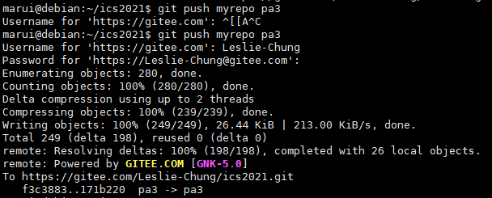
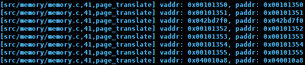
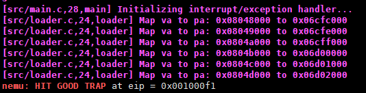

# 南京航空航天大学《计算机组成原理Ⅱ课程设计》报告

* 姓名：马睿

* 班级：1619304

* 学号：161930131

* 报告阶段：PA3.2

* 完成日期：2021.6.15

* 本次实验，我完成了所有内容。

# 目录

[TOC]

## 思考题

### 一、一些问题

- 因为还有12位的页内偏移量，10位页目录索引，10位页表索引。因为每个页目录项都是4个字节，所以页目录和页表索引在转换时还需要乘4，这样一来他们都变成了了12位，这12位与相应表项的基地址进行组合，最后就成了32位。

- 物理地址是必须的，如果是虚拟地址，会不断地从虚拟地址映射到虚拟地址，可能会找不到相应的物理地址。
- 一级页表需要保存所有进程的映射关系，使得页表非常庞大，不利于寻找相应的表项。


### 二、空指针真的是'空'的吗?

空指针在进行地址转换的时候，应该会访问到一个用户权限无法访问的地方，如何进行终止报错。


### 三、理解 _map() 函数

1. 取页目录基地址
2. 根据传入的虚拟地址和基地址得到页目录项，根据页目录项的`present`判断是否需要装入页表。如果需要，就用`palloc_f`函数申请一个页表，并且把这个页表的地址和其`P`、`R/W`、`U/S`位相结合到页目录项里面
3. 根据传入的虚拟地址和页目录项得到页表项
4. 根据页目录项的`present`判断是否缺页，如果缺页，则把物理地址和页表的`P`、`R/W`、`U/S`位相结合到页表项里面

该函数将虚拟地址空间`p`中的虚拟地址`va`映射到物理地址`pa`


### 四、内核映射的作用

注释后报错


注释掉后，虽然创建了用户进程的虚拟地址空间，但是没有将内核映射放至空间中，导致需要访问内核的虚拟地址时找不到相应的物理地址。


### 五、`git log`和远程仓库截图





## 实验内容

### PA3.2.1 在NEMU中实现分页机制

修改`nanos-lite/src/main.c`，打开宏

```C
#define HAS_PTE
```


修改`nemu/include/cpu/reg.h`，添加`CR3`寄存器和`CR0`寄存器

```C
#include "memory/mmu.h"

typedef struct {
    ...
    CR0 cr0;
  	CR3 cr3;
} CPU_state;
```


修改`monitor.c`，初始化`CR0`寄存器

```C
static inline void restart(){
    ...
    cpu.cr0.val = 0x60000011;
}
```


修改`nemu/src/memory/memory.c`，添加`page_translate()`

```c
paddr_t page_translate(vaddr_t vaddr) {
  PDE pde;
  uint32_t PDE_addr = cpu.cr3.page_directory_base << 12;
  //取出20位页目录基地址
  uint32_t DIR = vaddr >> 22;//取出线性地址中高10位页目录索引
  //页目录项地址 = 页目录基地址 + 页目录索引 * 4
  PDE_addr = PDE_addr | (DIR << 2);
  pde.val = paddr_read(PDE_addr, 4);
  Assert(pde.present, "PDE: 0x%08x, vaddr: 0x%08x", pde.val, vaddr);

  if(pde.accessed == 0){
    pde.accessed = 1;
    paddr_write(PDE_addr, 4, pde.val);
  }

  PTE pte;
  //从页目录项中取出20位页表基地址
  uint32_t PTE_addr = pde.val & 0xfffff000;
  uint32_t PAGE = (vaddr >> 12) & 0x3ff;//取出线性地址里中间10位页表索引
  //页表项地址 = 页表基地址 + 页表索引 * 4
  PTE_addr = PTE_addr | (PAGE << 2);
  pte.val = paddr_read(PTE_addr, 4);
  Assert(pte.present, "PTE: 0x%08x, vaddr: 0x%08x", pte.val, vaddr);

  if(pte.accessed == 0 || (pte.dirty == 0 && _write)){
    pte.accessed = 1;
    pte.dirty = 1;
    paddr_write(PTE_addr, 4, pte.val);
  }
  //页表项的高20位是页框基地址，与线性地址中的低12位页内偏移量组合，得到物理地址
  paddr_t paddr = (pte.val & 0xfffff000) | (vaddr & 0xfff);
  Log("vaddr: 0x%08x, paddr: 0x%08x", vaddr, paddr);
  return paddr;
}
```


修改`nemu/src/memory/memory.c`的`vaddr_read()`和`vaddr_write()`

```c
uint32_t vaddr_read(vaddr_t addr, int len) {
  if(cpu.cr0.paging) {
    if ((addr & 0xfff) + len > 0x1000) {//如果是跨页访问，即从要访问的起始位置+要访问的长度超过了一页的大小
      assert(0);
    }
 	else {
      paddr_t paddr = page_translate(addr, false);
      return paddr_read(paddr, len);
    }
  } 
  else {
    return paddr_read(addr, len);
  }
}

void vaddr_write(vaddr_t addr, int len, uint32_t data) {
  if(cpu.cr0.paging) {
    if ((addr & 0xfff) + len > 0x1000) {
      assert(0);
    }
    else {
      paddr_t paddr = page_translate(addr, true);
      return paddr_write(paddr, len, data);
    }
  } 
  else {
    paddr_write(addr, len, data);
  }
}
```


在`nanos-lite`下运行，发现有未实现的指令


双字节指令`MOV`


```
Opcode 		Instruction  				Description
0F 22 /r 	MOV CR0/CR2/CR3,r32  Move (register) to (control register)
```

修改`system.c`

```C
make_EHelper(mov_r2cr) {
  if(id_dest->reg == 0) {
  	cpu.cr0.val = id_src->val;
  }
  else if(id_dest->reg == 3) {
  	cpu.cr3.val = id_src->val;
  }
  else{
  	assert(0);
  }

  print_asm("movl %%%s,%%cr%d", reg_name(id_src->reg, 4), id_dest->reg);
}
```


填表

```C
  /* 0x20 */	EMPTY, EMPTY, IDEX(mov_E2G, mov_r2cr), EMPTY,
```

在`all-instr.h`中加入

```C
make_EHelper(mov_r2cr);
```


再次运行，发现还有指令


依旧是双字节`MOV`指令

```
Opcode 		Instruction 			Description
0F 20 /r 	MOV r32,CR0/CR2/CR3  Move (control register) to (register)
```


修改`system.c`

```C
make_EHelper(mov_r2cr) {
  if(id_src->reg == 0) {
    operand_write(id_dest, &cpu.cr0.val);
  }
  else if(id_src->reg == 3) {
  	operand_write(id_dest, &cpu.cr3.val);
  }
  else{
  	assert(0);
  }

  print_asm("movl %%%s,%%cr%d", reg_name(id_src->reg, 4), id_dest->reg);
}
```


填表

```C
  /* 0x20 */	IDEX(mov_G2E, mov_cr2r), EMPTY, IDEX(mov_E2G, mov_r2cr), EMPTY,
```

在`all-instr.h`中加入

```C
make_EHelper(mov_cr2r);
```


运行成功




### PA3.2.2 让用户程序运行在分页机制上

1. 将 `navy-apps/Makefile.compile` 中的链接地址 `-Ttext` 参数改为 `0x8048000`

2. 将`nanos-lite/src/loader.c`中的`DEFAULT_ENTRY`也改为`0x8048000`

3. 修改`nanoslite/src/main.c`

```C
void load_prog(const char *filename);

...
-  uintptr_t entry = loader(NULL, "/bin/pal");
-  ((void (*)(void))entry)();
+  load_prog("/bin/dummy");
```

重新编译


修改`nanos-lite/src/loader.c`

实现步骤：

1. 打开待装入的文件后，获取文件大小；
2. 循环判断是否已创建足够的页来装入程序；
3. 对于程序需要的每一页，做三个事情，即4，5，6步：
4. 使用 `Nanos-lite` 的 `MM` 提供的 `new_page()` 函数获取一个空闲物理页
5. 使用映射函数 `_map()` 将本虚拟空间内当前正在处理的这个页和上一步申请到的空闲物理页建立映射
6. 读一页内容，写到这个物理页上
7. 每一页都处理完毕后，关闭文件，并返回程序入口点地址（虚拟地址）

```c
uintptr_t loader(_Protect *as, const char *filename) {
  int fd = fs_open(filename, 0, 0);
  size_t f_size = fs_filesz(fd);

  void *va = DEFAULT_ENTRY;
  void *pa = NULL;
  int pages = f_size / PGSIZE + 1;
  int i;
  for (i = 0; i < pages;i++){
    pa = new_page();
    Log("Map va to pa: 0x%08x to 0x%08x", va, pa);
    _map(as, va, pa);
    fs_read(fd, pa, PGSIZE);
    va += PGSIZE;
  }
  fs_close(fd);

  return (uintptr_t)DEFAULT_ENTRY;
}
```


运行




### PA3.2.3 在分页机制上运行仙剑奇侠传

修改`nanos-lite/src/syscall.c`

```C
static inline uintptr_t sys_brk(uintptr_t new_brk) {
  return mm_brk(new_brk);
}
```

修改`nanos-lite/src/main.c`

```C
load_prog("/bin/pal");
```


运行发现`vaddr_read`时跨页访问了


修改`memory.c`

```C
uint32_t vaddr_read(vaddr_t addr, int len) {
  if(cpu.cr0.paging) {
    if ((addr & 0xfff) + len > 0x1000) {//如果是跨页访问，即从要访问的起始位置+要访问的长度超过了一页的大小
      int low_len = 0x1000 - (addr & 0xfff);//前一页的数据长度
      int high_len = len - low_len;//后一页的数据长度
      uint32_t low_data = paddr_read(page_translate(addr, false), low_len);//前一页的数据
      uint32_t high_data = paddr_read(page_translate(addr + low_len, false), high_len);//后一页的数据
      //因为是小端方式，所以后一页的数据在高位，所以需要左移前一页字节数*8
      return (high_data << (low_len << 3)) | low_data;
    }
    else {
      paddr_t paddr = page_translate(addr, false);
      return paddr_read(paddr, len);
    }
  } 
  else {
    return paddr_read(addr, len);
  }

}
```


运行


分页之后比以前更卡了


## 遇到的问题及解决办法

无

## 实验心得

这次的PA相对而言，量和难度都变小了，完成的也比较快。


## 其他备注

无