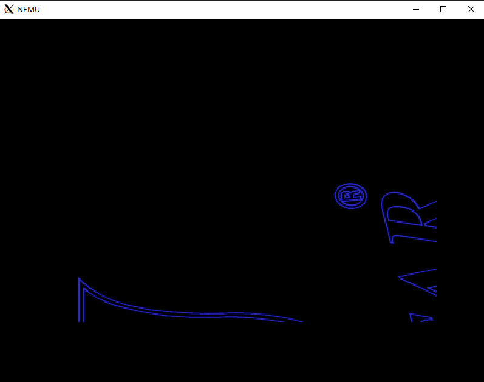
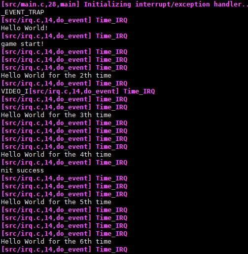
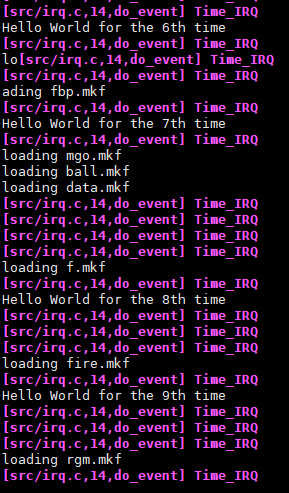
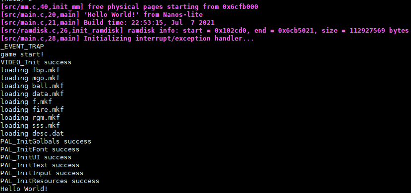

# 南京航空航天大学《计算机组成原理Ⅱ课程设计》报告

* 姓名：马睿

* 班级：1619304

* 学号：161930131

* 报告阶段：PA4

* 完成日期：2021.7.8

* 本次实验，我完成了所有内容。

# 目录

[TOC]

## 思考题

### 一、灾难性的后果

如果选择把现场信息保存在一个固定的地方, 发生中断嵌套的时候, 第一次中断保存的现场信息将会被优先级高的中断处理过程所覆盖，导致无法返回第一次产生中断的位置，也就永远无法返回到用户程序了。


### 二、必答题

分时多任务的具体过程 请结合代码, 解释分页机制和硬件中断是如何支撑仙剑奇侠传和 hello 程序在我们的计算机系统(Nanos-lite, AM, NEMU)中分时运行的.


1. 利用硬件中断指令来”启动“上下文的切换
2. 利用`schedule`中的`_switch`不断改变`CR3`寄存器的值，实现分时多任务的切换
3. 利用分页机制来实现用户程序的执行


## 实验内容

### PA4.1.1&4.1.2 实现内核自陷 & 实现上下文切换

修改`nexus-am/am/arch/x86-nemu/src/pte.c`

`_umake()` 是专门用来创建用户进程的现场的，因此目前 `_umake()` 只需要实现以下功能：

- 在 `ustack` 的底部初始化一个以 `entry` 为返回地址的陷阱帧。

- `p`是用户进程的虚拟地址空间, 在简化之后, `_umake()` 不需要使用它。`argv` 和 `envp` 分别是用户进程的 `main()` 函数参数和环境变量，可以忽略它们。

- 在陷阱帧之前设置好 `_start()` 函数的栈帧，把这一栈帧中的三个参数设置为 `0` 或 `NULL`；返回地址可以不设置。

因此, `_umake()` 函数需要在栈上初始化如下内容, 然后返回陷阱帧的指针, 由 Nanos-lite 把这一指针记录到用户进程 PCB 的 `tf` 中：

```C
_RegSet *_umake(_Protect *p, _Area ustack, _Area kstack, void *entry, char *const argv[], char *const envp[]) {
//创建一个用户进程(地址空间p，用户栈地址ustack，内核栈地址kstack，入口地址entry，参数argv，环境变量envp，argv和envp均以NULL结束)
  struct {
      _RegSet *tf;
  } *pcb = ustack.start;
  uint32_t *stack = (uint32_t *)(ustack.end - 4);//参数所在位置
  for (int i = 0; i < 3; i++) //一共有三个参数，将三个参数置零
    *stack-- = 0;
  pcb->tf = (void *)(stack - sizeof(_RegSet));//设置tf，即trap frame的起始位置
  pcb->tf->cs = 8;
  pcb->tf->eip = (uintptr_t)entry;
  return pcb->tf;
}
```


按照讲义，修改`nexus-am/am/arch/x86-nemu/src/asye.c`

```C
void _trap() {
  asm volatile("int $0x81");
}


_RegSet* irq_handle(_RegSet *tf) {
  _RegSet *next = tf;
  if (H) {
    _Event ev;
    switch (tf->irq) {
      case 0x80: ev.event = _EVENT_SYSCALL; break;
      case 0x81:{
         ev.event = _EVENT_TRAP; 
         printf("_EVENT_TRAP\n");
         break;
      }
      default: ev.event = _EVENT_ERROR; break;
    }

    next = H(ev, tf);
    if (next == NULL) {
      next = tf;
    }
  }

  return next;
}

void vectrap();
void _asye_init(_RegSet*(*h)(_Event, _RegSet*)) {
  // initialize IDT
  for (unsigned int i = 0; i < NR_IRQ; i ++) {
    idt[i] = GATE(STS_TG32, KSEL(SEG_KCODE), vecnull, DPL_KERN);
  }

  // -------------------- system call --------------------------
  idt[0x80] = GATE(STS_TG32, KSEL(SEG_KCODE), vecsys, DPL_USER);
  idt[0x81] = GATE(STS_IG32, KSEL(SEG_KCODE), vectrap, DPL_USER);
  set_idt(idt, sizeof(idt));

  // register event handler
  H = h;
}
```


按照讲义，先将栈顶指针切换到新进程的陷阱帧, 然后才根据陷阱帧的内容恢复现场

修改`trap.S`

```
#----|-------entry-------|-errorcode-|---irq id---|---handler---|
.globl vecsys;    vecsys:  pushl $0;  pushl $0x80; jmp asm_trap
.globl vecnull;  vecnull:  pushl $0;  pushl   $-1; jmp asm_trap
.globl vectrap;  vectrap:  pushl $0;  pushl $0x81; jmp asm_trap
asm_trap:
  pushal

  pushl %esp
  call irq_handle

  addl $4, %esp
  movl %eax,%esp
  popal
  addl $8, %esp

  iret
```


修改`nanos-lite/src/irq.c`

```C
_RegSet *schedule(_RegSet *prev);
static _RegSet *do_event(_Event e, _RegSet *r){
  _RegSet *ret = NULL;
  switch (e.event) {
    case _EVENT_TRAP:
      return schedule(r);
      break;
    case _EVENT_SYSCALL:
      return do_syscall(r);
    default: panic("Unhandled event ID = %d", e.event);
  }

  return ret;
}
```


修改`nanos-lite/src/proc.c`

```C
_RegSet *schedule(_RegSet *prev) {
    current->tf = prev;
    current = &pcb[0];
    _switch(&current->as);
    return current->tf;
  // return NULL;
}
```


运行成功




### PA4.1.3&4.1.4 分时运行仙剑奇侠传和hello程序 & 优先级调度

修改`nanos-lite/src/proc.c`

```C
int count = 0;
_RegSet *schedule(_RegSet *prev){
  current->tf = prev;

  current = (current == &pcb[0] && count > 200 ? &pcb[1] : &pcb[0]);
  if (count > 200) count = 0;
  count++;
  _switch(&current->as);
  return current->tf;
  // return NULL;
}
```


这里运行完之后，没有实现分时的效果


### PA4.2.1 添加时钟中断

修改`reg.h`

```C
typedef struct {
  ...
  bool INTR;
} CPU_state;
```


修改`cpu/intr.c`

```C
void raise_intr(uint8_t NO, vaddr_t ret_addr) {
  ...
  cpu.eflags.IF = 0;

  decoding.is_jmp = 1;
  decoding.jmp_eip = (gateDesc.offset_31_16 << 16) | (gateDesc.offset_15_0 & 0xffff);
}

void dev_raise_intr() {
  cpu.INTR = 1;
}
```

修改`cpu/exec/exec.c`

```C
#define TIMER_IRQ 32
void raise_intr(uint8_t NO, vaddr_t ret_addr);
void exec_wrapper(bool print_flag) {
  ...
  if (cpu.INTR & cpu.eflags.IF) {
    cpu.INTR = false;
    raise_intr(TIMER_IRQ, cpu.eip);
    update_eip();
  }

}
```


修改`nexus-am/am/arch/x86-nemu/src/asye.c`

```C
_RegSet* irq_handle(_RegSet *tf) {
  _RegSet *next = tf;
  if (H) {
    _Event ev;
    switch (tf->irq) {
      case 0x80: ev.event = _EVENT_SYSCALL; break;
      case 0x81:{
         ev.event = _EVENT_TRAP; 
         printf("_EVENT_TRAP\n");
         break;
      }
      case 0x20: ev.event = _EVENT_IRQ_TIME; break;
      default: ev.event = _EVENT_ERROR; break;
    }

    next = H(ev, tf);
    if (next == NULL) {
      next = tf;
    }
  }

  return next;
}

void vectime();
void _asye_init(_RegSet*(*h)(_Event, _RegSet*)) {
  // initialize IDT
  for (unsigned int i = 0; i < NR_IRQ; i ++) {
    idt[i] = GATE(STS_TG32, KSEL(SEG_KCODE), vecnull, DPL_KERN);
  }

  // -------------------- system call --------------------------
  idt[0x80] = GATE(STS_TG32, KSEL(SEG_KCODE), vecsys, DPL_USER);
  idt[0x81] = GATE(STS_IG32, KSEL(SEG_KCODE), vectrap, DPL_USER);
  idt[0x20] = GATE(STS_TG32, KSEL(SEG_KCODE), vectime, DPL_USER);
  set_idt(idt, sizeof(idt));

  // register event handler
  H = h;
}
```


修改`trap.S`

```
#----|-------entry-------|-errorcode-|---irq id---|---handler---|
.globl vecsys;    vecsys:  pushl $0;  pushl $0x80; jmp asm_trap
.globl vecnull;  vecnull:  pushl $0;  pushl   $-1; jmp asm_trap
.globl vectrap;  vectrap:  pushl $0;  pushl $0x81; jmp asm_trap
.globl vectime;  vectime:  pushl $0;  pushl $0x20; jmp asm_trap
asm_trap:
  pushal

  pushl %esp
  call irq_handle

  addl $4, %esp
  movl %eax,%esp
  popal
  addl $8, %esp

  iret
```


修改`nanos-lite/src/irq.c`

```C
_RegSet *schedule(_RegSet *prev);
static _RegSet *do_event(_Event e, _RegSet *r){
  _RegSet *ret = NULL;
  switch (e.event) {
    case _EVENT_TRAP:
      return schedule(r);
      break;
    case _EVENT_SYSCALL:
      return do_syscall(r);
    case _EVENT_IRQ_TIME:
      ret = schedule(r);
      Log("Time_IRQ");
      break;          
    default: panic("Unhandled event ID = %d", e.event);
  }

  return ret;
}
```


修改`nexus-am/am/arch/x86-nemu/src/pte.c`

```C
_RegSet *_umake(_Protect *p, _Area ustack, _Area kstack, void *entry, char *const argv[], char *const envp[]) {
//创建一个用户进程(地址空间p，用户栈地址ustack，内核栈地址kstack，入口地址entry，参数argv，环境变量envp，argv和envp均以NULL结束)
  struct {
      _RegSet *tf;
  } *pcb = ustack.start;
  uint32_t *stack = (uint32_t *)(ustack.end - 4);
  for (int i = 0; i < 3; i++) //一共有三个参数，将三个参数置零
    *stack-- = 0;
  pcb->tf = (void *)(stack - sizeof(_RegSet));
  pcb->tf->cs = 8;
  pcb->tf->eip = (uintptr_t)entry;
    
  pcb->tf->eflags = 0x2 | (1 << 9);
  return pcb->tf;
}
```


运行成功

这张图是把程序调度的频率比例设为20






这张图是把程序调度的频率比例设为200




## 遇到的问题及解决办法

感觉`PA4`的讲义描述的不是非常清晰，步骤有些简略，需要不断尝试才能知道；而且不知道是不是自己写的程序有`bug`，`PA4.1`完成后没有分时任务的效果，完成`PA4.2`才有，但是讲义说`PA4.1`完成后就有分时的效果。


## 实验心得

无


## 其他备注

无